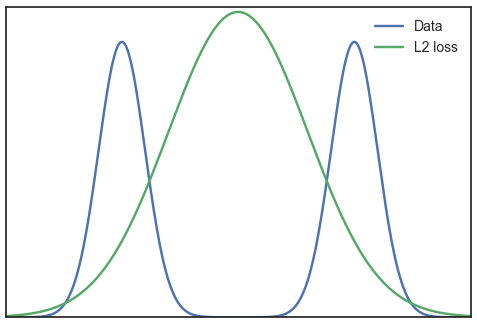

# Image losses

You can use/combine multiple metrics to improve the image generation quality ([source: Loss Functions for Neural Networks for Image Processing](https://arxiv.org/abs/1511.08861)):

- MS-SSIM preserves the contrast in high-frequency regions
- L1 preserves colors and luminance
- LPIPS for scene understanding

## Why does L2 reconstruction loss yield blurry images?

In generative modeling, especially in vision, it is a well known observation that using $L_2$ loss function yields blurry images. But how can we explain this, not empirically, but intuitively?

We look at the foundation first. $L_2$ loss is defined as:

$$L = \frac{1}{2M} \sum_i^M \sum_j^N (\hat{x}_{ij} - x_{ij})^2 $$
$$= \frac{1}{2M} \sum_i^M  \Vert \mathbb{\hat{x}_i} - \mathbb{x_i} \Vert_2^2$$

where $M$ is the total number of examples, $\hat{x}$ are the real data, and $x$ are the reconstructions.

Now, we will try to interpret that in probabilistic setting.

<h2 class="section-heading">Probabilistic interpretation</h2>

Let's take a look at Gaussian distribution. It is defined as follows:

$$
p(x \vert \mu, \sigma^2) = \frac{1}{Z} \, \exp \left( \frac{\Vert \mu - x \Vert_2^2}{2\sigma^2} \right)
$$

where $Z$ is normalizing constant, $\mu$ is the mean, $\sigma^2$ is the variance.

If we set $\mu = \hat{x}$ (i.e., our Gaussian is now centered in our data example) and $\sigma^2 = 1$, and we ignore the normalizing constant, then:

$$
p(x \vert \hat{x}) \propto \exp \left( \frac{1}{2} \Vert \hat{x} - x \Vert_2^2 \right)
$$

We could further applying $\log$ to both sides:

$$
\log \, p(x \vert \hat{x}) \propto \frac{1}{2} \, \Vert \hat{x} - x \Vert_2^2
$$

we get the same equation as $L_2$ loss.

In conclusion, minimizing $L_2$ loss, or MSE, is the same as maximizing the log-likelihood (MLE) of a Gaussian. Therefore, we assume that our data, $x$ comes from a Gaussian.

Now we consider the nature of the real distribution of our data. Suppose we want to search image of "car". Inputting this query into Google Image would yield many images of car, and those images are different to each other, be it in term of color, shape, etc. Therefore we know that there are multiple ways to generate images from a single word "car", all equally possible (as in if we look at an image, we would immediately think of "car"). As there are multiple possible way of generating "car" image, we could think that the distribution of "car" images have multiple peaks. In other words, we say that the distribution of images is multimodal.

Here is the problem. In our loss function above, we assume that a particular image comes from a Gaussian. This is a unimodal distribution, meaning that there is only a single peak in it. What would happen if we fit a unimodal distribution to a multimodal one using $L_2$ loss?

Let's simplify our multimodal distribution into bimodal distribution (two modes/peaks). And let's fit a Gaussian to approximate it. We would get something like this:

During the optimization process, we present two types of samples, originated from left and right modes. As the $L_2$ loss have to minimize the distance of our reconstruction to **both** sample types, we are really trying to satisfy everybody here. Hence, our Gaussian would be centered right in the middle of those two modes. Intuitively, it is because the middle ground between both modes is where the distance is minimized to both of them. The word "both" is crucial here.

The implication is if we sample from our Gaussian, the sample would come from the middle of the two mode in image space, even though that region is in reality has very low probability. Therefore, our sample would be the average of samples that comes from those two modes, hence we get blurry image.

To make this idea more concrete, suppose those two modes represent "sedan" and "suv". If we sample from our Gaussian, what we get is somewhere between those two types of car. Now, imagine this in high dimensional space, with many more modes for all properties of "car". Surely by mixing many properties of different types of cars will not make an image realistic to us, however, in term of $L_2$ metric, this is the best image our model can produce.

## More

- [Loss Functions for Medical Image Segmentation: A Taxonomy](https://medium.com/@junma11/loss-functions-for-medical-image-segmentation-a-taxonomy-cefa5292eec0)
- [Segmentation Loss Odyssey](https://arxiv.org/abs/2005.13449)
