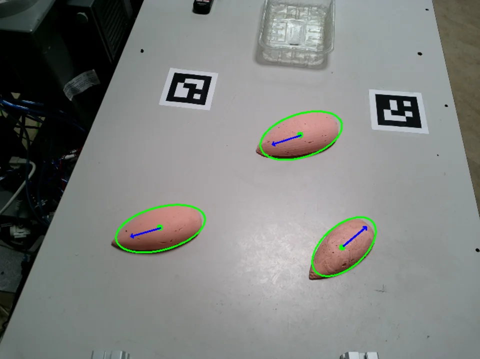

# Orientation Detection Using PCA

How Principal Component Analysis (PCA) can be used to determine the orientation of an object (often represented as a "blob" of pixel points) in an image.

### 1. Extracting the Points of the Blob

- **Segmentation / Thresholding**: First, isolate the object of interest by applying segmentation techniques or thresholding to obtain a binary mask.
- **Pixel Extraction**: Gather all $(x, y)$ coordinates for pixels that belong to the object (this collection of points is called the "blob").

### 2. Computing the Centroid

For a set of points
$$\{(x_1, y_1), (x_2, y_2), \dots, (x_N, y_N)\}$$

calculate the centroid $\bar{x}, \bar{y}$ as follows:

$$
\bar{x} = \frac{1}{N}\sum_{i=1}^{N} x_i,\quad \bar{y} = \frac{1}{N}\sum_{i=1}^{N} y_i.
$$

This centroid represents the center of mass of the blob.

### 3. Centering the Points

Subtract the computed centroid from every point to get centered coordinates:

$$
(x_i', y_i') = (x_i - \bar{x},\ y_i - \bar{y}).
$$

Centering is essential before calculating the covariance matrix.

### 4. Forming the Covariance Matrix

Using the centered points, form the 2D covariance matrix $\Sigma$:

$$
\Sigma =
\begin{bmatrix}
\sigma_{xx} & \sigma_{xy} \\
\sigma_{yx} & \sigma_{yy}
\end{bmatrix},
$$

where

$$
\sigma_{xx} = \frac{1}{N}\sum_{i=1}^{N} (x_i')^2,\quad
\sigma_{yy} = \frac{1}{N}\sum_{i=1}^{N} (y_i')^2,\quad
\sigma_{xy} = \sigma_{yx} = \frac{1}{N}\sum_{i=1}^{N} x_i' y_i'.
$$

This matrix captures how the points are spread out around the centroid in different directions.

### 5. Computing Eigenvalues and Eigenvectors

**Eigenvalue Problem**: Solve for $\lambda$ and $v$ such that

$$
\Sigma \, v = \lambda \, v.
$$

**Interpretation**:

- The two eigenvalues, $\lambda_1$ and $\lambda_2$, indicate the variance of the blob along the directions of their corresponding eigenvectors, $v_1$ and $v_2$.
- The **principal eigenvector** is the one associated with the **largest eigenvalue** ($\lambda_{\text{max}}$), as it indicates the direction of maximum variance. This direction is typically the object's long axis.

### 6. Interpreting the Results

- The principal eigenvector, aligned with the largest spread of the data, represents the object's **orientation**.
- For instance, if you have a pear-shaped object, the principal eigenvector points along its long axis (from the base to the tip).

## Why This Works

- **Covariance Matrix**: Encodes the spread (variance) of the blob in every direction.
- **PCA**: Diagonalizing the covariance matrix (via eigenvalue decomposition) reveals the principal components – the directions in which the data variance is maximized and minimized.
- **Principal Eigenvector**: The direction corresponding to the highest variance (largest eigenvalue) naturally aligns with the object's major (long) axis.
