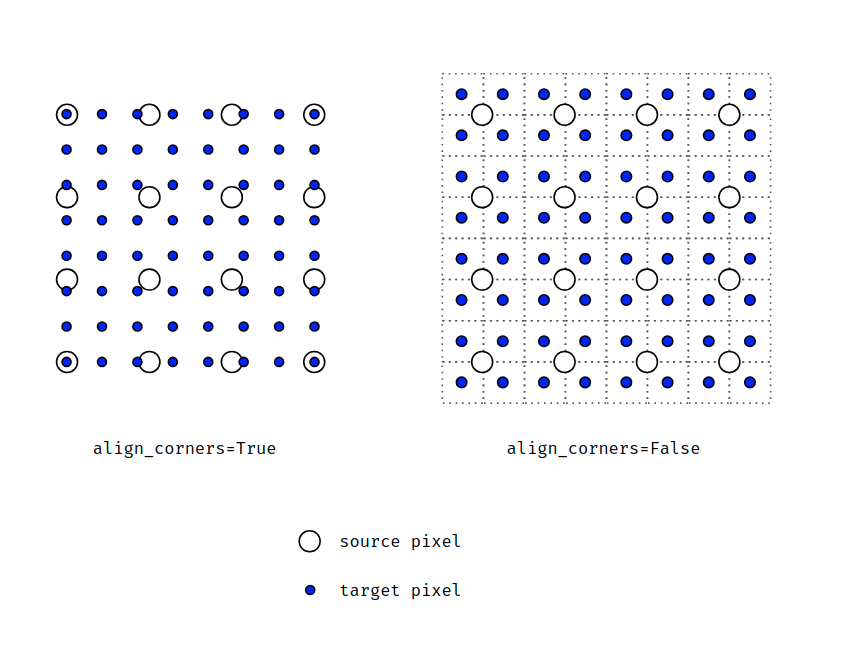

# Resampling

Resampling is the process of changing the resolution of an image. This is done by either increasing or decreasing the number of pixels in an image. Resampling is often used to reduce the size of an image to make it easier to work with. It can also be used to increase the size of an image to make it easier to see.

Be careful with `align_corners` parameter in interpolation algorithms (should be set to `true` in most cases):

- <https://leimao.github.io/article/Interpolation/>
- <https://hackernoon.com/how-tensorflows-tf-image-resize-stole-60-days-of-my-life-aba5eb093f35>
- <https://bartwronski.com/2021/02/15/bilinear-down-upsampling-pixel-grids-and-that-half-pixel-offset/>
- <https://bartwronski.com/2021/02/28/computing-gradients-on-grids-forward-central-and-diagonal-differences/>
- <https://github.com/dmlc/gluon-cv/issues/437>
- <https://ppwwyyxx.com/blog/2021/Where-are-Pixels/>
- <https://machinethink.net/blog/coreml-upsampling/>
