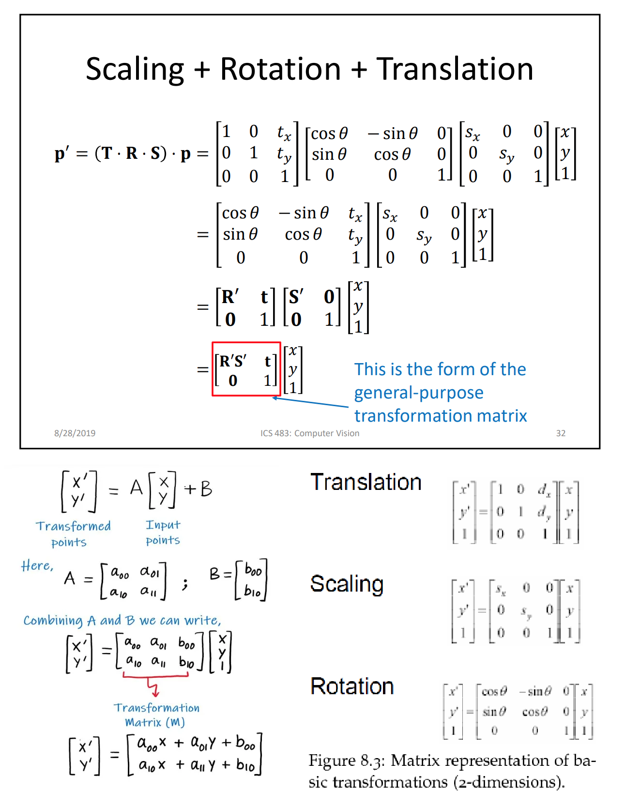
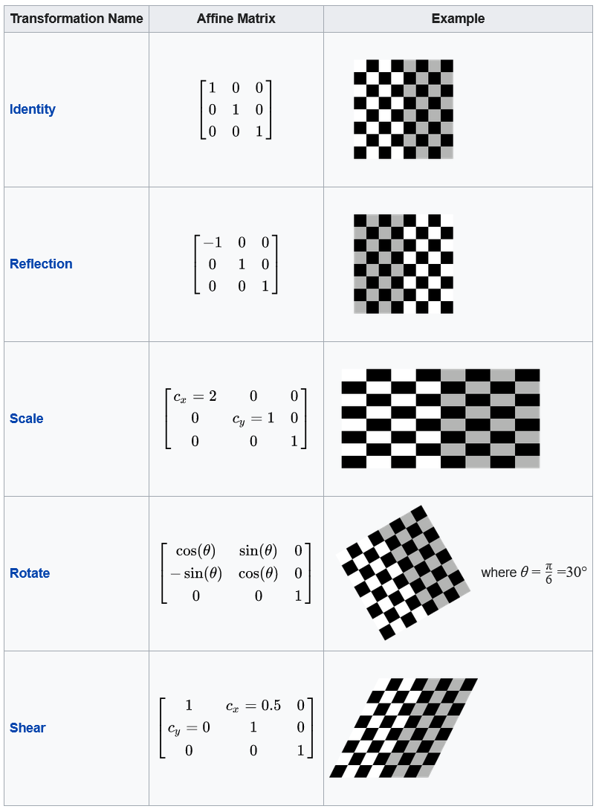

# Transformation matrices

## SVD: Singular Value Decomposition

SVD is a technique to decompose a matrix into three other matrices: U, S, and V.

For example, in image processing, we can use SVD to decompose a transformation matrix into three matrices: rotation, scaling, and rotation.

With a rotation, scaling and another rotation, we can do any linear transformation.
