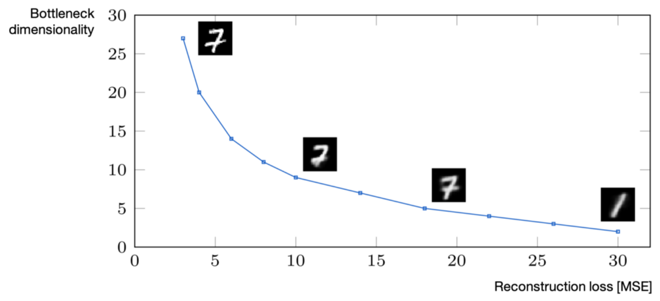

# Autoencoder

- An auto-encoder is the combination of an function that converts the input data into a different representation, and a decoder function that converts the new representation back into the original format.
- Can be used for data visualization (compressing data into 2D or 3D).
- Autoencoders work because data may occupy a manifold of lower dimensionality than n.
- One class autoencoders are used for anomaly detection:
  - A well-trained autoencoder will predict any new data that is coming from the normal state of the process (as it will have the same pattern or distribution).
  - Therefore, the reconstruction error will be small.
  - However, if we try to reconstruct a data from a rare-event, the Autoencoder will struggle.
  - This will make the reconstruction error high during the rare-event.
  - We can catch such high reconstruction errors and label them as **a rare-event prediction**.
- Is it possible to find a linear boundary with them? Not sure but I guess yes. For example, if you train an autoencoder on really simple images spread in two classes, you might be able to apply just a single threshold to "classify" those images. the decision boundary is nonlinear in the original data space, but linear in the feature space into which the data are mapped

VAE are generative, but what about autoencoders?

- The latent space can be repurposed for something else like interpolation.
- We usually consider autoencoders not be generative since there are no distributional assumptions of how your data (in latent space) is generated.
- In probabilistic reasoning lingo, there are no assumptions on the data generation process.
- (Ian Goodfellow): the autoencoder doesn’t give direct explicit access to an estimate of the density or the ability to sample directly.

Bottleneck dimensionality vs reconstruction loss:

