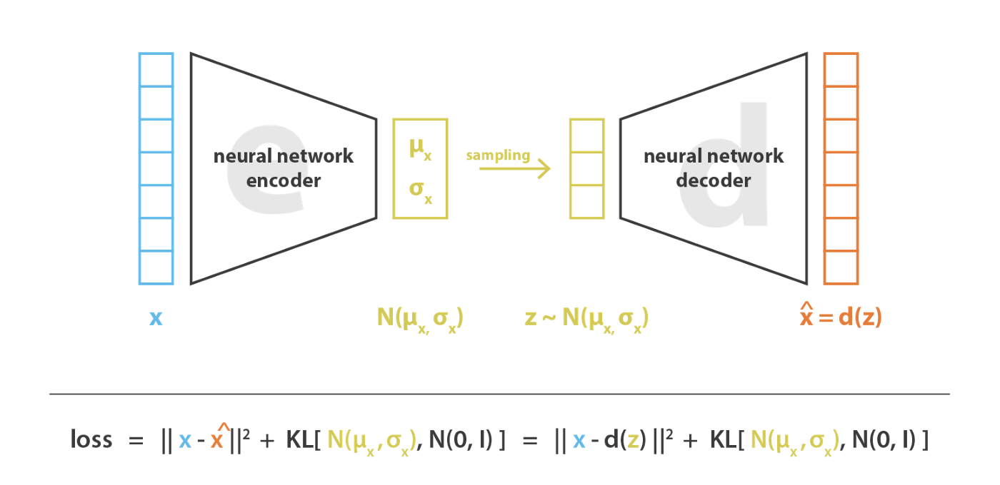

# Variational Autoencoders


- We add a constraint on the encoding network, that forces it to generate latent vectors that roughly follow a unit gaussian distribution.
- Generating new images is now easy: all we need to do is sample a latent vector from the unit gaussian and pass it into the decoder.

```python
image_loss = mean((generated_image - real_image)**2)
latent_loss = kl_divergence(latent_variable, unit_gaussian)
loss = image_loss + latent_loss
```



- the KL divergence of two gaussians is easy to compute in its closed form.
- In order to optimize the KL divergence, we need to apply a simple reparameterization trick: instead of the encoder generating a vector of real values, it will generate a vector of means and a vector of standard deviations.

```python
samples = random_normal([batchsize, n_z], mean=0, std=1, dtype=tf.float32)
sampled_z = z_mean + (z_stddev * samples)
```

## More

- <https://wiseodd.github.io/techblog/2016/12/10/variational-autoencoder/>
- <https://hameddaily.blogspot.com/2018/12/yet-another-tutorial-on-variational.html>
- <https://jaan.io/what-is-variational-autoencoder-vae-tutorial/>
- <https://towardsdatascience.com/generating-images-with-autoencoders-77fd3a8dd368>
- <https://wiseodd.github.io/techblog/2017/01/24/vae-pytorch/>
- <https://jhui.github.io/2017/03/06/Variational-autoencoders/>
- <https://www.jeremyjordan.me/variational-autoencoders/>
- <http://kvfrans.com/variational-autoencoders-explained/>
- <https://miro.medium.com/max/2255/1*ejNnusxYrn1NRDZf4Kg2lw@2x.png>
- <https://www.assemblyai.com/blog/variational-autoencoders-for-dummies/>
- Invariant Representations without Adversarial Training : <https://dcmoyer.github.io/selfhosted/blag.html>
