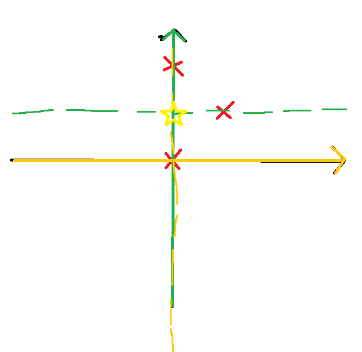

# K-medians

Same as K-means but with medians instead of means to compute the centroids.

Question: do the centroids lie in between data points or on data points?

- Three red points are the dataset points
- median on orange horizontal axis is 0, `median([0, 0, 1]) = 0`
- median on green vertical axis is 1, `median([0, 1, 2]) = 1`
- Thus, the centroid is (0, 1) (yellow star)
- There is no (0, 1) point in the dataset
- So the answer is no, the centroids may not be within dataset points.
