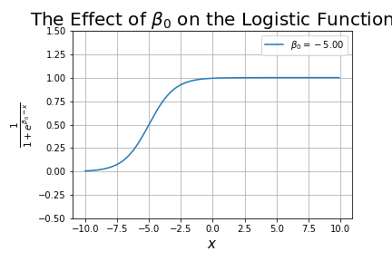
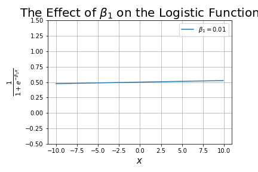

# Logistic Regression

Equation:

$$\hat{y} = \frac{1}{1 + e^{-z}}$$

where:

- $z = \theta^T x  = \theta_0 + \theta_1 x_1 + \theta_2 x_2 + ... + \theta_n x_n$

## Trap

Many machine learning experts actually label logistic regression as a classification method (it is not).

Logistic regression estimates the probability of an event occurring, such as voted or didn't vote, based on a given dataset of **independent variables**. Since the outcome is a probability, the dependent variable is bounded between 0 and 1.

The decision boundary for a logistic classifier is linear. (The classifier needs the inputs to be linearly separable.)

## More

- <https://github.com/ujjwalkarn/DataSciencePython#logistic-regression-in-python>
- <https://www.dataschool.io/guide-to-logistic-regression/>
- <https://florianhartl.com/logistic-regression-geometric-intuition.html>
- <https://chunml.github.io/ChunML.github.io/tutorial/Logistic-Regression/>
- <https://learningwithdata.wordpress.com/2015/04/30/tutorial-on-logistic-regression-and-optimization-in-python/>
- <http://blog.yhat.com/posts/logistic-regression-and-python.html>
- <https://www.hackingnote.com/en/machine-learning/logistic-regression>
- <https://www.quora.com/Why-is-logistic-regression-considered-a-linear-model>
- <https://www.countbayesie.com/blog/2019/6/12/logistic-regression-from-bayes-theorem>
- <https://towardsdatascience.com/understanding-binary-cross-entropy-log-loss-a-visual-explanation-a3ac6025181a>
- <https://sebastianraschka.com/faq/index.html#logistic-regression>
