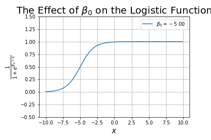
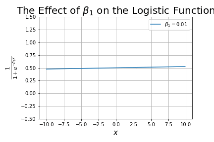

# Logistic Regression

Equation:

$$\hat{y} = \frac{1}{1 + e^{-z}}$$

where:

- $z = \theta^T x  = \theta_0 + \theta_1 x_1 + \theta_2 x_2 + ... + \theta_n x_n$

## Trap

Logistic regression models the probability of a binary outcome following a Bernoulli distribution. The Bernoulli distribution is a discrete probability distribution of a random variable that takes only two values - typically 0 and 1, with p being the probability of success (1) and 1-p being the probability of failure (0).

In logistic regression, we estimate p (the probability of the positive class) based on a given dataset of **independent variables**. The model outputs a probability between 0 and 1, which matches the Bernoulli distribution's parameter p. This probability can then be used to make binary predictions by applying a threshold (typically 0.5).

While commonly used for classification tasks, logistic regression is fundamentally a probabilistic model that estimates Bernoulli probabilities using a linear decision boundary. This means the input features need to be linearly separable for the model to perform well.

## More

- <https://github.com/ujjwalkarn/DataSciencePython#logistic-regression-in-python>
- <https://www.dataschool.io/guide-to-logistic-regression/>
- <https://web.archive.org/web/20230531102205/https://florianhartl.com/logistic-regression-geometric-intuition.html>
- <https://chunml.github.io/ChunML.github.io/tutorial/Logistic-Regression/>
- <https://learningwithdata.wordpress.com/2015/04/30/tutorial-on-logistic-regression-and-optimization-in-python/>
- <https://www.hackingnote.com/en/machine-learning/logistic-regression>
- <https://www.quora.com/Why-is-logistic-regression-considered-a-linear-model>
- <https://www.countbayesie.com/blog/2019/6/12/logistic-regression-from-bayes-theorem>
- <https://towardsdatascience.com/understanding-binary-cross-entropy-log-loss-a-visual-explanation-a3ac6025181a>
- <https://sebastianraschka.com/faq/index.html#logistic-regression>
