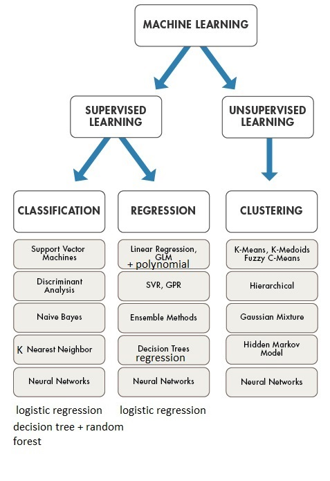

# Machine Learning Algorithm Types

Pros and cons: [link to PDF](./pros-cons-different-ml-algorithms.pdf)

## Supervised learning

- Each sample is a pair $(x,y)$ where $y$ is the label
- Oracle $p_{Y|X}(y|x)$

We want to learn a function $f$ that mimics the oracle.

### Binary Classification

Goal: find a boundary (hyperplane if linear) that best separates the two classes.

Some algorithms (SVM) also return a confidence score (a point close to the hyperplane has a low score).

### Multi-class Classification

- one-vs-all (one-vs-rest):
  - train one classifier per class (problem of class imbalance)
  - N classifiers for N classes
  - decision: keep highest score (**requires an algorithm that can give a score**)
- one-vs-one:
  - binomial coeff: $\frac{N!}{2!(N-2)!}=\frac{N(N-1)}{2}$ classifiers
  - majority vote

### Regression

The output variable $y$ is a scalar.

### Label Aware Dimensionality Reduction

- LDA: linear discriminant analysis
- GDA: gaussian discriminant analysis
- maximize distance between classes
- minimize distance within classes

## Semi-supervised learning

- sometimes getting the label is expensive
- active sampling (choose label for training)
- Examples:
  - mean teacher
  - VAT
  - pseudo-labelling
  - MixMatch
  - Unsupervised Data Augmentation or UDA
  - Pi-Model

Learning with not Enough Data:

- <https://lilianweng.github.io/posts/2021-12-05-semi-supervised/>
- <https://lilianweng.github.io/posts/2022-02-20-active-learning/>
- <https://lilianweng.github.io/posts/2022-04-15-data-gen/>

## Unsupervised learning

It consists in handling data that are not labelled, no oracle involved.

The only thing we can do is to describe the distribution.

1. dimensionality reduction: PCA, t-SNE, SOMs.
2. membership test: one class svm, autoencoders with reconstruction error, GMMs.
3. representation learning: autoencoders, VAEs, GANs, transformers.
4. clustering: k-means, DBSCAN, GMMs.
5. data visualization: SOMs, t-SNE, PCA.
6. Data estimation and generation: GMMs, VAEs, GANs.
