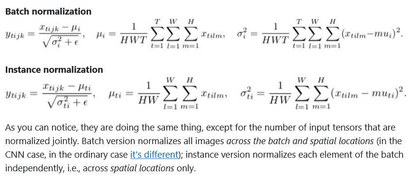

# BatchNorm

[PDF link with explanations](./BatchNorm.pdf)

## Batchnorm vs InstanceNorm

## CNNs and batchnorm

Remember to set the bias to zero when using batchnorm. This is because batchnorm will learn the bias.

## More

- <https://www.alexirpan.com/public/perils-batch-norm/batch_norm_appendix.html>
- <https://www.alexirpan.com/2017/04/26/perils-batch-norm.html>
- <https://www.learnopencv.com/batch-normalization-in-deep-networks/>
- <https://deepnotes.io/batchnorm>
- <https://wiseodd.github.io/techblog/2016/07/04/batchnorm/>
- <http://web.archive.org/web/20230524162122/https://rohanvarma.me/Batch-Norm/>
- <https://kratzert.github.io/2016/02/12/understanding-the-gradient-flow-through-the-batch-normalization-layer.html>
- <https://stackoverflow.com/questions/45799926/why-batch-normalization-over-channels-only-in-cnn>
- <https://blog.janestreet.com/l2-regularization-and-batch-norm/>
- <https://colab.research.google.com/github/davidcpage/cifar10-fast/blob/master/batch_norm_post.ipynb#scrollTo=9OCWAQl50KYm>
- <https://blog.paperspace.com/busting-the-myths-about-batch-normalization/>
- <https://leimao.github.io/blog/Batch-Normalization/>
- <http://gradientscience.org/batchnorm/>
- <https://stackoverflow.com/questions/45463778/instance-normalisation-vs-batch-normalisation>
- <https://datascience.stackexchange.com/questions/22073/why-is-scale-parameter-on-batch-normalization-not-needed-on-relu>
- <https://old.reddit.com/r/MachineLearning/comments/ql5hdb/d_why_do_we_apply_batch_normalization_between/>
