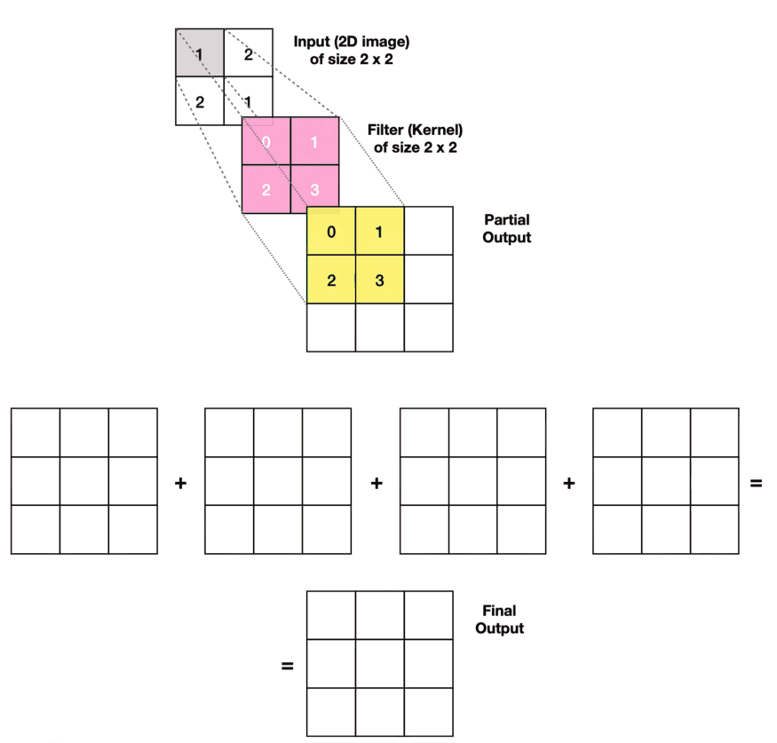

# CNN

- Convolution means sliding a flipped kernel across an image.
- output shape: $\frac{W-K+2P}{S}+1$

## Cascade of convolutional layers

In a CNN model:

- 1st layer: edges
- 2nd layer: corners and contours
- 3rd layer: object parts
- last layer: object class

## Tasks tackled by CNNs

- Object Detection: Identify the object category and locate the position using a bounding box for every known object within an image.
- Semantic Segmentation: Identify the object category of each pixel for every known object within an image. Labels are class-aware.
- Instance Segmentation: Identify each object instance of each pixel for every known object within an image. Labels are instance-aware.

## Convolutional layer

- [Convolution arithmetic](https://github.com/vdumoulin/conv_arithmetic)
- <https://towardsdatascience.com/a-comprehensive-introduction-to-different-types-of-convolutions-in-deep-learning-669281e58215>

## Computational cost of CNN layer

$\mathcal{O}(HWNK²M)$

- H x W is the space size of the output feature map
- N is the number of input channels
- K x K is the size of the convolution kernel
- M is the number of output channels

## Architectural priors

Shift invariance vs equivariance property:

- translation ~~invariance~~ equivariance property
- <https://www.youtube.com/shorts/KDCKJkNpMGQ>

What architectural prior does a CNN NOT have? Rotation invariance.

## Receptive fields

According to the theory of Effective Receptive Field (ERF), the size of ERF is proportion to O(K√L), where K is the kernel size and L is the depth, i.e., number of layers.

In other words, ERF grows linearly with the kernel size while sub-linearly with the depth.

More reading:

- <https://distill.pub/2019/computing-receptive-fields/>
- <https://theaisummer.com/receptive-field/>

## Implementation of the convolutions

GEMM: General matrix multiply gemm

Implementations:

- im2col
- FFT (works well for big filters)

Remember that matrix product is $\mathcal{O}(N^3)$

More reading:

- <https://sahnimanas.github.io/post/anatomy-of-a-high-performance-convolution/>
- <https://petewarden.com/2015/04/20/why-gemm-is-at-the-heart-of-deep-learning/>

## CNN and Shannon sampling theorem

The pooling layers in CNN break the Shannon Nyquist sampling theorem: <https://towardsdatascience.com/https-towardsdatascience-com-making-convolutional-networks-shift-invariant-again-f16acca06df2>

## NCHW vs NHWC

Pytorch uses channel first for historical reasons. It's bad cause  NVIDIA GPUs natively perform convolution operations in NHWC format. The NCHW tensor must be transposed to NHWC before the convolution and transposed back to NCHW after (right).

Use NHWC for Pytorch: <https://pytorch.org/tutorials/intermediate/memory_format_tutorial.html#>

## Transposed convolutions

It is also called deconvolution or fractionally strided convolution.

It is a convolution that aims at increasing the spatial resolution of the input.

It is often replaced by an upsampling layer followed by a convolution.

More reading:

- <https://medium.com/activating-robotic-minds/up-sampling-with-transposed-convolution-9ae4f2df52d0>?
- <https://medium.com/apache-mxnet/transposed-convolutions-explained-with-ms-excel-52d13030c7e8>
- <https://towardsdatascience.com/understand-transposed-convolutions-and-build-your-own-transposed-convolution-layer-from-scratch-4f5d97b2967>

### Cons of transposed convolutions

Better to upscale and then use conv layer because otherwise one gets those cheeky checkerboard artifacts because some pixels appear multiple times in the output: <https://distill.pub/2016/deconv-checkerboard/>

## Data augmentation techniques

<https://sebastianraschka.com/blog/2023/data-augmentation-pytorch.html>

TrivialAugment gives good results: <https://arxiv.org/abs/2103.10158>
