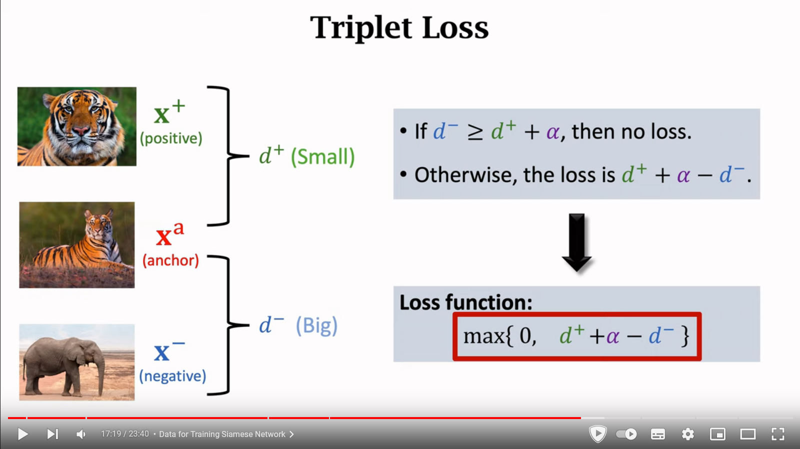
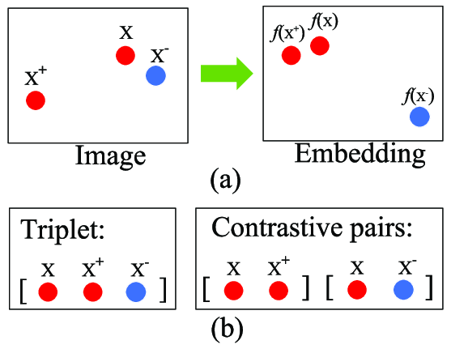

# Contrastive learning, Siamese networks, Triplet loss

<https://ankeshanand.com/blog/2020/01/26/contrative-self-supervised-learning.html>

## Contrastive learning

Contrastive learning is a method of training a neural network to learn a feature representation of the data. It is a semi-supervised learning method that uses pairs of data points to learn a feature representation of the data.

The contrastive learning method is based on the idea that similar data points should be close to each other in the feature space and dissimilar data points should be far apart in the feature space.

## Siamese networks

A siamese network is a neural network that contains two networks with the same weights. The two networks are trained to produce similar outputs for similar inputs and dissimilar outputs for dissimilar inputs.

The final output of the siamese network is a distance metric that can be used to compare the similarity of two inputs. The distance metric can be computed using the Euclidean distance or the cosine similarity.

## Triplet loss

The triplet loss works by learning more robust feature representation of the data, where examples of the same class are close together on the feature space and examples belonging to different classes are further apart.

Triplet Loss tries to ensure a margin between distances of negative pairs and distances of positive pairs.

The triplet loss is different from the cross entropy, since it will try to form clusters, while the cross entropy will just compute hyperplanes and split data.

It can be used for developing models for

- face identification
- person re-identification
- one-shot learning
- recommender systems as shown later in this post.

The triplet loss can be used to build a system to show recommendations to a customer shopping online. Each item in the online store can be indexed by a feature extractor trained with triplet loss and stored in a database. Recommendations can then be suggested to the customer by retrieving the closest embeddings to the items currently being viewed by the customer.

## Contrastive loss vs Triplet loss

Triplet Loss is different from Contrastive Loss not only mathematically but also in its sample selection strategies

## Arcface

The ArcFace loss has been introduced in 2019 (CVPR) and its main goal is to maximize face class separability by learning highly discriminative features for face recognition. According to the writers of the paper, this method outperformed triplet loss, intra-loss, and inter-loss on the most common face identification benchmarks.

ArcFace, I noticed some benefits over the triplet loss:

- ArcFace scales well for a large number of classes
- It alleviates the problem of hard sample mining encountered when training triplet losses (since it doesn’t need one). All it needs is data and corresponding labels.
- It provides a nice geometric interpretation
- It provides a stable training
- It converges faster
- and most importantly, a single model trained with this loss performed better than a blend of five models trained by triplet loss.

## More

- <https://arxiv.org/abs/1905.10675>
- <https://qdrant.tech/articles/detecting-coffee-anomalies/>
- <https://lilianweng.github.io/posts/2021-05-31-contrastive/>
- <https://gombru.github.io/2019/04/03/ranking_loss/>
- <https://www.quora.com/What-is-a-contrastive-loss-function-in-Siamese-networks/answer/Sri-Krishna-12>
- <https://omoindrot.github.io/triplet-loss>
- <https://qdrant.tech/articles/triplet-loss/>
- <https://towardsdatascience.com/metric-learning-tips-n-tricks-2e4cfee6b75b>
