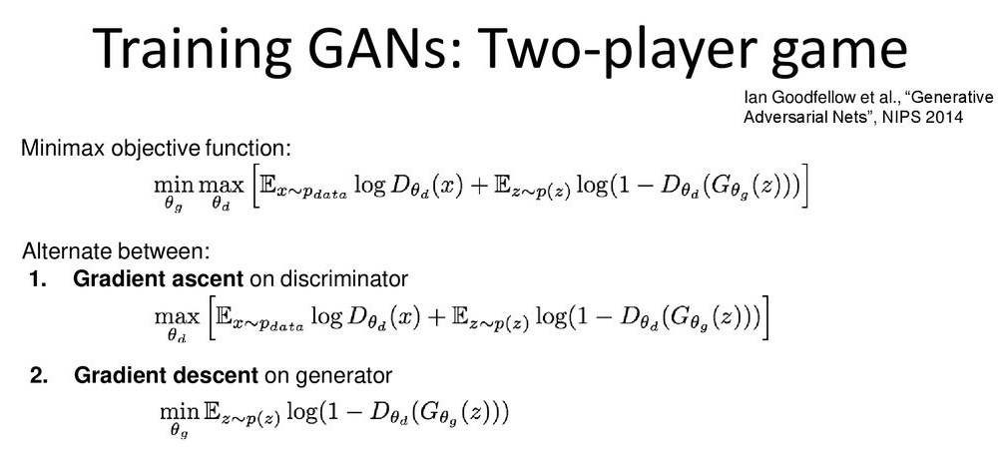
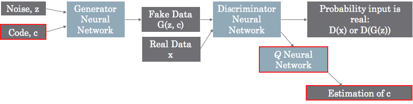
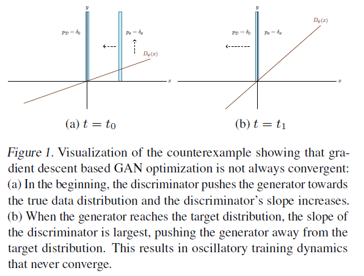

# Generative Adversarial Networks

## Info GAN

- The idea is to provide a latent code, which has meaningful and consistent effects on the output
- splitting the Generator input into two parts: the traditional noise vector and a new “latent code” vector.
- The codes are then made meaningful by maximizing the Mutual Information between the code and the generator output.
- To calculate the regularization term, you don’t need an estimation of the code itself, but rather you need to estimate the likelihood of seeing that code for the given generated input.
- Therefore, the output of Q is not the code value itself, but instead the statistics of the distribution you chose to model the code.
- $Q(c|x)$, the probability distribution for c given the image x.
- For instance, if you have used a continuous valued code (i.e. between -1 and +1), you might model $Q(c|x)$ as a Normal/Gaussian distribution. In that case, $Q$ would output two values for this part of the code: the mean and standard deviation.
- Once you know the mean and standard deviation you can calculate the likelihood $Q(c|x)$, which is what you need for the regularization term.

## Zero centered gradient penalty

$$L_{reg} = \left( \frac{\partial D(x)}{x} - 0\right)^2$$

- The reason as to why this works is that this essentially weakens the discriminator, which can be really helpful at the beginning of training.
- A powerful discriminator looks like a steep function, and as a result, there's no useful gradient signal for updating the generator.
- to penalize the discriminator for deviating from the Nash-equilibrium.
- The simplest way to achieve this is to penalize the gradient on real data alone
- when the generator distribution produces the true data distribution and the discriminator is equal to 0 on the data manifold

faut imager une fonction sigmoide qui devient de plus en plus "steep"

## More

- <https://medium.com/beyondminds/advances-in-generative-adversarial-networks-7bad57028032?sk=9f420a2c96c228a3f6d1a9f52b382109>
- <https://lilianweng.github.io/lil-log/2017/08/20/from-GAN-to-WGAN.html>
- <https://wiseodd.github.io/techblog/2017/01/20/gan-pytorch/>
- <https://github.com/soumith/ganhacks>
- <https://adamdking.com/blog/gaugan/>
- <https://towardsdatascience.com/zilic-detect-any-disease-with-machine-learning-fdae88664148>
- <https://towardsdatascience.com/comprehensive-introduction-to-turing-learning-and-gans-part-1-81f6d02e644d>
- <https://blog.floydhub.com/gans-story-so-far/>
- <https://towardsdatascience.com/10-lessons-i-learned-training-generative-adversarial-networks-gans-for-a-year-c9071159628>
