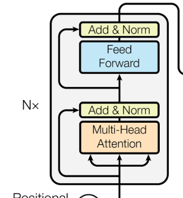
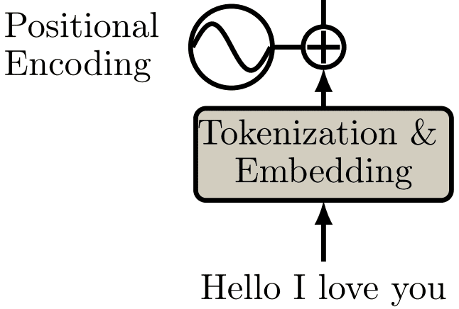
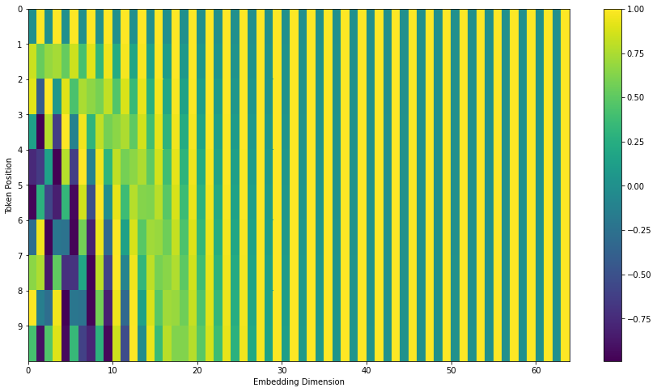

# Transformers

- [Transformers](#transformers)
  - [Introduction](#introduction)
  - [Architecture](#architecture)
    - [Transformer encoder](#transformer-encoder)
    - [Attention](#attention)
      - [Scaled dot product attention (or self-attention)](#scaled-dot-product-attention-or-self-attention)
      - [Multi head attention](#multi-head-attention)
      - [Applications of attention in transformers](#applications-of-attention-in-transformers)
      - [How to assign queries, keys and values](#how-to-assign-queries-keys-and-values)
      - [Cross attention](#cross-attention)
      - [Alternative interpretation of attention](#alternative-interpretation-of-attention)
    - [Embeddings](#embeddings)
    - [Feed-forward network](#feed-forward-network)
    - [Encoder block](#encoder-block)
    - [Positional encoding](#positional-encoding)
    - [Transformer decoder](#transformer-decoder)
      - [Stacked self-attention layers](#stacked-self-attention-layers)
      - [Masked self-attention](#masked-self-attention)
      - [Linear + Softmax](#linear--softmax)
    - [Residual connections and layer normalization](#residual-connections-and-layer-normalization)
  - [Inference](#inference)
  - [Tokenization](#tokenization)
  - [Greedy sampling vs stochastic sampling](#greedy-sampling-vs-stochastic-sampling)
  - [Language modeling head](#language-modeling-head)
  - [In a nutshell](#in-a-nutshell)
  - [Training](#training)
    - [Batch size and sequence length](#batch-size-and-sequence-length)
    - [Fixed or variable length?](#fixed-or-variable-length)
    - [Softmax is useless](#softmax-is-useless)
    - [Loss](#loss)
  - [Transformers in NLP](#transformers-in-nlp)
    - [GPT](#gpt)
      - [GPT2](#gpt2)
      - [GPT3](#gpt3)
    - [BERT](#bert)
  - [Transformers in computer vision](#transformers-in-computer-vision)
    - [Adapting transformers to CV](#adapting-transformers-to-cv)
    - [Patch embeddings and tokenization](#patch-embeddings-and-tokenization)

## Introduction

<https://arxiv.org/abs/1706.03762>

Transformers are a type of neural network architecture that allow for parallelization while maintaining the ability to capture long-range dependencies.

They are based on the attention mechanism. Attention is a mechanism that allows a model to focus on certain parts of the input.

The transformer architecture is based on the encoder-decoder architecture. The encoder takes the input and produces a representation of it. The decoder takes that representation and produces the output.

Transformers are now SOTA for NLP tasks, since they can capture long-range dependencies and are parallelizable, unlike RNNs or LSTMs.

## Architecture


The transformer architecture is based on the encoder-decoder architecture.

The encoder takes an input sequence of symbol representations $(x_1, ..., x_n)$ and produces a sequence
of continuous representations $z = (z_1, ..., z_n)$.

Given $z$, the decoder then generates an output sequence $(y_1, ..., y_m)$ of symbols one element at a time.
The decoder takes that representation and produces the output.


Input elements $x_1, x_2, etc$ are called **tokens**. They can be text representations, pixels, images in case of videos.

The input and predicted sequences can be of same or arbitrary length.

At each step the model is auto-regressive, consuming the previously generated symbols as additional input when generating the next.

The transformer is based solely on attention mechanisms, dispensing with recurrence and convolutions
entirely.

### Transformer encoder

The encoder is composed of a stack of $N=6$ identical layers.



Each layer has two sub-layers:

- The first is a **multi-head self-attention** mechanism.
- The second is a simple, position-wise fully connected feed-forward network.

We employ a residual connection around each of the two sub-layers, followed by layer normalization .

That is, the output of each sub-layer is $LayerNorm(x + Sublayer(x))$, where $Sublayer(x)$ is the function implemented by the sub-layer itself.

To facilitate these residual connections, all sub-layers in the model, as well as the embedding layers, produce outputs of dimension $d=512$.

### Attention

In the context of the Transformer, attention refers to a mechanism that allows the model to weigh the importance of different parts of an input sequence when producing an output sequence. This mechanism enables the model to focus on relevant information while ignoring irrelevant parts of the input.

#### Scaled dot product attention (or self-attention)


An input sequence $X \in \mathbb{R}^{n \times d}$ of $n$ tokens of dimensions $d=512$, is projected using three matrices of weights:

- $W_Q \in \mathbb{R}^{d \times d_q}$
- $W_K \in \mathbb{R}^{d \times d_k}$
- $W_V \in \mathbb{R}^{d \times d_v}$

to extract feature representations:

- $Q = XW_Q \in \mathbb{R}^{n \times d_q}$, the query matrix
- $K = XW_K \in \mathbb{R}^{n \times d_k}$, the key matrix
- $V = XW_V \in \mathbb{R}^{n \times d_v}$, the value matrix

$d_q$, $d_k$ and $d_v$ are hyperparameters, but they are often taken as $512$ (for simple attention, not multi-head attention).

Note that the input $X \in \mathbb{R}^{n \times d}$ is a list of tokens, so each $n$ is a token, and each $d$ is the dimension of the token embedding, that is the vector that represents the token in the embedding space.

We compute the dot products of the query with all keys, divide each by $\sqrt d_k$, and apply a row-wise softmax function to obtain the weights on the values:

$$Attention(Q, K, V) = softmax \left( \frac{QK^T}{\sqrt d_k} \right) V$$

The dimensions of the matrices are:

- $QK^T \in \mathbb{R}^{n \times n}$: the **dot product matrix**
  - the dot product for every possible pair of queries and keys
  - Each row represents the attention logits for a specific element to all other elements in the sequence.
- $S = softmax \left( \frac{QK^T}{\sqrt d_k} \right) \in \mathbb{R}^{n \times n}$: it's the **attention weights matrix**:
  - The softmax is applied to each row, so the sum of the weights for each row is 1.
  - The i-th row of $S$ is the attention weights for the i-th token with respect to the other tokens.
- $O = S V \in \mathbb{R}^{n \times d_v}$: the **attention output matrix**:
  - Each row of $O$ is the weighted sum of the values for a token.

Note that the attention outout is $O \in \mathbb{R}^{n \times d_v}$, so it's different from the input $X \in \mathbb{R}^{n \times d}$.

Thus, a final weight matrix $W^O \in \mathbb{R}^{d_v \times d}$ can be applied to the output to obtain the final output $O' \in \mathbb{R}^{n \times d}$.

The formula can be implemented this way in PyTorch:

```python
def scaled_dot_product(q, k, v):
    d_k = k.size(-1)  # dimension of the key (usually 512, 64 for multi-head attention)

    # (b, n, d_q) x (b, d_k, n) -> (b, n, n)
    attn_logits = torch.matmul(q, k.transpose(-2, -1))
    attn_logits = attn_logits / math.sqrt(d_k)  # (b, n, n)
    attention_weights = F.softmax(attn_logits, dim=-1)  # (b, n, n)
    # (b, n, n) x (b, n, d_v) -> (b, n, d_v)
    values = torch.matmul(attention_weights, v)
    return values
```

On the image below, we see the self-attention mechanism in action. The query is the word "it".


Visually, we can show the attention over a sequence of words as follows (the softmax is not visualized for simplicity):


Each word in the input sequence is a query.
We need to score each word of the input sentence against this word to produce scores.
The score determines how much focus to place on other parts of the input sentence as we encode a word at a certain position.
The query is compared to all keys with a score function (in this case the dot product) to determine the weights.

The weights are rescaled using the softmax function, so that the sum of the weights is 1.

Finally, the we select the relevant value vectors and drown-out the irrelevant ones by scaling them using the attention weights. We assign the value vectors a higher weight whose corresponding key is most similar to the query.

Self-attention is called "self" because we compare each word with all other words in the same sequence.

For sake of simplicity, we assume that the sequence length is one, that is $n=1$.
The query is a vector, for the current word, of dimensions $d_q$.
Key-value is the memory, it's the past, all the words that have been seen so far.
Attention takes the query, find the most similar key(s), and then get the value(s) that correspond to that/those similar key(s).


The encoder builds/discovers key-value pairs, it's the memory.
The decoder builds the queries, it's the question that is asked to the memory.

The transformer paper using dot product attention to compute similarity between the query and the keys. But other similarity functions can be used.

All-to-all comparison: Each layer is $O(n^2)$, where $n$ is the sequence length.
Note that we have only multiplied matrices so far, so the computation is parallelizable using GPUs.

In the softmax, we divide by $\sqrt d_k$. This is to avoid the softmax to be too peaked (saturate to 1 for an output, 0 for the rest) for large values of $d_k$. If the softmax is too peaked, the gradient might be too small.
Mathematical explanation:

$$q_i \sim \mathcal{N}(0,\sigma^2), k_i \sim \mathcal{N}(0,\sigma^2) \to \text{Var}\left(\sum_{i=1}^{d_k} q_i\cdot k_i\right) = \sigma^4\cdot d_k$$

We want the variance $\sigma^2$ to be 1 throughout the whole network, so we divide by $\sqrt d_k$ (remember that $\text{Var}(aX) = a^2\text{Var}(X)$):

$$\text{Var}\left(\sum_{i=1}^{d_k} \frac{q_i\cdot k_i}{\sqrt d_k}\right) = \text{Var}\left(\sum_{i=1}^{d_k} q_i\cdot k_i\right) \cdot \frac{1}{d_k} = \frac{\sigma^4\cdot d_k}{d_k} = \sigma^4 = {(\sigma^2)}^2 = 1^2 = 1$$

#### Multi head attention


We perform the self-attention operation multiple times $h$ independently, in parallel, called **heads**.

Each head has $h$ different linear transformations, that is different $W_Q$, $W_K$, $W_V$.

The rational is that different heads can learn different relationships between words.

$h$, the number of heads, is usually set to 8.

We thus have $h$ outputs $O_1, \dots, O_h$ (remember that each $O_i \in \mathbb{R}^{n \times d_v}$).

We then concatenate them to obtain the attention output $O \in \mathbb{R}^{n \times hd_v}$.

Since the output should be of dimension $d$, we apply a final linear transformation $W^O \in \mathbb{R}^{hd_v \times d}$ to obtain the final output $O' \in \mathbb{R}^{n \times d}$.

For multi-head attention, GPT-style networks usually set $d_q = d_k = d_v = \frac{d}{h} = \frac{512}{8} = 64 = d_{head}$.

One crucial characteristic of the multi-head attention is that it is permutation-equivariant with respect to its inputs.
This means that if we switch two input elements in the input sequence, the output is exactly the same besides the elements 1 and 2 switched.
Hence, the multi-head attention is actually looking at the input not as a sequence, but as a set of elements.

But positions are important for NLP! The solution is to encode the position of each word in the sequence using **positional encoding**.

Implementation:

```python
class MultiheadAttention(nn.Module):
    def __init__(
        self,
        embed_dim: int = 512,  # number of heads, h
        num_heads: int = 8,  # embedding dimension, d
    ):
        super().__init__()

        assert (
            embed_dim % num_heads == 0
        ), "Embedding dimension must be 0 modulo number of heads."

        self.embed_dim = embed_dim  # d = 512
        self.num_heads = num_heads  # h = 8
        self.head_dim = embed_dim // num_heads  # d_head = 64

        # each head has three weight matrices: Q, K, V
        # each transforms the embed dim (512) to the head dim (64)
        # we stack all weight matrices 1...h together for efficiency
        self.qkv_proj = nn.Linear(embed_dim, self.head_dim * 3 * num_heads)

        # Final output linear layer
        self.o_proj = nn.Linear(embed_dim, embed_dim)

    def forward(self, x):
        b, seq_length, embed_dim = x.size()  # (b, 4096, 512)
        assert embed_dim == self.embed_dim

        qkv = self.qkv_proj(x)  # (b, 4096, 512) -> (b, 4096, 512 * 3)

        # Separate Q, K, V from linear output
        # (b, 4096, 512 * 3) -> (b, 4096, 8, 64 * 3)
        qkv = qkv.reshape(b, seq_length, self.num_heads, 3 * self.head_dim)
        qkv = qkv.permute(0, 2, 1, 3)  # (b, 8, 4096, 64 * 3)
        # split the last dim into 3 chunks, returns a tuple of tensors
        q, k, v = qkv.chunk(3, dim=-1)  # (b, 8, 4096, 64 * 3) -> (b, 8, 4096, 64) x 3

        # Determine value outputs
        # output shape is the same as v: (b, 8, 4096, 64)
        values = scaled_dot_product(q, k, v)
        values = values.permute(0, 2, 1, 3)  # (b, 8, 4096, 64) -> (b, 4096, 8, 64)
        # (b, 4096, 8, 64) -> (b, 4096, 512)
        values = values.reshape(b, seq_length, embed_dim)
        o = self.o_proj(values)  # (b, 4096, 512) -> (b, 4096, 512)

        return o
```

#### Applications of attention in transformers

Attention layers have different uses in the transformer architecture:

- in the encoder, the self-attention layers are used to learn the relationships between words in the input sequence and in the outputs of the previous encoder blocks.
- in the decoder, the self-attention layers allow each word in the sequence to attend to all the previous words in the sequence, including the current word itself. This is called **masked self-attention**.
- in the intermediate decoder blocks, the queries are the outputs of the previous decoder block, and the keys and values are the outputs of the encoder blocks. This allows the decoder to attend to all of the input sequence.

#### How to assign queries, keys and values

For unsupervised language model training like GPT, Q, K and V are usually from the same source, so such operation is also called self-attention.

For the machine translation task, it first applies self-attention separately to source and target sequences, then on top of that it applies another attention where Q is from the target sequence and K, V are from the source sequence.

For example, if you translate from English to French, the key is what will map the query in English to the value in French. So the K and V will be learned by the encoder, and the decoder will generate the French sentence (token by token), by querying the English sentence.

For recommendation systems, Q can be from the target items, K, V can be from the user profile and history.

In the case of text similarity, Q is the first piece of text and V is the second piece of text. K is usually the same tensor as V.

#### Cross attention

In cross attention, we have two different sequences:

- for example a sentence in English as the input, to be translated into French as the output
- or for GPT networks, we have a sequence of tokens as the input, and we want to predict the next token(s) in the sequence as output.

Cross-attending block transmits knowledge from inputs to outputs. In this case you get K=V from inputs and Q are received from outputs.


It's pretty logical: you have database of knowledge Keys and Values that you derive from the inputs and by asking Queries from the output you extract required knowledge.

#### Alternative interpretation of attention

Attention is the updated kernel method. Remember nearest neighbors? Say you have 100,000 words. Find every word which is the most similar to each other. To do this, you make a 100,000 * 100,000 matrix of distances right? Then find the argmin for each row in order to find the nearest neighbor of each word.

Well attention is like this! `Q @ K.T` is the matrix size 100,000 * 100,000. The softmax then acts as the argmin (rather argmax since now it's 0/1 probabilities).

The difference is the old kernel method is SYMMETRIC: `similarity(Q, K) == similarity(K, Q)`.
On the other hand, the key innovation for attention is it's NOT SYMMETRIC: `similarity(Q, K) != similarity(K, Q)`.

The question is HOW do we make a distance measure NON symmetric?
Well that's where $W_Q$ and $W_K$ come in!
In old nearest neighbors, you do `X @ X.T`.
To break symmetry, we project the data into TWO new spaces (imagine a rotation into a new space).
Then, since the data is in TWO totally irrelevant spaces, computing the dot product for nearest neighbors makes it NON symmetric! That's where the lines `Q = X @ W_Q` and `K = X @ W_K` come into play!
The projection into a new space ie like a rotation.

Then compute the dot product for distances: `Q @ K.T`.

Now, why SOFTMAX?
Remember in nearest neighbors we compute the argmin to get the closest word / datapoint.
Well softmax will make all numbers 0 to 1 with the most similar getting a 1 and least similar a 0! It's like a continuous argmin / argmax!

The issue now is we have a 100,000 * 100,000 of non symmetric distance measures.
How the heck do we pass this information down the model?
Clearly a 100,000 column matrix is damn crazy.
So, we "mix" the signals with a weighted average!

We first project the data again into a NEW space using `V = X @ W_V`, then using the huge 100,000 x 100,000 non symmetric "distance" matrix, we "mix" the signals.

All the weight matrices $W_Q$, $W_K$, $W_V$ are trainable.
$X$ is trainable, since it's just the embedding matrix.

In summary, attention seems to work because it mimics nearest neighbors EXCEPT it uses a NON SYMMETRIC similarity measure, and cleverly "passes" similarity information downstream using a final mixing projection.

### Embeddings

To convert from tokens to embeddings and vice-versa, the transformer uses a weight matrix $W_{emb} \in \mathbb{R}^{vocab \times d}$. This matrix is learned during training. It is used at three different places in the transformer:

- to convert the input tokens into embeddings before the first encoder block
- to convert the output tokens into embeddings before the first decoder block
- to convert the output of the decoder into logits for the final softmax layer. For this, we use the transpose of the embedding matrix $W_{emb}^T \in \mathbb{R}^{d \times vocab}$.

For the "tokens-to-embedding" layers, they multiply the weight matrix by a constant $\sqrt{d}$, where $d$ is the embedding dimension. This is done to prevent the variance of the embeddings from being too large.

```python
class Embedder(nn.Module):
    def __init__(self, vocab_size: int = 50000, d_model: int = 512):
        super().__init__()
        self.embed = nn.Embedding(vocab_size, d_model)  # this will be learned

    def forward(self, x):
        return self.embed(x)  # (b, 4096) -> (b, 4096, 512)
```

### Feed-forward network

The feed-forward network is a simple 2-layer fully connected network with a RELU activation layer in between.

Thus, this network has two weight matrices:

- $W_1 \in \mathbb{R}^{d \times dff}$
- $W_2 \in \mathbb{R}^{dff \times d}$

Where $dff$ is the dimension of the hidden layer, which is usually set to $dff = 2048$.

The feed-forward network is position-wise, which means that it is applied to each position in the sequence independently and identically.


Note that the feed-forward network is the same for all positions in the sequence, and it is applied independently to each position.

### Encoder block


The word in each position flows through its own path in the encoder.
There are dependencies between these paths in the self-attention layer.
The feed-forward layer does not have those dependencies, however, and thus the various paths can be executed in parallel while flowing through the feed-forward layer.

### Positional encoding

Without position encoding, attention is just bag of words. When you convert a sequence into a set (tokenization), you lose the notion of order.

Positional encoding is a set of small constants, which are added by summation to the word embeddings before the first self-attention layers in the encoder and decoder.

So if the same word appears in a different position, the actual representation will be slightly different, depending on where it appears in the input sentence.



In the transformer paper, the authors came up with the sinusoidal function for the positional encoding, but the positional encoding can be learned as well.

The formula for the positional encoding is:

$$ PE_{(pos, 2i)} = sin(pos / 10000^{2i / d}) $$
$$ PE_{(pos, 2i+1)} = cos(pos / 10000^{2i / d}) $$

Where $pos$ is the position of the token in the sequence, $i$ is the dimension of the embedding, and $d$ is the embedding dimension.



In practise, the embeddings are usually scaled by a factor of $\sqrt{d}$, where $d$ is the embedding dimension.
This means the original meaning in the embedding vector won’t be lost when we add them together.

### Transformer decoder


The transformer architecture figure in the paper is not very clear. The important thing is to notice that the last encoder block will send its output to all the decoder blocks:


#### Stacked self-attention layers

The decoder is also composed of a stack of $N = 6$ identical layers.

In addition to the two sub-layers in each encoder layer, the decoder inserts a third sub-layer in the middle, which performs multi-head attention over the output of the encoder stack.
This attention layer helps the decoder focus on relevant parts of the input sentence.

Similar to the encoder, they employ residual connections around each of the sub-layers, followed by layer normalization.

#### Masked self-attention

Masking plays an important role in the transformer. It serves two purposes:

- In the encoder and decoder: To zero attention outputs wherever there is just padding in the input sentences.
- In the decoder: To prevent the decoder ‘peaking’ ahead at the rest of the translated sentence when predicting the next word.

The self-attention sub-layer in the decoder stack (masked multi-head attention) is modified to prevent positions from attending to subsequent positions.

This is done by masking future positions (setting them to -inf) before the softmax step in the self-attention calculation.

This masking, combined with fact that the output embeddings are offset by one position, ensures that the predictions for position $y_i$ can depend only on the known outputs at positions less than $i$, that is $\{y_1, \dots, y_{i-1}\}$.


#### Linear + Softmax

The output of the last decoder block is a tensor of shape `(batch_size, seq_len, d)`. How do we get the predicted word?

To get the predicted word, we need the token first.

To get the token, we need to convert an embedding to the corresponding token. We need to multiply the embedding by the transpose of the embedding matrix $W_{emb}^T \in \mathbb{R}^{d \times vocab}$.

Note that the vocabulary size is the number of tokens in the vocabulary, which is usually around 30,000 or 50,000.

After this linear layer, we will have a tensor of shape `(batch_size, seq_len, vocab)`.

We can then apply the softmax function to the last dimension to get the probabilities of each token.

We can then pick the token with the highest probability as the predicted token. Or we can sample from the distribution to get a random token, which is useful to generate more diverse text.

### Residual connections and layer normalization


Normalization used is layer normalization, which is different from batch normalization.
In batch normalization, we normalize across the batch dimension, while in layer normalization, we normalize across the feature dimension, the last axis.
Put it differently, with LayerNorm, we normalize each data point separately.

## Inference

The transformer is autoregressive. This means that it makes predictions one token at a time, and uses its output so far to decide what to do next.


1. The input sequence is tokenized and converted into embeddings.
2. Since the encoder has a fixed content length, we pad the input sequence. For example, if the tokens are `[token_1, token_2, token_3]`, we pad it to `[token_1, token_2, token_3, pad_token, pad_token, ..., pad_token]` until it reaches the maximum length.
3. We add positional encoding to the embeddings.
4. The embeddings are passed through the encoder stack to produce the encoder output: key, value pairs for each token in the input sequence.
5. The decoder is initialized with the start-of-sequence token.
6. Since the decoder has a fixed content length, we pad and mask the output sequence. For example, the first input being fed to the decoder is the start-of-sequence token, so we pad it to `[start-of-sequence, pad_token, pad_token, ..., pad_token]` until it reaches the maximum length. We also mask the padded tokens: `[1, 0, 0, ..., 0]`.
7. The decoder passes the start-of-sequence token through the decoder stack to produce the first set of predictions, using the encoder output as the key, value pairs for the attention mechanism.
8. The decoder uses the predictions to find the most likely token, and adds it to the output sequence (which now contains two tokens, the start-of-sequence token and the predicted token).
9. The output sequence (which is also the input of the decoder), is added positional encoding.
10. The decoder passes the updated output sequence through the decoder stack to produce the next token.
11. The steps above are repeated until the end-of-sequence token is produced, or a maximum length is reached.

In the whole process, the encoder is only used once, and the decoder is used $N$ times, where $N$ is the length of the output sequence.

## Tokenization

Tokens are the ML term for the “symbols” I’ve been talking about in this whole article. I wanted to reduce the specialist lingo so I said “symbols,” but really the models take in tokens and spit out tokens.

Famous techniques are BPE (Byte Pair Encoding) and WordPiece.

The principle is the same:

- The text is split into tokens
- There is a vocab that maps string tokens to integer indices
- There is an encode method that converts `str -> list[int]`
- There is a decode method that converts `list[int] -> str[2]`

## Greedy sampling vs stochastic sampling

Greedy sampling is when you always pick the most likely token.

Stochastic sampling is when you sample from the distribution of the tokens. This is useful to generate more diverse text.

## Language modeling head

The language modeling head is a linear layer that takes in the output of the last decoder block, and outputs a tensor of shape `(batch_size, seq_len, vocab)`.

We can apply a softmax + argmax to get the next most likely token, but we can as well keep the embeddings and use them as input to another model, like a classifier.

## In a nutshell

Good things about transformers:

- all-to-all comparisons can be done fully parallel
- with RNN/LSTM must be computed in serial per token
- transfer learning works! Train big expensive models (nvidia, microsoft) and release it freely
- An attention model differs from a classic sequence-to-sequence model because the encoder passes a lot more data to the decoder. Instead of passing the last hidden state of the encoding stage, the encoder passes all the hidden states to the decoder. This is called the **context**.

Bad things:

- Transformers are O(N²), don't work well with big sequences or infinite ones. Because an output word is affected by more than one input word (each one with different importance). So if you have a sentence of length N, you'll have at least N * N values to interpret each pair of words.
- the default implementation assumes a maximum sequence length (unlike RNNs). For infinite/very long sequences, a different architecture (Transformer-XL) is needed.
- data hungry (ViT)

**In a nutshell:**

- **they're position-aware feed forward neural networks.**
- But the weights are not fixed, they're computed on the fly.
- The exact inner workings of attention are irrelevant as long as you understand **that attention computes similarity between vectors**.
- **They "read" the whole sentence at once.**. It's surprising cause we usually prefer to treat sequences sequentially!!! like with RNN.
- Each word gets represented given it's own position and all the others words in the sentence and their positions.

On the image below, we can see how the model translates the sentence "I arrived at the" into French:


1. First, the Transformer starts by generating initial representations, or embeddings, for each word
2. Then, using self-attention, it aggregates information from all of the other words, generating a new representation per word informed by the entire context, represented by the filled balls.
3. This step is then repeated multiple times in parallel for all words, successively generating new representations.
4. The decoder then generates the output sentence word by word while consulting the representation generated by the encoder. It attends not only to the other previously generated words, but also to the final representations generated by the encoder.

## Training

The loss is applied to the output of the softmax layer. The loss is usually the cross-entropy loss over the vocabulary.

### Batch size and sequence length

It's usually a good idea to have a batch size of 32 or 64. The sequence length is usually the longest sequence in your dataset. If you have a lot of short sequences, you can pad them to the longest sequence in the batch.

### Fixed or variable length?

It depends.

Once the model is trained, the input length is fixed. But during training, you can fix the length to be the longest document in your dataset. It's your max size (512, 1024, etc.).

Then during inference, if a sentence is smaller, just pad or go until the stop token is generated.

### Softmax is useless

Softmax is useless because it's a monotonic function. It doesn't change the order of the values. So it doesn't change the order of the probabilities. So it doesn't change the order of the predictions.

During training, we can use the logits directly. During inference, we can use the logits directly or we can use the softmax if we want to sample from the distribution.

### Loss

The loss is usually the cross-entropy loss, but we don't want our model to be too confident. So we can use label smoothing.

## Transformers in NLP

### GPT

GPT stands for Generative Pre-trained Transformer:

- generative: it can generate text
- pre-trained: it was trained on a large corpus of text
- transformer: it uses the transformer architecture. It's actually a decoder-only transformer.


GPT uses Multi-Head Causal Self Attention. It's a self-attention layer where the attention mask is causal. It means that the attention is only applied to the previous tokens.

We set the entries before the softmax to `-inf` so that the softmax will output 0 for those entries. This is called masking.

In python, that would give this, `mask` being a NxN matrix where the upper right triangle is 0 and the lower left triangle is 1:

```python
mask = torch.tril(torch.ones((N, N)))
# we don't use -inf because it can cause nan
mask = (1 - mask) * -1e9


def attention(q, k, v, mask):
    return softmax((q @ k.T / sqrt(d)) + mask) @ v
```

#### GPT2

GPT2 does not use the encoder-decoder architecture. It uses a decoder-only transformer. <https://jalammar.github.io/illustrated-gpt2/>

They use GELU activation function instead of ReLU.

In the original transformer, the layer normalization is applied after the residual connection. In GPT2, it's applied before. It's called pre-layer normalization.

#### GPT3

Was trained on 300 billions of tokens.

175 billion parameters.

GPT3 is 2048 tokens wide.

The difference with GPT2 is the alternating dense and sparse self-attention layers.

The embedding size is 12288. That is each token is represented by a vector of size 12288.

GPT3 uses sparse attention. It means that the attention is only applied to a subset of the tokens. It's a way to reduce the complexity of the model.

### BERT

The GPT, and some later models like TransformerXL and XLNet are auto-regressive in nature. BERT is not. That is a trade off. In losing auto-regression, BERT gained the ability to incorporate the context on both sides of a word to gain better results.

When BERT models are pretrained, a specified percentage of the words in each batch of text – usually 15% – are randomly removed or “masked” so the model can learn to predict the missing words from the words around them.

That’s why BERT is a “bidirectional” transformer. A model has a better chance of predicting what word should fill in the blank in the phrase “Every good ____ does fine” than it has at predicting the next word in the phrase “Every good____.”

<https://jalammar.github.io/a-visual-guide-to-using-bert-for-the-first-time/>
