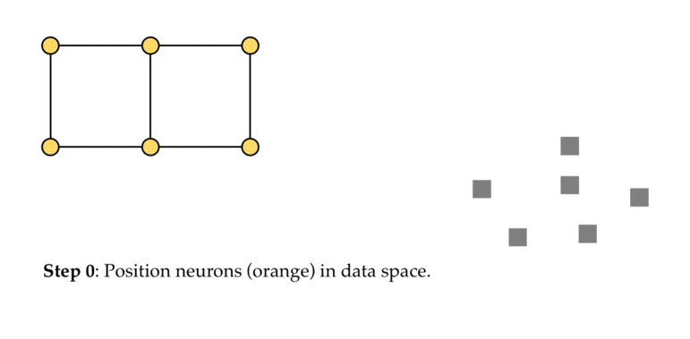

# Self organizing maps

Use cases:

- Clustering
- dimensionality reduction, or data viz cause it projects to 2D space
- find structure in data

SOM grids can either be rectangular or hexagonal. Each square or hexagon is a neuron.

Through multiple iterations, neurons on the grid will gradually coalesce around areas with high density of data points.

The neurons are moving in the dimensionality of the data!

To check that the algorithm has converged, we can plot the evolution of the SOM’s energy

How does dimensionality reduction occurs?:

- <https://youtu.be/g8O6e9C_CfY?t=684>
- Basically, we compute the distances between all neurons and data points and we put that on a 2D space.

To prevent any variable from overpowering the others, we need to standardize all variables.

## More

<https://annalyzin.wordpress.com/2017/11/02/self-organizing-map/>
