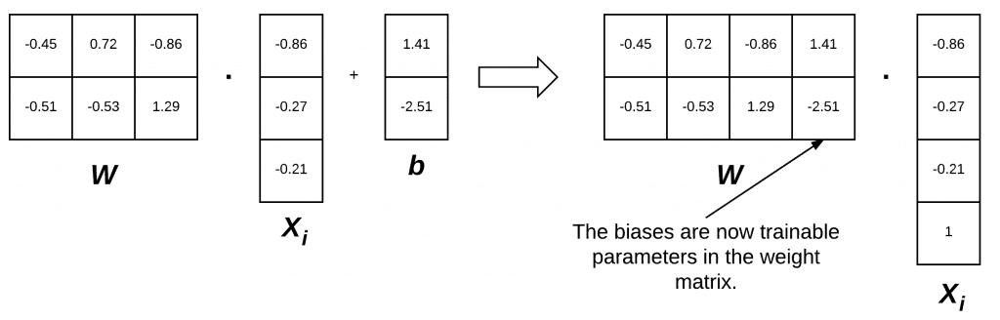

# Implementation tricks

## Bias trick

## Log-sum-exp

<https://gregorygundersen.com/blog/2020/02/09/log-sum-exp/>

## Einsum

- <https://rockt.github.io/2018/04/30/einsum>
- <https://www.drgoulu.com/2016/01/17/einsum/>
- <https://stackoverflow.com/questions/55894693/understanding-pytorch-einsum>
- <https://stackoverflow.com/questions/26089893/understanding-numpys-einsum>
- <https://old.reddit.com/r/MachineLearning/comments/r8tsv6/discussion_why_are_einstein_sum_notations_not/>
