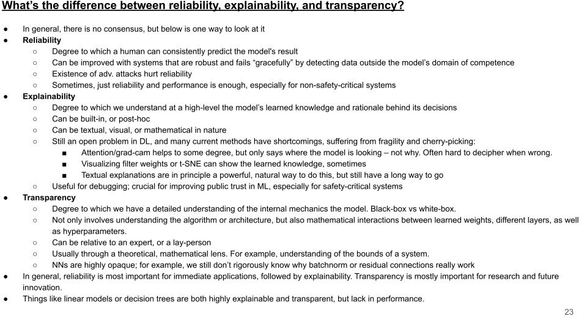

# ML Interpretability

## CNN Interpretability

When using a CNN classifier, does the gradient of the input image pixels with respect to the output classes tell you something about the importance of the pixels?

No! Gradient of that would measure how changing the pixel value would change the output. But a single pixel is not important, it is the combination of pixels in a region that is important.

Also, the local gradient is not very stable (it depends on the input image), so it is not a good measure of importance. It can actually be used to fool the classifier (adversarial examples).

Instead, use methods like integrated gradients, which measure the importance of a region by averaging the gradients over many input images.

## More

- <https://christophm.github.io/interpretable-ml-book/>
- <https://theaisummer.com/xai/>
