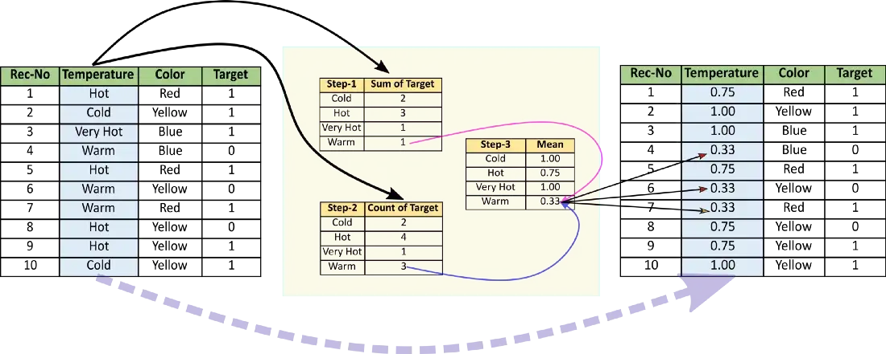
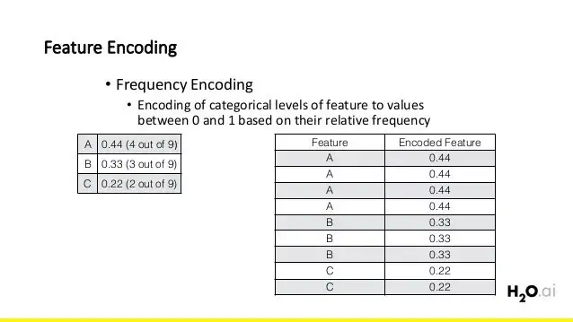

# Machine Learning

A machine learning algorithm is an algorithm that is able to learn patterns from data.

## Table of Contents

- [Machine Learning](#machine-learning)
  - [Table of Contents](#table-of-contents)
  - [Tackling a ML problem](#tackling-a-ml-problem)
  - [Maths behind ML](#maths-behind-ml)
    - [Problematic](#problematic)
    - [Hypothesis space](#hypothesis-space)
    - [Risk](#risk)
    - [Bias Variance Trade-off](#bias-variance-trade-off)
      - [Bias](#bias)
      - [Variance](#variance)
      - [Is it possible to overfit using an unsupervised learning algorithm?](#is-it-possible-to-overfit-using-an-unsupervised-learning-algorithm)
      - [High bias algorithms](#high-bias-algorithms)
      - [High variance algorithms](#high-variance-algorithms)
      - [More on bias and variance](#more-on-bias-and-variance)
    - [Losses](#losses)
      - [L2](#l2)
      - [L1](#l1)
      - [L0](#l0)
      - [MSE](#mse)
      - [SoftMax](#softmax)
      - [Binary Cross Entropy](#binary-cross-entropy)
      - [Cross entropy](#cross-entropy)
      - [Kullback-Leibler](#kullback-leibler)
      - [Focal loss](#focal-loss)
    - [Regularization](#regularization)
      - [L1 regularization: Lasso](#l1-regularization-lasso)
      - [L2 regularization: Ridge](#l2-regularization-ridge)
      - [L1 + L2 regularization: elastic net](#l1--l2-regularization-elastic-net)
      - [More about regularization](#more-about-regularization)
  - [How to sample data](#how-to-sample-data)
  - [Linear separability and the curse of dimensionality](#linear-separability-and-the-curse-of-dimensionality)
  - [Data preprocessing](#data-preprocessing)
    - [Is it necessary to standardize for linear regression?](#is-it-necessary-to-standardize-for-linear-regression)
    - [Why for PCA?](#why-for-pca)
    - [Why standardizing input data is necessary for euclidean distance based algorithms?](#why-standardizing-input-data-is-necessary-for-euclidean-distance-based-algorithms)
    - [Why standardizing input data is necessary for neural networds?](#why-standardizing-input-data-is-necessary-for-neural-networds)
    - [Numerical](#numerical)
    - [Categorical](#categorical)
  - [Generative models vs discriminative models](#generative-models-vs-discriminative-models)
  - [Ensemble methods](#ensemble-methods)
  - [Class imbalance](#class-imbalance)
  - [Hyperparameters Optimization](#hyperparameters-optimization)
  - [Gradient descent](#gradient-descent)
    - [Momentum](#momentum)
    - [Adaptive learning rates](#adaptive-learning-rates)
    - [Why do we need gradient descent?](#why-do-we-need-gradient-descent)
  - [Manifold hypothesis](#manifold-hypothesis)
  - [Embeddings, latent space, representation learning](#embeddings-latent-space-representation-learning)
    - [Embeddings](#embeddings)
  - [Output of sigmoid is not a probability](#output-of-sigmoid-is-not-a-probability)
  - [No free lunch theorem](#no-free-lunch-theorem)
  - [NLP](#nlp)
    - [Grams](#grams)
  - [Problems of AI](#problems-of-ai)
  - [Jobs in ML](#jobs-in-ml)
  - [Advice for ML engineers](#advice-for-ml-engineers)

## Tackling a ML problem

ML problem:

1. Define your problem. Identify the task.
2. Gather data (w or w/o labels)
3. Choose metric(s), what defines success? Do we want high specificity or high sensitivity?
4. Prepare, clean and split your data.
5. Choose an algorithm and a loss if needed.
6. Train and fine-tune parameters.
7. Repeat until satisfactory results are achieved or deadline is coming

## Maths behind ML

### Problematic

$p_{Z}(x,y) = p_{Y|X}(y|x)p_{X}(x)$ where $z = (x,y)$ and $p_{Y|X}(y|x)$ is the **oracle**.

The oracle is unknown, we want to find a function $h$ that approximates it: $y=h(x)$.

### Hypothesis space

We start by defining the hypothesis space $H$. It is the set of all possible functions that we can use to approximate the oracle.

$$h\in Y^{X}$$

In practice a particular algorithm is not able to search within the whole set of labelling functions $Y^{X}$, but only a subset $H\subset Y^{X}$ it's called the **hypothesis space**.

A good initial model should exploit the assumptions and the structure of the data. Most ML algorithms have an inductive bias, which is a set of assumptions about the data. Thus, it is important to choose the right algorithm for the problem.

### Risk

The risk measures the quality of a predictor $h$.

The real risk is the expectation of the loss $R_{true}(h) = E[L(y,h(x))]$. A good predictor is a predictor that minimizes the **real risk**.

Unfortunately, it cannot be computed because the oracle is unknown and we cannot sample from it.

We thus define the empirical risk: $R_{emp}^{S}(h) = \frac{1}{|S|}\sum L(y,h(x))$. It is the average loss on the test set $S$. The empirical risk is a good estimator of the real risk if the test set is representative of the whole dataset.

We can thus minimize the empirical risk to find a good predictor: this is the **empirical risk minimization** (ERM) principle:

$$\hat{h} = \underset{h\in H}{argmin}(R_{emp}^{S}(h))$$

But ERM is tricky:

- if $H$ is too rich we might find a predictor $\hat{h}$ that has a null empirical risk $R_{emp}^{S}(h) = 0$ but actually has $R_{true}(h) \neq 0$. This happens when $h$ fits the dataset $S$ perfectly, learned it by heart. This is overfitting.
- with too few points in our dataset $S$, the empirical risk could be zero.

Empirical risk cannot be fully trusted!

This is why we split the dataset in a training and a test set, it helps to avoid overfitting if the test set is representative of the whole dataset. We can also use cross validation to detect overfitting.

Why do we need three sets (training, validation, test)?

- training set: used to train the model
- validation set: to tune the hyperparameters of the model
- test set: used to evaluate the model. Used only once at the end of the project.

We need to split the dataset in three sets because we need to tune the hyperparameters of the model on the validation set. If we use the test set to tune the hyperparameters, we will overfit the model to the test set and the we will not have a good evaluation of the model.

### Bias Variance Trade-off

Choosing the appropriate level of richness for $H$ is difficult => **bias-variance trade-off**

$$y=f(x)+\epsilon$$

where $f$ is the oracle, $\epsilon$ noise in data.

The risk is the expectation of the squared error (MSE):

$$\begin{equation}
\begin{split}
R(\hat{f}) & = E[(y-\hat{f}(x))^{2}] \\
& = (f-E[\hat{f}])^{2}+E[(\hat{f}-E[\hat{f}])^{2}]+\sigma_{\epsilon}^{2}\\
& = bias^{2}+variance+\sigma_{\epsilon}^{2}
\end{split}
\end{equation}$$

The expected prediction error is thus the estimator variance + squared estimator bias + noise.

The term  $E[\hat{f}]$ is a tricky one. It refers to the average prediction after the model has been trained over several independent datasets.

Noise:

- if noise is gaussian => infinite support => true risk > 0
- if noise is uniform => finite support => true risk >= 0
- irreducible error $\epsilon$ : it is an error that we cannot reduce by choosing a better model. it is due to randomness or natural variability in a system.

#### Bias

- Bias is the inability of a machine learning model to capture the true relationship between the data variables.
- For example, in linear regression, the relationship between the X and the Y variable is assumed to be linear, when in reality the relationship may not be perfectly linear.
- measures the expected deviation from the true value of the function or parameter.
- Bias represents the difference between the average prediction and the true value
- The richer the hypothesis space the smaller can be this term.
- High bias can cause an algorithm to miss the relevant relations between features and target outputs (underfitting).

#### Variance

- variance measures how much, on average, predictions vary for a given data point
- it is an error from sensitivity to small fluctuations in the training set.
- If for a fixed algorithm (e.g. “Decision Tree”) the models for different training sets `L` and `L’` tend to differ a lot, we call this algorithm a high-variance one.
- High variance can cause an algorithm to model the random noise in the training data, rather than the intended outputs (overfitting).
- Should go to $0$ as the number of samples goes to infinity because the model cannot overfit the training set if it has infinite samples.

#### Is it possible to overfit using an unsupervised learning algorithm?

Overfitting happens when the model fits the training dataset more than it fits the underlying distribution.

Overfitting has little to do with whether the setting is supervised or unsupervised. Essentially, you can break your data points into two components: pattern + stochastic noise.

For instance, the classic unsupervised problem is clustering, where one measure of quality of the solution is the similarity of points within a cluster. As you keep forming more and more clusters, the similarity keeps increasing, but again, instead of clustering points with very similar values into a single cluster, you tend to assign them to finer clusters, at which point you are fitting the noise.

For example, take a simple autoencoder, which takes in the input, encodes it into a lower dimension, and can then reproduce the input in the decoding step. If you have too few training examples, too little regularization, and/or too high model complexity, the model can just ‘memorize’ the training examples that it would like to recreate, and not really learn how to encode them efficiently and effectively. When given new, unseen examples, the autoencoder won’t be able to effectively reproduce them.

#### High bias algorithms

- Linear regression: the model is too simple to capture the true relationship between the data variables.
- Logistic regression: same reason as linear regression.
- KNN: if K is too large, it will just predict the most common class in the training set.

#### High variance algorithms

- Decision trees: if the tree is too deep, it will overfit the training set.
- Neural networks: if the network is too deep, it will overfit the training set.
- Polynomial regression: if the polynomial is too high degree, it will not generalize well.
- KNN: if K is too small, the prediction will be very sensitive to the noise in the training set.
- SVM: by increasing $C$ (parameter that influences the number of violations of the margin allowed in the training data), it will increase the bias but decrease the variance

#### More on bias and variance

[PDF doc](./bias-variance-tradeoff.pdf)

### Losses

We need to define a loss function $L$ to measure the quality of a predictor $h$.

$L(y,h(x))$ is the loss of the prediction $h(x)$ for the true label $y$.

The empirical risk based on the binary loss is difficult to optimize (not convex, not smooth), we usually use a convex surrogate (or proxy) instead.

#### L2

We have $y_1, y_2, ..., y_k$ sampled from the same distribution but with some noise added.

We want to find an estimate $\beta$ that tries to guess the true value.

$$L_2 = \frac{1}{k}\sum{(y_i - \beta)^2}$$

We want to find $\beta$ that minimizes that quantity:

$$\frac{\partial L_2}{\partial \beta}= -\frac{2}{k}\sum{(y_i - \beta)}=0$$

$$\sum{(y_i - \beta)}=0$$

$$k\beta = \sum{y_i}$$

$$\beta = \frac{1}{k}\sum{y_i}$$

We found the **mean**.

#### L1

$$L_1 = \frac{1}{k}\sum{|y_i - \beta|}$$

$$\frac{\partial L_1}{\partial \beta}= -\frac{1}{k}\sum{sign(y_i - \beta)}=0$$

$$\sum{sign(y_i - \beta)}=0$$

$sign(y_i - \beta)=1$ when $y_i>\beta$, $-1$ for the opposite.

The equation is null only when half of $y_i$ are greater than $\beta$, it's the **median**.

#### L0

L0 is not really a mathematical loss.

L0 norm refers to the number of non-zero elements in a vector.

Using a L0 regularization loss would mean trying to reduce the number of non-zero elements in a vector.

L0 is not computationally tractable, so we use L1 instead, which can provide sparse solutions too.

#### MSE

Same as L2. But L2 is not really a loss, it is a norm.

Why not use MSE for binary classification? [Answer](https://github.com/Jonas1312/mse-for-binary-classification).

#### SoftMax

The softmax function is an extension of the sigmoid (logistic) function to the multi-class case. In other words, it can be shown that when there are only two classes softmax becomes the sigmoid function.

[The Softmax function and its derivative](https://eli.thegreenplace.net/2016/the-softmax-function-and-its-derivative/)

#### Binary Cross Entropy

$P(y|x)=z^y(1-z)^{1-y}$ where $z=f(x)$ (bernouilli distribution)

We use the log for numerical stability and to help with calculating the derivative $\frac{\partial P(y|x)}{\partial z}=0$:
$$ln(P(y|x)) = ln(z^y(1-z)^{1-y})=yln(z)+(1-y)ln(1-z)$$

We want to maximise it, but usually we do gradient **descent**, so we just add a negative sign. min/max of loglikelihood is the same as the min/max of likelihood.

#### Cross entropy

- it measures the divergence between two probability distribution
- if the cross entropy is large, it means that the difference between two distribution is large
- while if the cross entropy is small, it means that two distribution is similar to each other.
- it is not a proper distance since it is not symmetric: <https://sebastianraschka.com/faq/docs/proper-metric-cross-entropy.html>

$$\mathrm{H}(p, q) = \mathrm{E}_p[-\log q] = \mathrm{H}(p) + D_{\mathrm{KL}}(p \| q)$$

For a multiclass problem:

$$L_{CE} = -\sum_{i=1}^{n}y_ilog(\hat{y_i}) = -log(\hat{y_k})$$

where $\hat{y_k}$ is the probability that the sample belongs to the ground truth class $k$.

We can show that minimizing the cross entropy is equivalent to maximizing the log likelihood.

When training a model, you can have an estime of what's the probability for predicting the right class.
For example, if you have a cross entropy loss of $4.17$, $H = 4.17 = -\sum_{i=1}^{n}y_ilog(\hat{y_i})$, it means that the probability of predicting the right class is $e^{-4.17} = 0.015 = \frac{1}{65}$. If the number of classes is greather than 65, then the model has learned something.

#### Kullback-Leibler

- <https://www.countbayesie.com/blog/2017/5/9/kullback-leibler-divergence-explained>
- <https://jhui.github.io/2017/01/05/Deep-learning-Information-theory/>

#### Focal loss

- <https://leimao.github.io/blog/Focal-Loss-Explained/>

### Regularization

Regularization is a technique used to avoid overfitting.

It adds a term to the loss function that penalizes the complexity of the model.

- $L_{reg}(y,f_{\theta}(x)) = L(y,f_{\theta}(x)) + \lambda \Omega(f_{\theta})$
- $\lambda$ is the regularization factor
- Regularization can help reduce both bias and variance in a machine learning model, but the primary effect is to reduce variance.
- Regularization can sometimes lead to a small reduction in bias by encouraging simpler models that are less likely to underfit.
- Regularization is more effective at reducing variance by adding a penalty term to the model's objective function, which discourages it from having excessively large weights or coefficients.

#### L1 regularization: Lasso

For the L1 regularization, useless weights will be set to zero, thus you reduce the number of weights in your network, that is the hypothesis space.

L1-norm is preferable if the sparsity of the model’s parameters is important.

#### L2 regularization: Ridge

For the L2 regularization, large weights tend to cause sharp transitions in the activation functions and thus large changes in output for small changes in inputs.

With L2, you also of course reduce the hypothesis space, because a weight can't have values in `]-inf, +inf[` anymore, but rather values in a much smaller interval like `]-2, 2[` for instance.

A network with large weights may change its behavior quite a bit in response to small changes in the input. Because it means that the model is overly relying on a single thing to produce its output.

L2-norm may not penalize the near-zero parameters enough to push it to 0.

**Do not regularize BIAS!**, it might lead to underfitting.

#### L1 + L2 regularization: elastic net

Both L1 and L2 regularization can be used together, this is called the elastic net. It combines the properties of both L1 and L2 regularization.

#### More about regularization

[PDF doc](./regularization.pdf)

## How to sample data

- batch sampling (one dataset)
- online sampling (one by one)
- hybrid sampling (per batch)
- active sampling (cherry picking) **not i.i.d anymore because the distribution changes**

## Linear separability and the curse of dimensionality

Some algorithms can only separate data with a linear boundary, such as logistic regression, SVM, perceptron, etc.

But sometimes the classes can't be separated with an hyperplane.

The solution is to project the data into a high-dimension space so that the points become linearly separable.

But this can lead to the **curse of dimensionality** if the dimensionnality is too high.

This phenomena occurs when the dimensionality of the data increases, **the sparsity of the data increases**:

- let's say we're in two dims
- eucl distance between two points: $d(A,B) = \sqrt{(x_A-x_B)^2 + (y_A-y_B)^2}$
- now let's say that A and B lie on the $y=x$ line, that is $x_A=y_A$ and $x_B=y_B$:
- $d(A,B) = \sqrt{(x_A-x_B)^2 + (x_A-x_B)^2}$
- $d(A,B) = \sqrt{2(x_A-x_B)^2}$
- $d(A,B) = \sqrt{2}*\sqrt{(x_A-x_B)^2}$
- We see a factor of $\sqrt{2}$
- For $d=1$ we see a factor of $\sqrt{1}$

We can see that the distance between two points scales with the square root of the number of dimensions.

It means that with a high number of dimensions the data becomes very sparse (at fixed number of points). There are fewer observations per region.

So to keep the density constant, we need many more points to sample. We need exponentially more points to fill the space!

As the data’s dimensionality increases the sparsity of the data increases making it harder to ascertain a pattern. As the number of feature or dimensions grows, **the amount of data we need to generalize accurately grows exponentially**.

Due to this sparsity, it becomes much more easy to find a separable hyperplane because the likelihood that a training sample lies on the wrong side of the best hyperplane becomes infinitely small when the number of features becomes infinitely large.

The so called curse of dimensionality can be summarized very succinctly as “some algorithms behave badly in many dimensions” like kmeans or knn, because **the more you increase the dimensionnality, the greater the distance between points**.

More dimensions make your model more discriminative but at the same time they require more rich data sources and longer time to train.

## Data preprocessing

Sometimes the variables do not vary in the same ranges, can be a problem if the ML algorithm uses the euclidean distance or gradient descent.

There are also some algorithms that converge faster if data is normalized (neural networks).

Ways to normalize data:

- scale to a range: `[0, 1]` or `[-1, 1]` using min-max normalization
- standardize (also called Z-score normalization): substract $\mu$ and divide by $\sigma$
- normalize: divide by the norm of the vector

All normalization factors must be computed on training set! This is to avoid data leakage.

### Is it necessary to standardize for linear regression?

No, because the coefficients are not affected by the scale of the data.

But, it can be important if using regularization!

It's also recommended to do it to avoid numerical issues.

### Why for PCA?

 rincipal Component Analysis (PCA) is an algorithm where standardization is crucial, since it is “analyzing” the variances of the different features.

### Why standardizing input data is necessary for euclidean distance based algorithms?

Let's say we have this design matrix:

|     | X1  | X2  |     |     |
| --- | --- | --- | --- | --- |
| A   | 0   | 0   |     |     |
| B   | 2   | 1   |     |     |
| C   | 0.5 | 10  |     |     |

We have:

- $d(A, B) = \sqrt{(0-2)^2 + (0-1)^2} = \sqrt{5}$
- $d(A, C) = \sqrt{(0-0.5)^2 + (0-10)^2} = \sqrt{100.25}$
- $d(B, C) = \sqrt{(2-0.5)^2 + (1-10)^2} = \sqrt{83.25}$

So a ML algorithm could cluster $A$ and $B$ within the same class and $C$ in another class since $A$ and $B$ are quite close.

The euclidean distance is dominated by the $X_2$ variable.

If $X_2$ is in the range `[0, 10000000]` and $X_1$ is in the range `[0, 2]`, then we can see that $C$ is not that far from $A$!

Let's standardize the data to range `[0, 1]`:

|     | X1   | X2  |     |     |
| --- | ---- | --- | --- | --- |
| A   | 0    | 0   |     |     |
| B   | 1    | ~0  |     |     |
| C   | 0.25 | ~0  |     |     |

We have:

- $d(A, B) = \sqrt{(0-1)^2 + (0-0)^2} = \sqrt{1}$
- $d(A, C) = \sqrt{(0-0.25)^2 + (0-0)^2} = \sqrt{0.25}$
- $d(B, C) = \sqrt{(1-0.25)^2 + (0-0)^2} = \sqrt{0.75}$

We can see that $A$ and $C$ are closer than $A$ and $B$! So the algorithm will cluster $A$ and $C$ in the same class.

### Why standardizing input data is necessary for neural networds?

Some algorithms like decision trees are (almost) not affected by the scale of the data, but this is not the case for neural networks (and most of the other ML algorithms).

The loss landscape is characterized by the parameter values.

Let's say that we have a simple NN with two input neurons $\mathcal{X_1}\in{[0, 1]}$ and $\mathcal{X_2}\in{[0, 0.01]}$:

Thus we have $\mathcal{X_1}\gg\mathcal{X_2}$ (on average).

$$\mathcal{Y}=\mathcal{w_1}\mathcal{X_1}+\mathcal{w_2}\mathcal{X_2}$$

We know that $\mathcal{X_1}$ and $\mathcal{X_2}$ are both equally important to predict $\mathcal{Y}$, thus $\mathcal{w_1}\ll\mathcal{w_2}$.

$$\mathcal{w_1}^{(n+1)}=\mathcal{w_1}^{(n)} - \eta_1*\frac{\partial L}{\partial \mathcal{w_1}}=\mathcal{w_1}^{(n)} - \eta_1*\frac{\partial L}{\partial \mathcal{y}}*\mathcal{X_1}$$

Thus $\eta_1$ must be much smaller than $\eta_2$, which is not really efficient because it requires to set one learning rate for each parameter.

**Solution**: Standardize the input variables and use **one** learning for all parameters.

### Numerical

- discrete (ordinal):
  - number of items in a basket, rating (1-5), ...
  - depends on your algorithm
    - standardize or normalize (if you want to use a distance-based algorithm)
    - keep as is (if you want to use a tree-based algorithm)
- continuous:
  - salary, age...
  - use **standardization**, **normalization**, **binning**

### Categorical

- binary:
  - yes/no, pass/fail, male/female, ...
  - use **label encoding** (yes=1, no=0, ...)
- nominal:
  - no order, distinct categories (France, Belgium, Germany, ...) or (red, green, blue, ...) or (male, female, ...)
  - use **one-hot encoding** for variables with low to mid cardinality (< 5-10 levels). Make sur to drop one of the columns to avoid multicollinearity for regression problems (dummy variable trap).
- ordinal:
  - has an order (low, medium, high, ...)
  - use **label encoding** (low=0, medium=1, high=2, ...)
- many levels? (high cardinality, more than 10):
  - we need to reduce the cardinality to avoid the **curse of dimensionality**
  - use **embedding** (learn a vector representation of the variable, used in NLP for example)
  - use **target encoding** (also known as **mean encoding**):
    - replace the categorical variable with the mean of the target variable
    - you average the target value by category
    - 
    - Target encoding is good because it picks up values that can explain the target.
    - the problem with target encoding is that it might cause data leakage, as we are considering feedback from the target variable while computing any summary statistic.
    - A solution is to use a modified version: Leave-one-out Target encoding; for a particular data point or row, the mean of the target is calculated by considering all rows in the same categorical level except itself. It mitigates data leakage and overfitting to some extent.
  - frequency encoding: 

## Generative models vs discriminative models

A generative model learns the joint probability distribution $p(x,y)$.

A discriminative model learns the conditional probability distribution $p(y|x)$.

## Ensemble methods

[Notes about ensemble](./ensemble/ensemble.md)

## Class imbalance

Some algorithms are more sensitive to class imbalance than others. For example, decision trees are not sensitive to class imbalance, while neural networks are.

Strategies to deal with class imbalance:

- Oversampling: duplicate the minority class
- Undersampling: remove samples from the majority class
- Generate synthetic samples: SMOTE, GANs
- Change the metric (Most of the time, just selecting the decision threshold of the model trained over imbalanced data based on the metric of interest is enough.)
- penalize the loss during training
- Use tree based algorithms

Weighted loss functions vs weighted sampling?

- Yann LeCun suggests weighted sampling.
- The rationale behind is that you don't want to trust a single stochastic gradient that gets magnified possibly a lot.
- Better to recompute it a few times during the entire epoch.

Many papers use the term long-tail learning to refer to class imbalance in multi-class classification tasks, so you can find lots of relevant research under this keyword

## Hyperparameters Optimization

- Babysitting: trial and error
- Grid Search: exhaustive search over a grid of hyperparameters
- Random Search: random search over a grid of hyperparameters
- Bayesian Optimization: $P(hyperparams|metric) = \frac{P(metric|hyperparams)P(hyperparams)}{P(metric)}$

## Gradient descent

**Gradient always points in the direction of steepest ascent.**

$$w^{(t+1)}=w^{(t)} - \eta\frac{\partial L}{\partial w}$$

### Momentum

Not only move in the (opposite) direction of the gradient, but also move in the "averaged" direction of the last few updates:

$$w^{(t+1)}=w^{(t)} - \eta V^{(t)}$$
where:

$$V^{(t)}=\beta V^{(t-1)}+(1-\beta)\frac{\partial L}{\partial w}$$

with $\beta=0.9$ usually.

### Adaptive learning rates

Some optimizers use adaptive learning rates, which means that the learning rate is not constant but changes over time:

- decrease learning rate if the gradient changes its direction
- increase learning rate if the gradient stays consistent.

### Why do we need gradient descent?

We could just use bisection or newton methods to solve $f(x)=0$?

In the case of non-convex problems, the equation would have more than one solution, but I do not think that non-convexity is the issue here.

The problem is that neural nets have way too many parameters to try and solve that equation analytically. While we can solve it for two or three parameters $\theta$, it becomes intractable in practice for higher and higher dimensionalities (parameters in $\theta$).

So the problem is the curse of dimensionality.

## Manifold hypothesis

Assumption that says: one's observed data lie on a low-dimensional manifold embedded in a higher-dimensional space.

High dimensional data is actually (often, in theory) "embedded" in a lower dimensional manifold, and machine learning models are trying to learn the geometry of this manifold.

The Manifold Hypothesis is a heuristic that states that real-world high-dimensional data lie on low-dimensional manifolds embedded within the high-dimensional space.

It explains why machine learning techniques are able to find useful features and produce accurate predictions from datasets that have a potentially large number of dimensions (variables).

The mathematical basis for this is that a lot of the dimensions are highly correlated, making them redundant.

In other words, the extrinsic dimensionality of a dataset often exceeds intrinsic dimensionality of an underlying phenomena.

## Embeddings, latent space, representation learning

- representations are encoded versions of the original input: one-hot encoding, embeddings, latent vectors, ...
- latent vectors are intermediate representations: output of a layer in a neural network, bottleneck of an autoencoder, ...
- embedding vectors are representations where similar items are close to each other: word2vec, siamese networks, ...

### Embeddings

In domains such as recommender systems, we must transform non-numeric variables (ex. items and users) into numbers and vectors.

Prior to embeddings, one of the most common methods used was one-hot encoding.

But we literally end up with a huge vector of 0s with a single or a handful of 1’s. This simplicity comes with drawbacks. For variables with many unique categories, it creates an unmanageable number of dimensions.

Since each item is technically equidistant in vector space, it omits context around similarity.

Intuitively, we want to be able to create a denser representation of the categories and maintain some of the implicit relationship information between items.

We need a way to reduce the number of categorical variables so we can place items of similar categories closer together. That’s exactly what an embedding is.

Embeddings are dense numerical representations of real-world objects and relationships, expressed as a vector. The vector space quantifies the semantic similarity between categories.

PCA can help reduce the dimensionality of the data, but PCA leads to a loss of information. Moreover, PCA is only applicable to linear relationships.

Singular Value Decomposition via matrix factorization is another method that can be used to reduce the dimensionality of the data.

In NLP, Word2VEC, will transform words that are found in similar contexts to vector (embeddings) that are close to each other in vector space.

Generally, embeddings make ML models more efficient and easier to work with, and can be used with other models as well.

Neural network embeddings have 3 primary purposes:

1. Finding nearest neighbors in the embedding space. These can be used to make recommendations based on user interests or cluster categories.
2. As input to a machine learning model for a supervised task.
3. For visualization of concepts and relations between categories.

## Output of sigmoid is not a probability

Sigmoid/Softmax of neural networks is more of a score than probability estimates. Just adding a softmax activation does not magically turn outputs into probabilities [source](https://jtuckerk.github.io/prediction_probabilities.html).

Most deep networks nowadays are overconfident: <https://arxiv.org/pdf/1706.04599.pdf>

One can use temperature scaling, a learnable parameter inserted in the softmax: <https://lukesalamone.github.io/posts/what-is-temperature/>.

Uncertainty calibration: <https://pair.withgoogle.com/explorables/uncertainty-calibration/>

## No free lunch theorem

States that:

> When averaged across all possible situations, every algorithm performs equally well.

For every case where an algorithm works, I could construct a situation where it fails terribly.

Implies that assumptions are where the power of your mdoel comes from. This is why it's important to understand the assumptions and inductive priors of your model.

## NLP

### Grams

- unigram: one word
- bigram: two words
- trigram: three words
- n-gram: n words

A bigram is a two-word sequence of words like "How are you doing": "How are", "are you", "you doing".

The items can be phonemes, syllables, letters, words, or base pairs according to the application.

How many $N$-grams in a sentence? If $X$ is the number of words in a given sentence, the number of $N$-grams for sentence would be: $X - (N - 1)$.

## Problems of AI

- Human-in-the-loop requirements (facebook still employs 15000 people to assist their content moderation algorithm)
- manual data labelling is expensive and slow
- global shortage of data scientists
- hard to interpret an algorithm decision
- AI algorithms often make biased decisions, this is illegal
- privacy issue (faces, fingerprints, biometrics)

## Jobs in ML

What is a data scientist, ML engineer, ... ?

- A data scientist is a “person who is better at statistics than any software engineer and better at software engineering than any statistician”.
- data engineer (builds the data ingestion pipelines)
- machine learning engineer (train and iterate models to perform the task)
- software engineer (aids with integrating machine learning model with the rest of the product)

## Advice for ML engineers

- don't apply the same model to different problems. Instead, try to understand the problem and the data, and then choose the model that best fits the problem.
- don't choose complex models just because they are complex. Instead, choose the simplest model that solves the problem.
