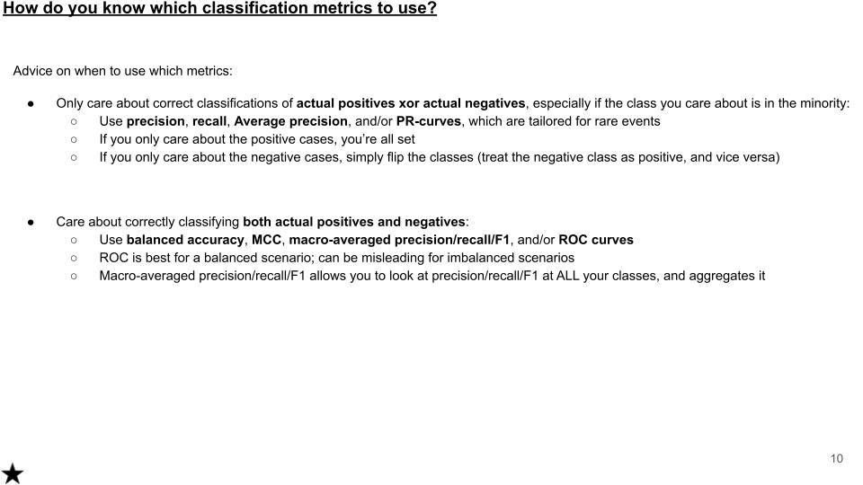
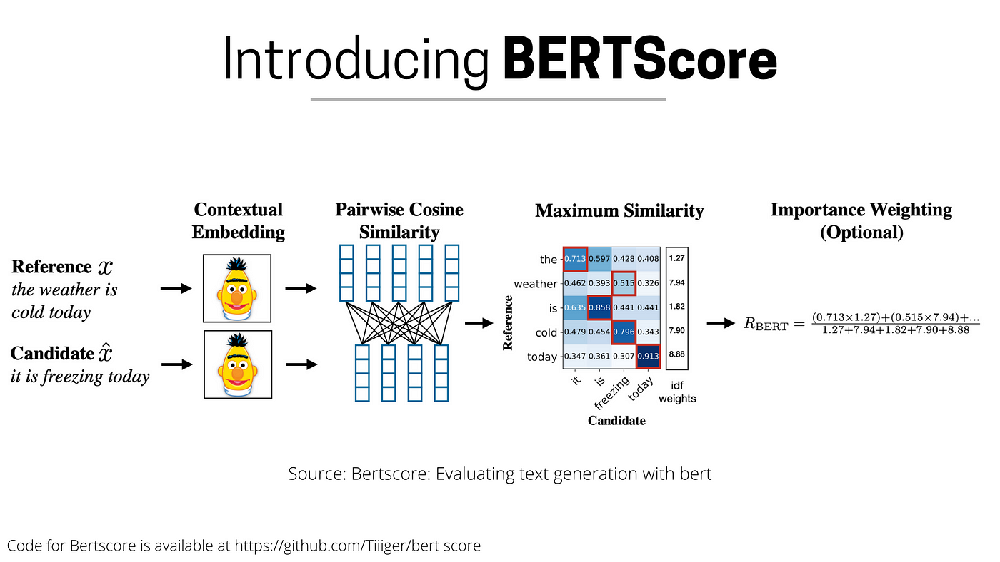

# Metrics

## Classification

[An Overview of General Performance Metrics of Binary Classifier Systems](./Metrics%20of%20Binary%20Classifier%20Systems.pdf)



## AUROC

- ROC Curves summarize the trade-off between the **true positive rate** and **false positive rate** for a predictive model using different probability thresholds.
- AUROC = Area Under the Receiver Operating Characteristic curve.
- The AUROC of a classifier is equal to the probability that the classifier will rank a randomly chosen positive example higher than a randomly chosen negative example $P(score(x^{+}) \gt score(x^{−}))$ ([source](https://stats.stackexchange.com/a/133435)). A skilful model will assign a higher score to a randomly chosen real positive occurrence than a negative occurrence on average.
- How to train a NN to optimize the AUROC: RL or derivate free methods

## Precision-Recall curve vs ROC curve

- Precision: how often the classifier is correct when it predicts positive $PRE = \frac{TP}{TP+FP}$
- Recall: how often the classifier is correct for all positive instances
- [The Precision-Recall Plot Is More Informative than the ROC Plot When Evaluating Binary Classifiers on Imbalanced Datasets](https://journals.plos.org/plosone/article?id=10.1371/journal.pone.0118432)
- Indeed, ROC is useful when evaluating general-purpose classification, while AUPRC is the superior method when classifying rare events.
- <https://towardsdatascience.com/why-you-should-stop-using-the-roc-curve-a46a9adc728>
- <https://stats.stackexchange.com/questions/7207/roc-vs-precision-and-recall-curves>

## mAP

So in object detection, we usually say that a predicted box is ok if the IoU of the ground truth box and the predicted box is greater than a threshold (usually 0.5). This is like a binary classification problem.

Different threshold values will give different precision and recall values, and for all threshold values, we can actually draw the precision-recall curve.

The AP is the area under the precision-recall curve.

In object detection, the mAP is the mean of the average precision (AP) accross all classes.

## MCC

<https://lettier.github.io/posts/2016-08-05-matthews-correlation-coefficient.html>

## Cosine similarity

Cosine similarity is a measure of similarity between two non-zero vectors of an inner product space that measures the cosine of the angle between them.

$$ \cos(\theta) = \frac{A \cdot B}{\|A\| \|B\|} $$

- -1 or 1 if vectors are collinear
- cosine similarity between vectors `[2,0,2]` and `[0,1,0]` is 0.

Cosine similarity looks at the angle between two vectors, euclidian similarity at the distance between two points.

Let's say you are in an e-commerce setting and you want to compare users for product recommendations:

    User 1 bought 1x eggs, 1x flour and 1x sugar.
    User 2 bought 100x eggs, 100x flour and 100x sugar
    User 3 bought 1x eggs, 1x Vodka and 1x Red Bull

By cosine similarity, user 1 and user 2 are more similar. By euclidean similarity, user 3 is more similar to user 1.

200 dimensions space is so, so empty. Everything is far from everything else. That's why we use cosine similarity - because everything is far from everything else, so if two vectors are pointing in the same direction, that's already pretty good.

Cosine similarity is generally used as a metric for measuring distance when the magnitude of the vectors does not matter. This happens for example when working with text data represented by word counts. We could assume that when a word (e.g. science) occurs more frequent in document 1 than it does in document 2, that document 1 is more related to the topic of science. However, it could also be the case that we are working with documents of uneven lengths (Wikipedia articles for example). Then, science probably occurred more in document 1 just because it was way longer than document 2. Cosine similarity corrects for this.

Text data is the most typical example for when to use this metric. However, you might also want to apply cosine similarity for other cases where some properties of the instances make so that the weights might be larger without meaning anything different. Sensor values that were captured in various lengths (in time) between instances could be such an example.

## Confidence Intervals for ML Models

K-cross validation gives a good estimate but no CI...

### CI for an estimated parameter (accuracy)

$$CI = \bar{x} \pm z \frac{s}{\sqrt{n}}$$

- $\bar{x}$ is the sample mean for example.
- $z$ is the confidence level value (1.96 for 95%: $P(-1.96 < Z < 1.96) = 0.95$)
- $s$ sample standard deviation
- $n$ sample size

Accuracy is the number of correct predictions $X = \sum{(\hat{y} == y)}$, divided by the test set size $n$.

We consider each prediction of the model as a Bernoulli trial, and the number of correct predictions $X$ is a random variable following a binomial law $Bin(n,p)$:

- $n$ test set size
- $p$ probability of success, that is prob to have a correct prediction $\hat{y} == y$
- $k$ number of trials

The number of correct predictions is $E[X]= np$, and the variance of the estimate is $\sigma^2 = np(1-p)$.

We want the accuracy to be normalized by the test set size, so we divide the expectation and standard deviation of the random variable $X$ by $n$ (and the variance by $n^2$).

$$\frac{\sigma^2}{n^2} = \frac{1}{n}p(1-p) = \frac{1}{n}ACC(1-ACC)$$

$$\frac{\sigma}{n}=\sqrt{\frac{1}{n}ACC(1-ACC)}$$

We can now compute the CI:

$$CI = ACC \pm z \sqrt{\frac{1}{n}ACC(1-ACC)}$$

### Bootstrap the test set

With replacement of course, 200 bootstraps.

For a 95 CI:

```python
ci_lower = np.percentile(test_accuracies, 2.5)
ci_upper = np.percentile(test_accuracies, 97.5)
```

## NLP Metrics

### BLEU

Use case: translation

It calculates the **precision** of n-grams (sequences of n words) in the generated text that appear in the reference text, adjusted by a brevity penalty to prevent overly short generations from being overly rewarded.

Captures word-by-word similarity. It is a good metric for comparing translations, but it has limitations, such as not considering synonyms or paraphrases.

### ROUGE

Use case: text summarization

ROUGE tries to compare the overall meaning of the generated text with the reference text.

It calculates the F1 score of n-grams in the generated text that appear in the reference text, with different versions of ROUGE focusing on different n-gram lengths (ROUGE-1, ROUGE-2, etc.) or on word sequences (ROUGE-L).

### METEOR

Use case: translation, text generation

This metric improves upon the shortcomings of BLEU by considering synonyms, stemming, and paraphrasing, which makes it more flexible. It combines precision and recall, and it aligns words between the generated and reference texts using a harmony of exact, stem, synonym, and paraphrase matches.

### BERTScore

Use case: summarization, translation, text similarity

BERTScore computes the similarity of tokens in candidate and reference texts based on their embeddings, capturing deeper semantic similarities that go beyond surface-level exact word matches.



The importance of each token is weighted by the inverse document frequency (IDF) of the token in the reference text, which helps to prioritize rare words that are more informative.
