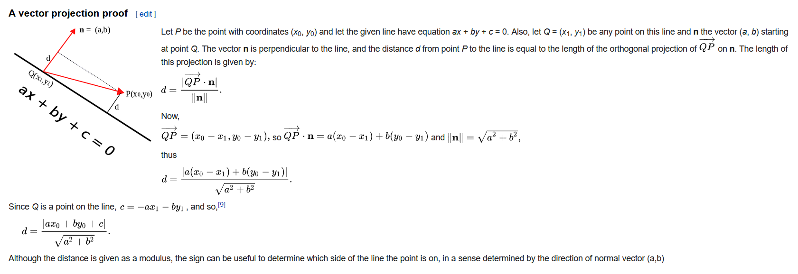

# Geometry

distance point $(x_{A}, y_{A})$ to line $ax+by+c=0$ is:

$$\frac{|ax_{A}+by_{A}+c|}{\sqrt{a^{2}+b^{2}}}$$

perpendicular vector to line $ax+by+c=0$ is $\overrightarrow{u}=(a,b)$

distance line to line: $d = \frac{|c_2 - c_1|}{\sqrt{a^2 + b^2}}= \frac{|c_2 - c_1|}{\sqrt{1 + m^2}}$
