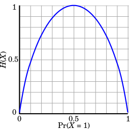
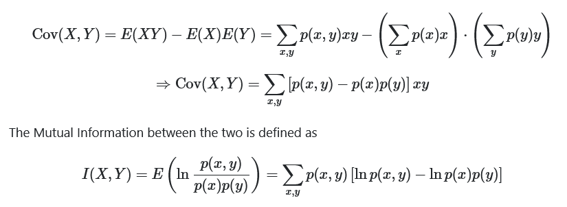
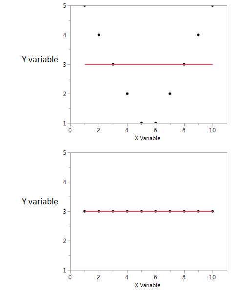
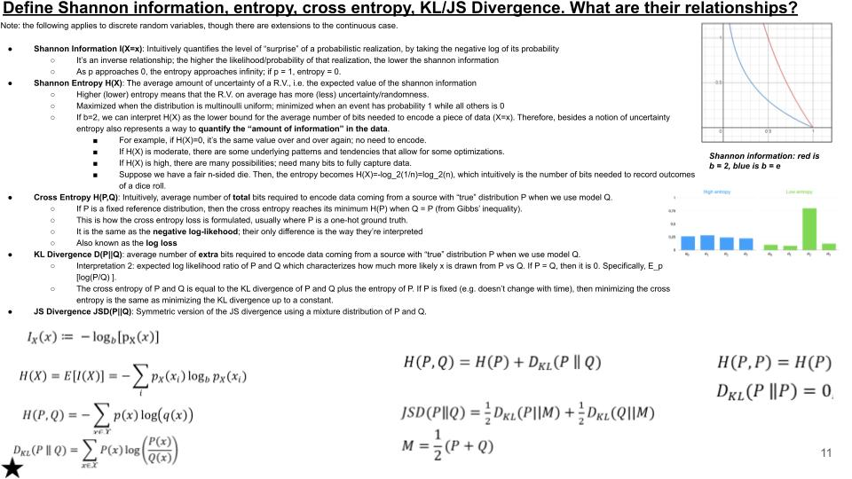

# Information theory

surprisal: how surprised I am when I learn the value of X

  Suprisal(x) = -log p(X=x)

entropy: how surprised I expect to be

  H(p)        = 𝔼_X -log p(X) = ∑_x p(X=x) * -log p(X=x)

cross-entropy: how surprised I expect Bob to be (if Bob's beliefs are q instead of p)

  H(p,q)      = 𝔼_X -log q(X) = ∑_x p(X=x) * -log q(X=x)

KL divergence: how much *more* surprised I expect Bob to be than me

  Dkl(p || q) = H(p,q) - H(p,p) = ∑_x p(X=x) * log p(X=x)/q(X=x)

information gain: how much less surprised I expect Bob to be if he knew that Y=y

  IG(q|Y=y)   = Dkl(q(X|Y=y) || q(X))

mutual information: how much information I expect to gain about X from learning the value of Y

  I(X;Y)      = 𝔼_Y IG(q|Y=y) = 𝔼_Y Dkl(q(X|Y=y) || q(X))

## Quantity of information

The information content of an event X is a function which increases as the probability $P(X)$  of an event decreases. When $P(X)$ is close to 1, the surprisal of the event is low, but if $P(X)$ is close to 0, the surprisal of the event is high. This relationship is described by the function:

$$I(X) = -log_2(p(X))$$

which gives 0 surprise when the probability of the event is 1.

## Entropy

the entropy H(X) of a random variable X with n possible events that occur with probabilities (p1,p2,…,pn), is defined as:

$$H(X) = E[I(X)]=-\sum_{i}^{n}{p(x_i) * log_2(p(x_i))}$$

H is maximum when all the $p_i$ are equal. This is the most uncertain, or 'impure', situation.

For decision trees, a feature with a lot of different values will be impure. The feature with the highest impurity will be split.

H(X) roughly means the amount of information (in bits) it takes to describe the outcome of X. It is the expected amount of information in an event drawn from that distribution.

Entropy establishes a lower bound for the average bits to encode events with the probability distribution P.

### Coin explanation

for a normal coin:
$$H(X) = -\sum_{i}^{n}{0.5 * log_2(0.5)}=1 bit$$

The fair coin takes exactly 1 bit to describe one of two outcomes, which makes sense.

This answers the question: “if I flip a coin with probability p of coming up heads, how surprised am I to see the result?”. With a fair coin, we don’t really have anything to go on, so no matter what happens, we’re the most “surprised” we can be.

On an unfair coin, on average each toss of the coin delivers less than one full bit of information. we know it’s biased to one side or another, so we’re "less surprised" accordingly. For example, if p = 0.1, we have an expectation that it’ll probably be tails, so most of the time observing the outcome doesn’t tell us much that we couldn’t have already guessed.

### Binary search

By asking the middle number, you eliminate half of the search space.

With this tactic you only need 5 questions for the $[1,32]$ search space: $log_2(32)=5 bits$

The question is a yes or no question, it's binary. We can encode each answer with a 1 or 0.

It means that with 5 questions we can totally describe the system/message, that is the number we're trying to guess.

The entropy of a random variable is the average bits of information needed to guess it's value successfully.

## Cross entropy

Cross-entropy H(P, Q) measures the expected number of bits to encode X with distribution P using an encoding scheme targeted for distribution Q.

$$H(P, Q) = -\sum_{x}^{}{P(x) * log(Q(x))}$$

In ML, we want our predictions Q to match the ground truth P. If they match, the cross-entropy will be the minimum and therefore, we often use it as our training objective.

In ML multiclass classification, $P(x)$ is $1$ for the true class, $0$ for the other, so the sum has just one member $-log(Q(x))$.

## Mutual information

$$I(X;Y) = H(X) - H(X|Y)$$

It measures the “amount of information” learned from knowledge of random variable Y about the other random variable X.

This definition has an intuitive interpretation:

- I(X; Y ) is the reduction of uncertainty in X when Y is observed.
- If X and Y are independent, then I(X; Y ) = 0, because knowing one variable reveals nothing about the other
- by contrast, if X and Y are related by a deterministic, invertible function, then maximal mutual information is attained.

## Mutual information versus covariance

- covariance is weighted sum of product of random variables
- MI is weigthed sum of joint probabilities
- So the two are not antagonistic—they are complementary
- describing different aspects of the association between two random variables.
- One could comment that Mutual Information "is not concerned" whether the association is linear or not
- while Covariance may be zero and the variables may still be stochastically dependent
- Covariance can be calculated directly from a data sample without the need to actually know the probability distributions involved
- while Mutual Information requires knowledge of the distributions, whose estimation, if unknown, is a much more delicate and uncertain work compared to the estimation of Covariance.

Two examples below, both have null covariance:

The first plot holds information about the mutual information shared by X and Y:

- I see that if I have a high or low value of X then I'm likely to get a high value of Y.
- But if the value of X is moderate then I have a low value of Y.

In the second plot, X tells me nothing about Y.

$cov(X, Y) = E[(X-E[X])(Y-E[Y])] = 0$ since $Y-E[Y] = 0$

## KL Divergence

The KL divergence yields a concrete value that tells you how many actual bits of space on disk you will waste if you try to use an encoding table from one ZIP file of data to encode another ZIP file of data. It's not just theoretical, this is exactly the type of task that it's used for.

The closer the folders are to each other in content, the fewer wasted bits. So, we can use this to measure how similar two sets of information are, in a manner of speaking.

These 'wasted bits' are also known as relative entropy, since entropy basically is a measure of how disordered something can be. The more disordered, the more possibilities we have to choose from, thus the more information possible.

Entropy does not guarantee that the information is usable. It only guarantees how much of this quantity we can get, much like pipes serving water. Yes, they will likely serve water, but you can accidentally have sludge come through instead. Still, their capacity is the same.

One thing to note is that with our ZIP files, if you use the encoding tables from one to encode the other, then you will end up with different relative entropy (i.e. our 'wasted bits') numbers than if you did the vice versa. This is because the KL is not what's called symmetric. That is, it can have different meaning based upon which direction it goes.

## Information, Entropy, Cross-entropy, KL/JS divergence

