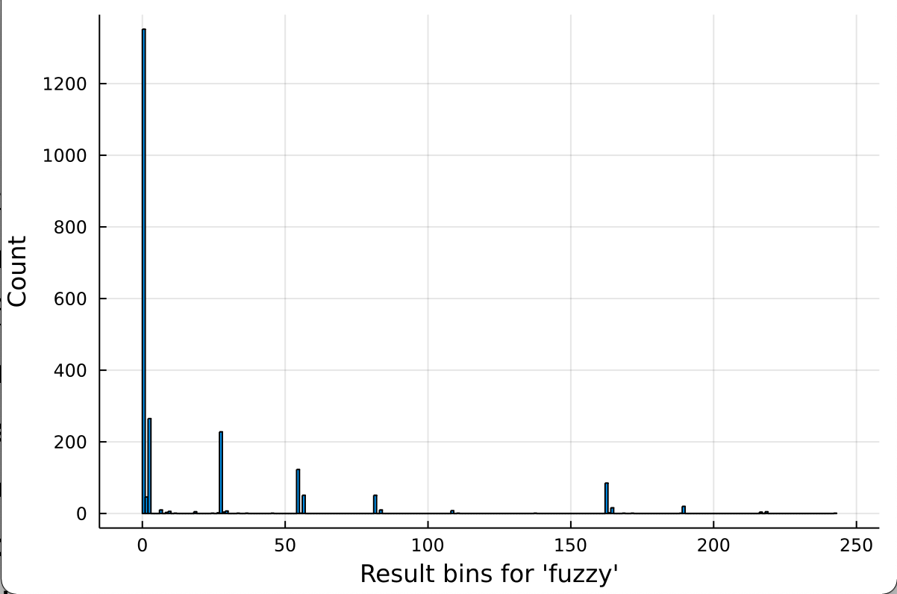
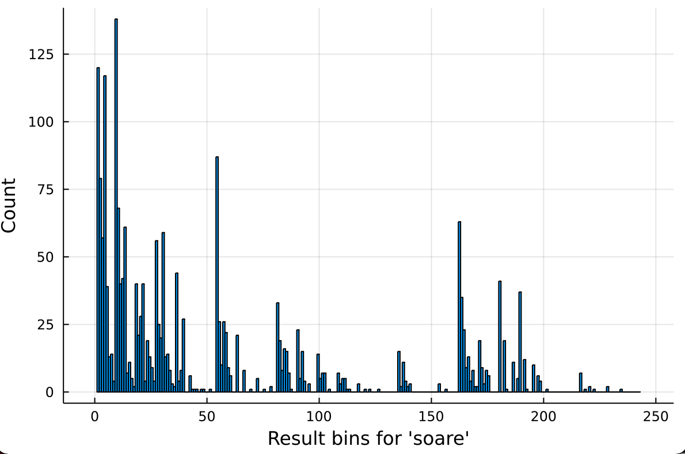

# Wordle

The best Wordle solver looks like: instead of fixing the greatest number of green letters, you want to pick the word that’s most likely to equally partition the search space like in a binary search.

When you make a guess, there’s $3^5=243$ possible results, the three outcomes of:

- green: good guess
- yellow: good guess but letter at the wrong position
- grey: nothing new

to the power 5 because it’s possible independently for each letter.

So our first guess will partition the search space and pick one of those 243 buckets.

If we happen to get the “all green” bucket, we’re immediately done, but we’ll almost certainly land up in one of the other buckets.

On the picture below, we play a word and we see how many times a bucket appears after playing that word. For the word `fuzzy` we can see that the "all gray" bucket, a bad one cause it brings no information, appears a lot. To have a lot of information, we would need a uniform-like distribution. We thus deduce that the word `fuzzy` shouldn't be played at the beggining cause it has **rare letters**: `z`, `y` and **double letters**.

With the word `soare`, it's much better: many buckets appear often and seem to bring some information.

We can deduce something important from those histograms: the more likely you are to land in a particular bin, the more difficult it is to guess your way down from there, because you landed in one that was likely. For example with the word `fuzzy`, you're more likely to end in the "all-grey" bucket which doesn't help much: one try lost...

We have the maximum entropy with a uniform distribution (a discrete random variable has maximum entropy when the outcomes are equally likely.), so we'd like a word that has a "uniform-like" histrogram (like `soare`)

If there are $N$ words and $M$ different colorings, we want the word that most closely puts $N/M$ words in each coloring. In our case, with 12,500 words and 243 outcomes, we should aim for around 50 words per coloring.

“soare” as the best word, with an entropy of ~5.89
