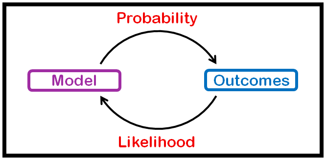

# Bayesian

One big advantage of the Bayesian interpretation is that it can be used to model our uncertainty compared to the frequentist approach.

## Bayes rule

$$P(A\mid B) = \frac{P(B\mid A) \cdot P(A)}{P(B)}$$

## Bayesian inference

Bayesian inference is a method of statistical inference in which Bayes' theorem is used **to update** the probability for a hypothesis **as more evidence or information becomes available**.

$$P(H\mid E) = \frac{P(E\mid H) \cdot P(H)}{P(E)}$$

$$P(\theta\mid D) = \frac{P(D\mid \theta) \cdot P(\theta)}{P(D)}$$

where

- $H$ (or $\theta$): the hypothesis
  - stands for any hypothesis whose probability may be affected by Experimental data (called "evidence" below).
  - Often there are competing hypotheses, and the task is to determine which is the most probable.
- $E$ (or $D$): the evidence
  - corresponds to new data that were not used in computing the prior probability.
- $P(H)$: the prior probability
  - is the estimate of the probability of the hypothesis $H$ "before" the data $E$, the current evidence, is observed.
- $P(E\mid H)$: the likelihood function
  - is the probability of observing $E$ "given" $H$.
  - As a function of $E$ with $H$ fixed, it indicates the compatibility of the evidence with the given hypothesis.
  - The likelihood function is a function of the evidence, $E$, while the posterior probability is a function of the hypothesis, $H$.
- $P(E)$: marginal likelihood or model evidence.
  - This factor is the same for all possible hypotheses being considered (as is evident from the fact that the hypothesis $H$ does not appear anywhere in the symbol, unlike for all the other factors)
  - so this factor does not enter into determining the relative probabilities of different hypotheses.
- $P(H\mid E)$: the posterior probability
  - is the probability of $H$ "given" $E$, i.e., "after" $E$ is observed.
  - This is what we want to know: the probability of a hypothesis "given" the observed evidence.

## Frequentist vs Bayesian: a coin toss

- N = 11
- Heads = 8
- Tails = 3

The frequentist starts and ends with numbers, the bayesian starts and ends with functions.

- Frequentist way:
  - Binomial: $\binom{11}{8}\theta^8(1-\theta)^3$
  - we do an MLE: derivate this with respect to $\theta$ equal zero
  - it gives $\hat{\theta}=\frac{8}{11}$

- Bayesian way:
  - we do MAP with the bayes rule
  - we already now the likelihood from the frequentist way
  - but we need the prior $P(\theta)$
  - we can use a beta distrib

## Probability vs Likelihood

- Let's say we have a coin. It's loaded, so that it comes up 75% heads and 25% tails, but we don't know this.
- If we flip the coin twice, the probability of it coming up tails twice is only $\frac{1}{4}\times \frac{1}{4}=\frac{1}{16}$.
- **Probability refers to the chance that a particular outcome occurs based on the values of parameters in a model** (given a known weight on the coin).
- On the other hand, if we flip the coin 100 times and get 75 heads, the likelihood that the coin is fair is essentially zero.
- **Likelihood describes, given a known result (a sample), the chances that the coin has a particular weight.** It describes how well a sample provides support for particular values of a parameter in a model

In more formal terms:

- probability fixes the parameter and calculates the probability of a random result.
- Likelihood fixes a value for the random variable and asks about the likelihood of a parameter.

In statistics:

- you have a sample (your particular coin flips, or the people you had complete a survey)
- a population (the actual weight of the coin, or what the entire country actually thinks).
- **Probability describes how likely your sample is, given a known population/density/model**
- **likelihood describes how likely a particular population is according to your model, given a known sample.**

## Conjugate prior

- when prior and posterior have analog closed form
- benefits: fast and easy to compute
- drawbacks: might not fit reality
- Example:
  - likelihood: binomial, prior: beta => posterior: beta
  - $P(X|\theta)P(\theta)=\binom{n}{k}\theta^{k}(1-\theta)^{n-k}\frac{1}{B(\alpha,\beta)}\theta^{\alpha-1}(1-\theta)^{\beta-1}$
  - $\propto \theta^{k+\alpha-1}(1-\theta)^{n-k+\beta-1}$
  - hence $\theta \sim Beta(k+\alpha, n-k+\beta)$
  - likelihood: normal, prior: normal => posterior: normal

## Naïve bayes

- hypothesis: Features $X_{i}$ are all independent given class Y (too naïve)
- $P(spam|msg) = \frac{P(msg|spam)P(spam)}{P(msg)}$
- $P(spam)$ computed from dataset, same for $P(\overline{spam}) = 1-P(spam)$
- $P(msg|spam)=P(word1|spam)(1-P(word2|spam))P(word3|spam)...$ with word1 and word3 in the message but not word2
- low risk of overfitting
- What makes it “naive” is that we compute the conditional probability (sometimes also called likelihoods) as the product of the individual probabilities for each feature:
