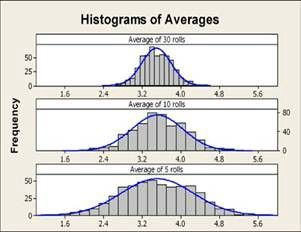

# CLT (central limit theorem)

- **if we repeatedly take independent, random samples of size n from any population, then when n is large the distribution of the sample means will approach a normal distribution, independently of the population’s actual distribution**
- As the sample size increases, the sampling distribution of the mean, X-bar, can be approximated by a normal distribution with **mean µ** and **standard deviation σ/√n** where:
- µ is the population mean
- σ is the population standard deviation
- n is the sample size

- If you roll a six-sided die, the probability of rolling a one is 1/6, a two is 1/6, a three is also 1/6, etc.
- The population mean for a six-sided die is $(a+b)/2 = (6+1)/2 = 3.5$ and the population standard deviation is $\sqrt{\frac{(6-1 + 1)^2-1}{12}} = 1.708$
- Thus, if the theorem holds true, the mean of the 30 dice averages should be about $3.5$ with standard deviation $1.708 / \sqrt{30} = 0.31$.

