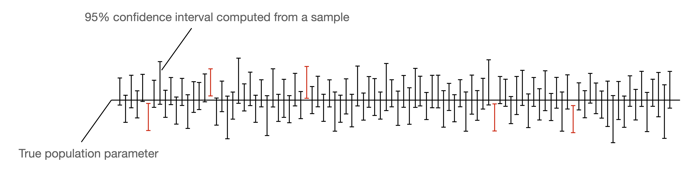

# Confidence Intervals

## Wrong Interpretation

A normal 95% confidence interval **does not tell you** that there is a 95% chance that the true value lies in that interval.

First, let’s assume we have access to the population. *(This is, of course, never the case. Otherwise, we wouldn’t have to estimate a parameter but could compute it precisely.)*

Then, if we draw a very large number of samples from the distribution, and apply our confidence interval method to these samples, 95% of the confidence intervals would contain the actual value.

## Statistical Significance

The difference of two measurements is statistically significant if confidence intervals **do not overlap**.

However we cannot say that results are not statistically significant if confidence **intervals overlap**.
