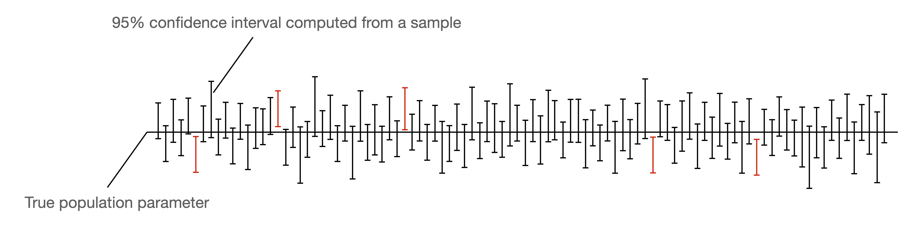

# Confidence Intervals

## Wrong Interpretation

When reporting a CI:

- **WRONG**: “There is a 95% probability that the mean is between 25.1 and 32.6”. Either μ is in that interval or not; there is no probability associated with it.
- **GOOD**: “I am 95% confident that the mean is between 25.1 and 32.6”.

First, let’s assume we have access to the population. *(This is, of course, never the case. Otherwise, we wouldn’t have to estimate a parameter but could compute it precisely.)*

Then, if we draw a very large number of samples from the distribution, and apply our confidence interval method to these samples, 95% of the confidence intervals would contain the actual value.

A confidence interval is an interval associated with a parameter and is a frequentist concept. The parameter is assumed to be non-random but unknown, and the confidence interval is computed from data.

Because the data are random, the interval is random. A 95% confidence interval will contain the true parameter with probability 0.95. That is, with a large number of repeated samples, 95% of the intervals would contain the true parameter.

95% confidence means that if you were to repeat the sampling process 100 times, 95 of those samples would produce a confidence interval that contains the true parameter.

## How to compute

CI = sample mean ± (critical value) * (standard error)

$$
CI = \bar{x} \pm z_{\alpha/2} \cdot \frac{s}{\sqrt{n}}
$$

- $\bar{x}$ is the sample mean
- $z_{\alpha/2}$ is the critical value from the standard normal distribution
- $s$ is the sample standard deviation
- $n$ is the sample size

You can get the critical value from the standard normal distribution from a z-table or t-table.

Choose between z-table and t-table based on these criteria:

- Use **z-table** when:
  - Sample size is large (n ≥ 30), OR
  - Population standard deviation (σ) is known
- Use **t-table** when:
  - Sample size is small (n < 30), AND
  - Population standard deviation is unknown (using sample standard deviation s instead)

## Statistical Significance

The difference of two measurements is statistically significant if confidence intervals **do not overlap**.

However we cannot say that results are not statistically significant if confidence **intervals overlap**.
