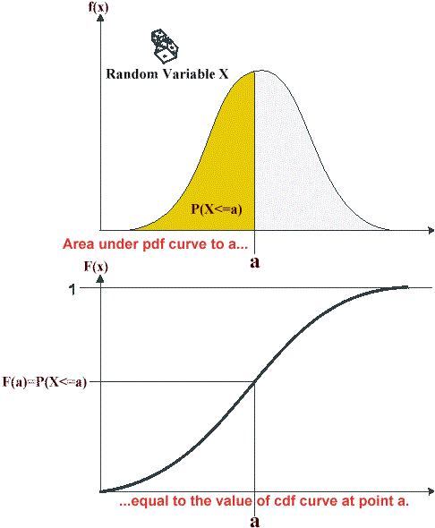
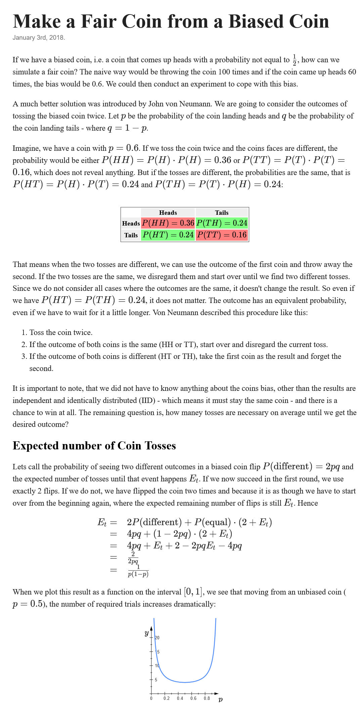

# Probabilities and Statistics

## Random variables

- A random variable is a variable holding an outcome or the result of some outcomes in a random process e.g. the observed value in rolling a die. Associatse possible outcomes with probabilities. toss/flip a fair coin, roll a die
- *i.i.d*: independent and identically distributed: they follow the same distribution and are independent

## Probability distributions

- for continious probabilities there's no "probabilities", but rather probability density
- $P_{Z}(A) = \int_{A}^{}p_{Z}(z)dz$ where $p_{Z}(z)$ is the probability density function of $Z$
- probability distribution : the process of sampling from a given process an infinite number of times, it gives a smooth histogram

## Independence, Marginalization, Conditioning and Chain rule

independence: if $X$ and $Y$ are independent, then $P(X,Y)=P(X)P(Y)$

marginalization (over $Y$): $P(X)=\sum_{y}P(X,Y=y)=\sum_{y}P(X|Y=y)P(y)$

conditionning: $P(X,Y) = P(X|Y)P(Y)$ [(more info here)](https://en.wikipedia.org/wiki/Conditional_probability)

- $P(X|Y)=\frac{P(X,Y)}{P(Y)}$
- $P(X|Y)$ is the probability of $X$ given $Y$, i.e. the probability of $X$, given that $Y$ has already occurred.
- So we need to look at the space where $X$ and $Y$ overlap, i.e. $P(X,Y)$.
- $P(Y)$ is a normalizing factor, to make sure that the probabilities sum to $1$. It is the probability of $Y$, regardless of $X$.

chain rule: $P(A,B,C,D)=P(A|B,C,D)P(B|C,D)P(C|D)P(D)$

## Gaussian law

- $\mathbb{P}(\mu-\sigma \le x \le \mu+\sigma) \approx 68\%$
- $\mathbb{P}(\mu-2\sigma \le x \le \mu+2\sigma) \approx 95\%$
- $\mathbb{P}(\mu-3\sigma \le x \le \mu+3\sigma) \approx 99\%$

## Percentile

The n-th percentile of a set of scores is a value that has n% of scores falling below it.

The 25th percentile is the value for which 25% of the data is below that value.

## Variance, SD, Covariance and Correlation

- variance: $Var(X) = \sigma_X^2 = E[(X-E[X])^2] = E[X^2] - E[X]^2$
- standard deviation: $\sigma_X = \sqrt{Var(X)}$
- covariance: $Cov(X,Y) = E[(X-E[X])(Y-E[Y])] = E[XY] - E[X]E[Y]$
- correlation: $Corr(X,Y) = \frac{Cov(X,Y)}{\sigma_X\sigma_Y} = \frac{Cov(X,Y)}{\sqrt{Var(X)Var(Y)}}$
  - having a high correlation doesn't mean that the variables are dependent, it just means that they are related.
  - also, having a low correlation doesn't mean that the variables are independent, since **correlation is a measure of linear dependence**. There can be other types of dependence that are not captured by correlation.

## Interview questions

### Why do we divide by n-1 when calculating the variance?

Usually we don't have access to the population, but rather to a sample of size $N$.

We can prove mathematically that:

$$E\left[\frac{\sum_{i=1}^{N}(x_i-\bar{x})^2}{N}\right] = \frac{N-1}{N}\sigma^2$$

The reason why we divide by $N-1$ is to get an unbiased estimator of the variance.

The rationale behind this is that we are using the sample mean $\bar{x}$ to estimate the population mean $\mu$. This means that we are using one degree of freedom to estimate the mean. Therefore, we only have $N-1$ degrees of freedom left to estimate the variance.

If we know the true mean $\mu$, then we can divide by $N$ instead of $N-1$.

### Estimators of the mean and variance

- estimator of the mean: $E(\bar{X}) = E(\frac{X_1 + ... + X_n}{n}) = \frac{1}{n}[E(X_1) + ... + E(X_n)] = \frac{1}{n}(\mu_1 + ... + \mu_n) = \frac{1}{n}n \mu = \mu$
- of variance: $Var(\bar{X})=\text{Var}\left(\frac{\sum_{i=1}^n X_i}{n}\right) = \frac{1}{n^2}\text{Var}\left(\sum_{i=1}^n X_i\right) = \frac{1}{n^2}\sum_{i=1}^n\text{Var}\left(X_i\right)  = \frac{1}{n^2} n\sigma^2 = \frac{\sigma^2}{n}$

### Generate random values with custom distribution

- Get the cumulative distribution function (CDF)
- Mirror the CDF along y = x
- Apply the resulting function to a uniform value between 0 and 1

### Monty Hall problem

- 3 doors closed
- behind one door a car
- behind two other doors goats
- you pick one door, this door has 1/3 chance to have a car behind it, and the other two doors have 2/3 chance to have a car behind them
- then a guy opens a door with a goat
- should you pick the other door?
- YES, cause you have 1/3 chance to have a car with the first door you picked
- but 2/3 with the other doors
- the fact that one door is opened now doesn't change the 2/3 probability

### Dice rolling

If I roll a dice 6 times, what is the probability that a 2 will have been rolled at some point during those 6 rolls?

$$P(\text{at least one 2}) = 1 - P(\text{no 2}) = 1 - (\frac{5}{6})^6 = 0.6651$$

### Find the right coin

We have three biased coins

- coin 1: 0.4 chance of heads: $P_{coin1}(H) = \frac{2}{5}$
- coin 2: 0.6 chance of heads: $P_{coin2}(H) = \frac{3}{5}$
- coin 3: 0.8 chance of heads: $P_{coin3}(H) = \frac{4}{5}$

We toss one of the coins 5 times and get 3 heads and 2 tails. Which coin did he use?

Well, $\frac{3}{5}$ seems to indicate that it's coin 2, but we need to take into account that the sample size is small (5 samples).

We need to compute the probability of having this result with each coin.

As a remindar, the binomial law is as follows:

$$P(X=k) = \binom{n}{k}p^k(1-p)^{n-k}$$

- coin 1: $P_{coin1}(3H,2T) = \binom{5}{3}(\frac{2}{5})^3(\frac{3}{5})^2 = 0.2304$
- coin 2: $P_{coin2}(3H,2T) = \binom{5}{3}(\frac{3}{5})^3(\frac{2}{5})^2 = 0.3456$
- coin 3: $P_{coin3}(3H,2T) = \binom{5}{3}(\frac{4}{5})^3(\frac{1}{5})^2 = 0.2048$

How can we be sure that it's coin 2? Well, to do so, we need to reject the hypothesis that it's coin 1 or 3. So the probability of having this result with coin 1 or 3 should be less than 5%. It's not the case here, so we can't be sure that it's coin 2.

### Fair coin from unfair coin

## More

- <https://www.simonwardjones.co.uk/posts/probability_distributions/>
- <https://www.simonwardjones.co.uk/posts/bayesian_inference/>
- <https://longintuition.com/2020/07/20/max-entropy-intuition.html>
- <https://seeing-theory.brown.edu/index.html#firstPage>
