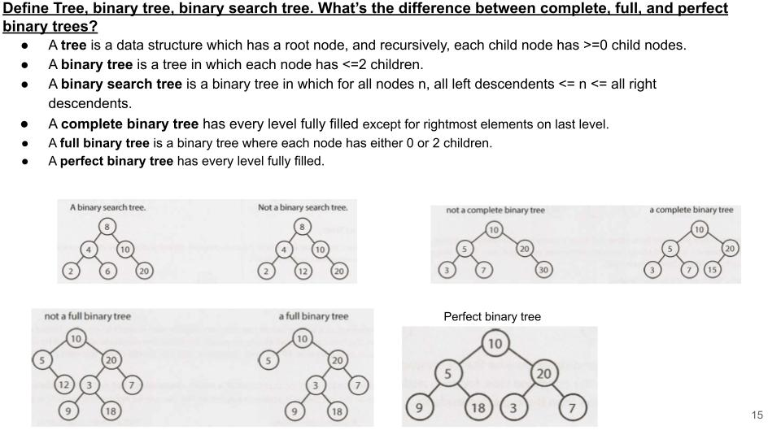
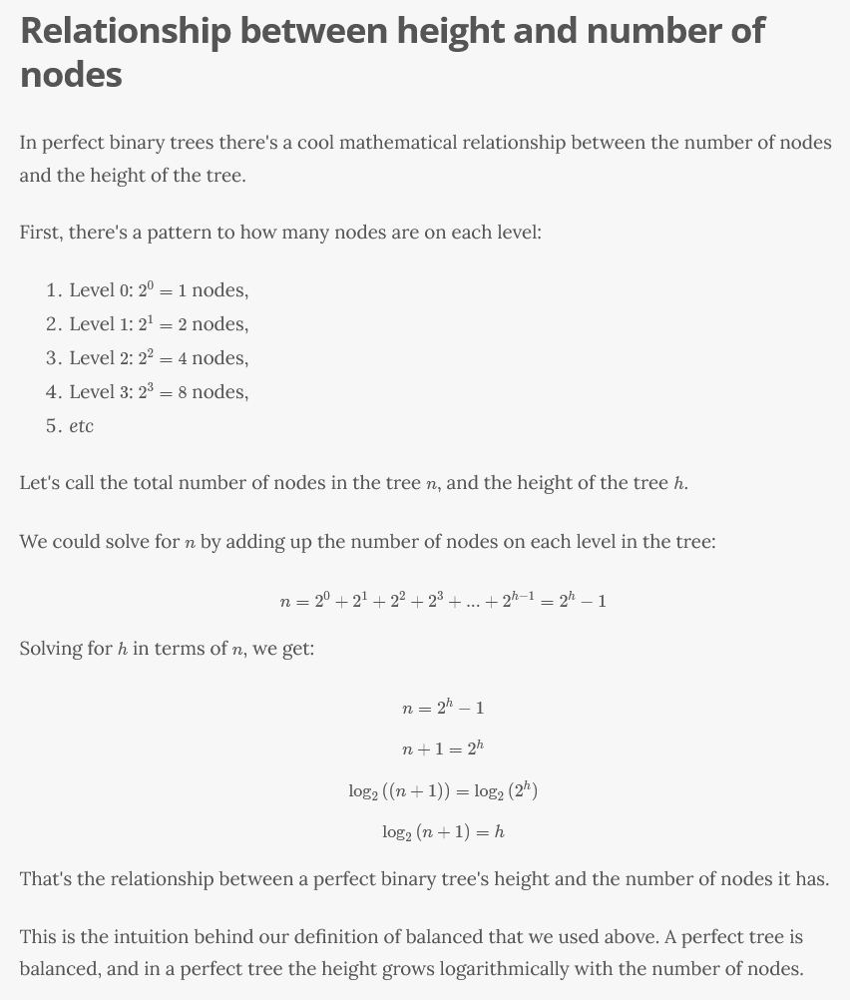
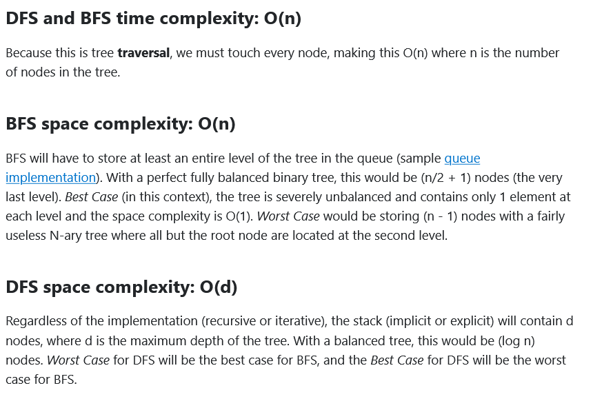
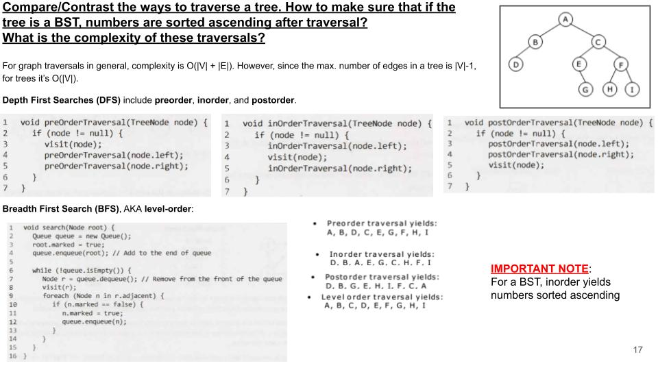
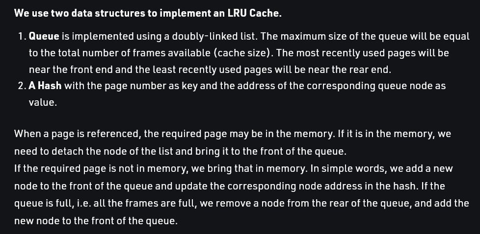

# Data Structures

[Data Structures Reference](https://www.interviewcake.com/data-structures-reference)

## Trees

Binary tree != binary search tree!

## Binary trees

### Depth-first search vs breadth-first search

## LRU Cache

## Bloom filters

to check if a username is in database or not for example

linear search is slow...

bloom filter is an array of bits

we hash the usernames with multiple hash functions, each of them return an index that we set to 1 in the array

to check if an entered username is present, if any of the indices computed by the hash functions is zero, it means the username is not present in the database

if all indices are at 1, it means the username MIGHT be in the database

More:
- <https://www.geeksforgeeks.org/bloom-filters-introduction-and-python-implementation/>
- <https://llimllib.github.io/bloomfilter-tutorial/>
