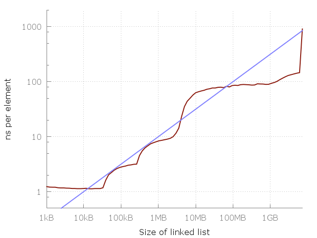

# Big O

Big $\mathcal{O}$ notation expresses the runtime in terms of how quickly it grows relative to the input, as the input gets arbitrarily large.

**Big** $\mathcal{O}$ describes the upper bound or **worst case** it takes to run an algorithm, that is to say the most operations it takes for an algorithm to complete.

**The complexity grows at most this much, but it could grow more slowly.**

## Space and Time Complexity

- Time Complexity: Describes the number of operations it takes to run an algorithm for $n$ inputs.
- Space Complexity: Describes the amount memory it takes to run an algorithm for $n$ inputs.

## Big $\Theta$, $\mathcal{O}$, $\Omega$

- Big $\mathcal{O}$: Describes the upper bound, that is the **worst case**.
- Big $\Omega$ (Omega): Describes the lower bound, that is the **best case**.
- Big $\Theta$ (Theta): Describes the tight bound, that is the intersection of Big $\mathcal{O}$ and Big $\Omega$.

## Why is constant always dropped from Big $\mathcal{O}$ analysis?

- Big-$\mathcal{O}$ notation only describes the long-term growth rate of functions, rather than their absolute magnitudes
- $f(x)$ and $g(x)$ grow at the same rate as $x$ tends to infinity if $\lim\limits_{x\to +\infty} \frac{f(x)}{g(x)}=M\neq0$
- Example: $f(x)=x^{2}$ and $g(x)=2x^{2}$ then $\lim\limits_{x\to +\infty} \frac{x^{2}}{2x^{2}}=\frac{1}{2}\neq0$. Both have the same growth rate.
- constant factors: too system-dependent
- lower-order terms: irrelevant for large inputs

## Amortized runtime

It's a single contiguous storage (a 1d array). Each time it runs out of capacity it gets reallocated and stored objects are moved to the new larger place — this is why you observe addresses of the stored objects changing.

The storage is growing geometrically to ensure the requirement of the amortized O(1) push_back(). The growth factor is 2 (Capn+1 = Capn + Capn) in most implementations of the C++ Standard Library (GCC, Clang, STLPort) and 1.5 (Capn+1 = Capn + Capn / 2) in the MSVC variant.

When the array if full, it takes $\mathcal{O}(N)$ to double the size and insert a new element.

But it happens in rare case, most of the time it's $\mathcal{O}(1)$.

$1 + 2 + 4 + 8 + 16 +32+...+X=2X$

Therefore $X$ insertions take $\mathcal{O}(2X)=\mathcal{O}(X)$, that we divide by $X$. So it gives $1$.

## Tips

- When you see a problem where the number of elements in the problem space gets halved each time, that will likely be a $\mathcal{O}(logN)$ runtime (binary search). The number of times we can halve $N$ until we get $1$ si $log_{2}N$.
- When you have a recursive function that makes multiple calls, the runtime will often (but not always) look like $\mathcal{O}(branches^{depth})$, where branches is the number of times each recursive call branches. This gives us $\mathcal{O}(2^N)$ runtime for recursive fibonacci for example.
- Generally speaking, when you see an algorithm with multiple recursive calls, you're looking at exponential runtime.
- Bidirectional Search:
  - two simultaneous breadth-first searches, one from each node
  - $\mathcal{O}(K^{d/2})$ runtime where: $K$ adjacent nodes, $d$ length path
  - Used by FACEBOOK to find the shortest path between two people
- The grade school or “carrying” method for multiplication requires about $n^2$ steps, where $n$ is the number of digits of each of the numbers you’re multiplying. So three-digit numbers require nine multiplications, while 100-digit numbers require 10,000 multiplications.

### Double for loops, second loop starts at i+1

```python
for i in range(N):
  for j in range(i+1, N):
    pass
```

the first time the inner loops runs for N-1 steps, then N-2, then N-3, etc

the total number of steps is: (N-1) + (N-2) + (N-3) + ... + 1

that's the sum of 1 through N = $\frac{N(N-1)}{2}$

so the complexity is $\mathcal{O}(N^2)$

### Arrays of different sizes

Be careful if your input is two arrays A and B, the complexity can be O(A+B) for example, not O(N)!

```python
for i in A:
  for j in B:
    for k in range(10000):
      do work
```

the complexity is $\mathcal{O}(AB)$

### Sort array of string

Do not mixup the length of the array and the length of the strings

$s$ length of the longest string, $N$ length of the array

sorting each string is $\mathcal{O}(slogs)$, $N$ times: $\mathcal{O}(Nslogs)$

now we need to sort the array, it's not $\mathcal{O}(NlogN)$ because it's harder to compare a string than an int. each string comparison takes $\mathcal{O}(s)$.

There's $\mathcal{NlogN}$ comparisons, so it's gonna take $\mathcal{O}(sNlog(N))$

so the total is $\mathcal{O}(sNlog(N) + Nslog(s))$

### Trees are not always exponential

```python
def sum(node):
  if node is None:
    return 0
  return sum(node.left) + sum(node.right) + value
```

complexity is $\mathcal{O}(branches^{depth}) = \mathcal{O}(2^{logN}) = \mathcal{O}(N)$

the runtime is linear in terms of number of nodes

If a binary search tree is not balanced, it takes O(N) to find an element in it. We could have a tree that's a straight line.

We have a binary tree (not search), it takes O(N) to find an element in it: $O(2^{log(N)})$. Makes sense, you just have to go through each node... Can't be log(N) since it's not "search tree".

### Don't mix up the N

```python
for i in range(N):
  print(fib(i))  # we use recursive fib here
```

iterative fib(N) is O(N), recursive is O(2^N) but don't confuse the N!!!

- fib(1) is $2^1$ steps
- fib(2) is $2^2$ steps
- fib(3) is $2^3$ steps

so it's $\mathcal{O}(2^{N+1})$

## Why Big-O does not really exists

Accessing memory is not $\mathcal{O}(1)$, it's $\mathcal{O}(\sqrt N)$

Levels/Hierarchy of Memory:

- L1
- L2
- L3
- RAM

cache faults if the address you fetch is not in L1

Memory acces time depends on the size of the data you're fetching:



## Exercices

- [Determining the big-O runtimes of these different loops?](https://stackoverflow.com/questions/11094330/determining-the-big-o-runtimes-of-these-different-loops)
