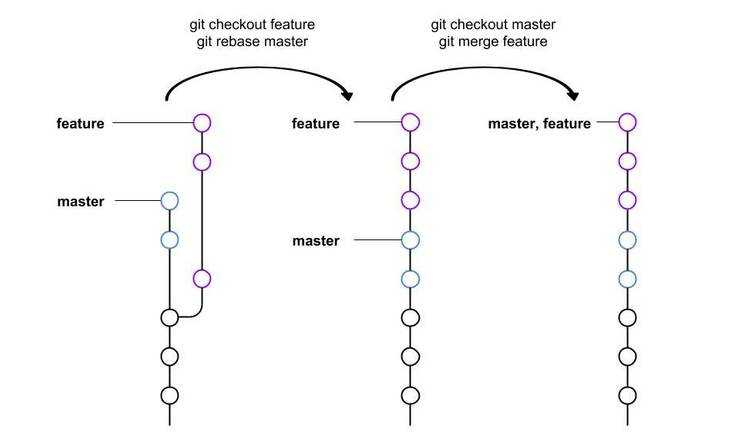
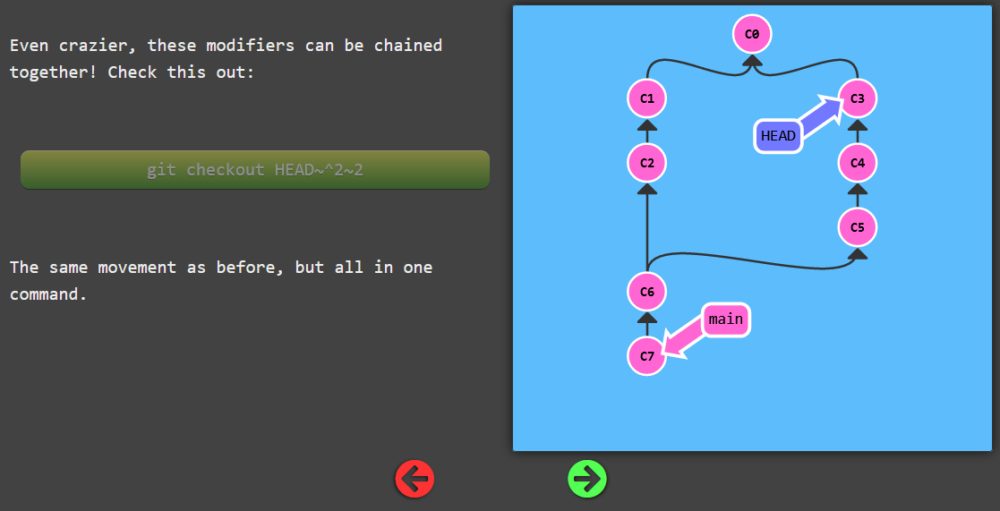

# Git

Git has an elegant and powerful underlying model based on a few simple concepts:

- Commits are immutable snapshots of the repository
- Branches are labels that point to commits. They are mutable and (usually) automatically move forward as new commits are made.
- Every object has a unique ID, derived from its content

## HEAD

HEAD is the symbolic name for the currently checked out commit -- it's essentially what commit you're working on top of.

Normally HEAD points to a branch name (like bugFix).

Detaching HEAD just means attaching it to a commit instead of a branch: `git checkout commit_hash`

## Areas

### Staging Area

- helps split changes in several commits
- review changes before commiting

## git push

`git push origin main`

translates to this in English:

Go to the branch named "main" in my repository, grab all the commits, and then go to the branch "main" on the remote named "origin". Place whatever commits are missing on that branch and then tell me when you're done.

**The opposite of git-push is not git-pull, it's git-fetch.**

## Merge

`git merge` ***ON TOP OF*** `main`

`git merge branch_to_merge`: merge the specified branch’s history into the current one (main), and moves HEAD of the current branch (main) to the new created commit.

## Rebase

`git rebase` current branch ***ON TOP OF*** `main`

`git rebase my_branch main` will rebase branch `main` ***ON TOP OF*** `my_branch`

1) `git checkout feature`
2) commit on `feature`...
3) `git rebase master`: rewrites the history, creates brand new commits that were on `feature` on top of `master`
4) `git checkout master`
5) `git merge feature`

## reset, revert

git reset reverses changes by moving a branch reference backwards in time to an older commit.

`git reset HEAD~1` will move the branch pointer to the previous commit. But it will keep the changes.

`git reset --hard` to delete last commit and changes!

While resetting works great for local branches on your own machine, its method of "rewriting history" doesn't work for remote branches that others are using.

In order to reverse changes and share those reversed changes with others, we need to use git revert.

`git revert HEAD` creates a new commit that reverts the previous commit

## Cherry pick

`git cherry-pick <Commit1> <Commit2> <Commit3>` It's a very straightforward way of saying that you would like to copy a series of commits below your current location (HEAD).

HEAD will point to `Commit3` at the end.

## Relatives

Moving upwards one commit at a time with `^` (caret (^) operator).

So saying main^ is equivalent to "the first parent of main".

main^^ is the grandparent (second-generation ancestor) of main.

Moving upwards a number of times with `~<num>` (tilde (~) operator).

`my_branch^^^^` is equivalent to `my_branch~4`

`git branch -f main HEAD~3` moves (by force) the main branch to three parents behind HEAD.

If you're on a merge commit, `git checkout HEAD^` will move to the first ancestor, `git checkout HEAD^2` to the 2nd, etc

## Interactive rebase

`git rebase -i <after-this-commit>` can select/drop, reorder commits and squash.

An editor will be fired up with all the commits in your current branch (ignoring merge commits), which come after the given commit `<after-this-commit>`.

## TAGS

- they (somewhat) permanently mark certain commits as "milestones" that you can then reference like a branch.
- It's exactly the same as a branch except that git moves a branch when you make a new commit.

`git tag version1 commit_hash`

## orphan branch

`--orphan <new-branch>`

Create a new orphan branch, named `<new-branch>`, started from `<start-point>` and switch to it. The first commit made on this new branch will have no parents and it will be the root of a new history totally disconnected from all the other branches and commits.

This can be useful when you want to publish the tree from a commit without exposing its full history. You might want to do this to publish an open source branch of a project whose current tree is "clean", but whose full history contains proprietary or otherwise encumbered bits of code.

If you want to start a disconnected history that records a set of paths that is totally different from the one of `<start-point>`, then you should clear the index and the working tree right after creating the orphan branch by running git rm -rf . from the top level of the working tree. Afterwards you will be ready to prepare your new files, repopulating the working tree, by copying them from elsewhere, extracting a tarball, etc.

## Advanced

[Git Under the Hood](https://blog.isquaredsoftware.com/presentations/2019-03-git-internals-rewrite/#/0)

## gitignore

Global .gitignore: <https://web.archive.org/web/20220928181951/https://julien.danjou.info/properly-managing-your-gitignore/>

## Workflows

- [GitHub Standard Fork & Pull Request Workflow](https://gist.github.com/Chaser324/ce0505fbed06b947d962)
- [A successful Git branching model](https://nvie.com/posts/a-successful-git-branching-model/)
- git flow: <https://www.gitkraken.com/blog/gitflow>

## Git Commit Titles and Messages

### Commit Title

[Conventional Commits](https://www.conventionalcommits.org/en/v1.0.0/):

- build: Changes that affect the build system or external dependencies (example scopes: gulp, broccoli, npm)
- chore: Other changes that don't modify src or test files
- ci: Changes to our CI configuration files and scripts (example scopes: Travis, Circle, BrowserStack, SauceLabs)
- docs: Documentation only changes
- feat: A new feature
- fix: A bug fix
- perf: A code change that improves performance
- refactor: A code change that neither fixes a bug nor adds a feature
- style: Changes that do not affect the meaning of the code (white-space, formatting, missing semi-colons, etc)
- test: Adding missing tests or correcting existing tests
- revert: Reverts a previous commit

Or:

- `Add` = Create a capability e.g. feature, test, dependency.
- `Cut` = Remove a capability e.g. feature, test, dependency.
- `Fix` = Fix an issue e.g. bug, typo, accident, misstatement.
- `Bump` = Increase the version of something e.g. dependency.
- `Make` = Change the build process, or tooling, or infra.
- `Start` = Begin doing something; e.g. create a feature flag.
- `Stop` = End doing something; e.g. remove a feature flag.
- `Refactor` = A code change that MUST be just a refactoring.
- `Reformat` = Refactor of formatting, e.g. omit whitespace.
- `Optimize` = Refactor of performance, e.g. speed up code.
- `Document` = Refactor of documentation, e.g. help files.

### Commit Message

- [How to Write a Git Commit Message](https://chris.beams.io/posts/git-commit/)
- <https://cbea.ms/git-commit/>
- [Using Git Commit Message Templates to Write Better Commit Messages](https://gist.github.com/lisawolderiksen/a7b99d94c92c6671181611be1641c733)
- [Write good git commit message](https://juffalow.com/blog/git/write-good-git-commit-message)
- [Commit messages guide](https://github.com/RomuloOliveira/commit-messages-guide)

## Interactive tutorials

- <https://learngitbranching.js.org/>
- <https://ohmygit.org/>

## Git tools on top of git

### Gitless

- <https://gitless.com/>
- <https://hub.packtpub.com/how-can-gitless-save-you-from-git/>
- <https://github.com/gitless-vcs/gitless>

## Cheatsheets

- <http://web.archive.org/web/20230921095122/https://paedubucher.ch/articles/2022-07-26-git-with-multiple-e-mail-addresses.html>
- <https://jwiegley.github.io/git-from-the-bottom-up/>
- <https://xosh.org/explain-git-in-simple-words/>
- <https://www.biteinteractive.com/picturing-git-conceptions-and-misconceptions/>
- <https://news.ycombinator.com/item?id=18512854>
- <https://web.archive.org/web/20210515091636/http://jonas.nitro.dk/git/quick-reference.html>
- <https://files.jrebel.com/pdf/zt_git_cheat_sheet.pdf>
- <https://education.github.com/git-cheat-sheet-education.pdf>
- <https://ikhlestov.github.io/pages/tools/git/>
- <http://ndpsoftware.com/git-cheatsheet.html>
- <https://gourav.io/blog/git-cheatsheet>
- <https://mg.readthedocs.io/git.html>
- <https://frontendmasters.com/courses/git-in-depth/>
- <http://rogerdudler.github.io/git-guide/>
- <https://stosb.com/blog/advanced-git-commands-you-will-actually-use/>
- <https://buzut.net/git-en-2-2/>
- <https://gist.github.com/eashish93/3eca6a90fef1ea6e586b7ec211ff72a5>
- <https://talks.tiste.io/git-101/#/>
- <https://rachelcarmena.github.io/2018/12/12/how-to-teach-git.html>
- <https://www.miximum.fr/blog/enfin-comprendre-git/>
- <https://www.freecodecamp.org/news/learn-the-basics-of-git-in-under-10-minutes-da548267cc91/>
- <https://marklodato.github.io/visual-git-guide/index-en.html>
- <https://learnxinyminutes.com/docs/git/>
- <https://github.com/k88hudson/git-flight-rules>
- <https://ohshitgit.com/>
- <https://neilkakkar.com/How-not-to-be-afraid-of-GIT-anymore.html>
- <https://www.freecodecamp.org/news/now-that-youre-not-afraid-of-git-anymore-here-s-how-to-leverage-what-you-know-11e710c7f37b/>
- <https://oyvn.github.io/git-zero-to-rebase>
