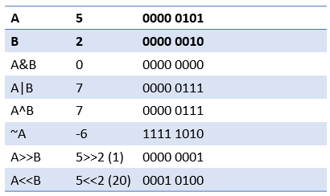
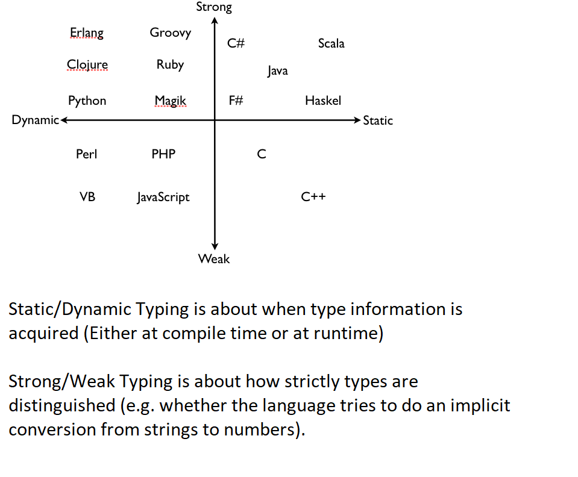
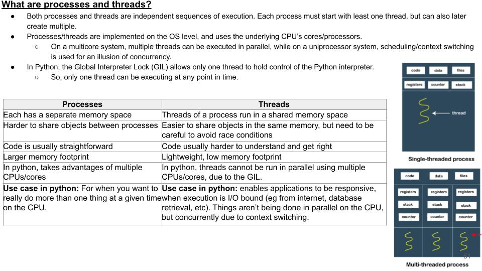

# General Knowledge

## Parameter vs args

- a parameter is what appears in the definition of a function (its signature, or prototype)
- an argument is a value that appears in the call to this function.

## Bit manipulation



## Floating point variables

- [What Every Programmer Should Know About Floating-Point Arithmetic](https://floating-point-gui.de/)

## Strong/Weak, Static/Dynamic Typing

- Static/Dynamic Typing is about when type information is acquired (Either at compile time or at runtime)
- Strong/Weak Typing is about how strictly types are distinguished (e.g. whether the language tries to do an implicit conversion from strings to numbers).
- Examples
  - Dynamic: python, javascript
  - Static: c++, java
  - Strong: java, python
  - Weak: javascript, c/c++



## Thread vs process

- Threads (of the same process) run in a shared memory space, while processes run in separate memory spaces.
- The thread context includes the thread's set of machine registers, the kernel stack, a thread environment block, and a user stack in the address space of the thread's process.
- Threads handling done by the scheduler



## Static variables

A static variable is created only once and its value is retained between function calls.

A static variable is created when the program starts and is destroyed when the program ends.

In the case of a static variable inside a function, the variable is initialized only once, when the function is called for the first time, and retains its value between subsequent calls to the function.

In the case of a static variable inside a class, the variable is shared among all objects of that class, and retains its value across all instances of the class.

## OOP

4 principles:

- Encapsulation: Private & public methods
- Abstraction: Don’t need to know inner details to use class
- Inheritance: To reuse code
- Polymorphism:  Ability of one function to perform in different ways.

## Classes

### Abstract classes

- classes that contain one or more abstract methods.
- An abstract method is a method that is declared, but contains no implementation.
- Abstract classes may not be instantiated, and require subclasses to provide implementations for the abstract methods.

## Good coding

- should fail nicely, and give a reason why it failed
- no code duplication
- readable
- optimized, but optimization shoudln't impact readability
- commented if needed
- structured, maintenable

## CI CD

- Continuous integration: Frequent merging of several small changes into a main branch
- Continuous delivery: When teams produce software in short cycles with high speed and frequency so that reliable software can be released at any time, and with a simple and repeatable deployment process when deciding to deploy
- Continuous deployment: When new software functionality is rolled out completely automatically

## Folder structure

- <https://github.com/kriasoft/Folder-Structure-Conventions>

## Publish code

### Write a good README

- <https://skerritt.blog/make-popular-open-source-projects/>

### Documentation

- [What nobody tells you about documentation](https://www.divio.com/blog/documentation/)

## TTY

You can simulate a non-interactive tty by redirecting stdout to a file:

```bash
python -c 'import sys; print(sys.stdout.isatty())' > tty.txt  # False
```

Same for stdin:

```bash
python -c 'import sys; print(sys.stdin.isatty())' < tty.txt  # False
```

## Network

### localhost

Don't use localhost in your code, etc.

This takes an extra time to resolve the localhost to an IP address:

1. The resolver library checks the /etc/hosts file and gets two IP addresses for localhost:
2. Checks IPv6 address first -> will probably fail
3. Checks IPv4 address second -> will probably succeed
4. The resolver library returns the IP address to the application
5. The application connects to the IP address

All of that can be avoided using the ip (usually 127.0.0.1)

### 127.0.0.1 vs 0.0.0.0

When you provide a service on 0.0.0.0 that means it binds to all interfaces - so if your computer has 2 wired Ethernet cards and one wifi interface, the service will be accessible to any client/device on any of those networks.

When you provide a service on 127.0.0.1 it will only be available to clients running within the same machine it is running on.

In essence, 0.0.0.0 means "anywhere and everywhere", while 127.0.0.1 means "precisely here and nowhere else".
