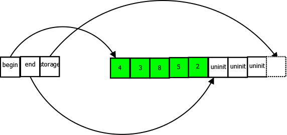

# C++ Notes

- [C++ Notes](#c-notes)
  - [Hello World](#hello-world)
  - [Python vs CPP Gotcha](#python-vs-cpp-gotcha)
  - [Modern c++](#modern-c)
  - [Exact types](#exact-types)
  - [Process argv](#process-argv)
  - [Assert](#assert)
  - [Preprocessor](#preprocessor)
  - [Compiler](#compiler)
  - [Cmake](#cmake)
  - [Stack and Heap](#stack-and-heap)
  - [Direct, copy, uniform initialization](#direct-copy-uniform-initialization)
  - [sizeof](#sizeof)
  - [Literals](#literals)
  - [magic numbers](#magic-numbers)
  - [string and char arrays](#string-and-char-arrays)
  - [cast](#cast)
  - [const and constexpr](#const-and-constexpr)
  - [Things about operators](#things-about-operators)
  - [++i vs i++](#i-vs-i)
  - [Using statements](#using-statements)
  - [Typedefs](#typedefs)
  - [Enum](#enum)
  - [Pointers](#pointers)
  - [Pointers and const](#pointers-and-const)
  - [References](#references)
  - [Returning by value, reference, address](#returning-by-value-reference-address)
  - [C arrays](#c-arrays)
  - [Dynamic memory allocation](#dynamic-memory-allocation)
  - [Range-for loops](#range-for-loops)
  - [Std::array](#stdarray)
  - [std::sort](#stdsort)
  - [Std::vector](#stdvector)
  - [Std::bitset](#stdbitset)
  - [std::list](#stdlist)
  - [Default parameters for functions](#default-parameters-for-functions)
  - [std::deque](#stddeque)
  - [Polymorphism](#polymorphism)
  - [Classes (and structs)](#classes-and-structs)
    - [Size, alignment](#size-alignment)
    - [Rule of three/five](#rule-of-threefive)
    - [= default, delete](#-default-delete)
    - [Ban default constructor](#ban-default-constructor)
    - [Friend functions](#friend-functions)
    - [Overloading operators](#overloading-operators)
    - [virtual, override, final](#virtual-override-final)
    - [Inheritance](#inheritance)
    - [Constructors and initialization of derived classes](#constructors-and-initialization-of-derived-classes)
    - [Mutable](#mutable)
    - [delete this](#delete-this)
  - [statements, expressions](#statements-expressions)
  - [lvalues, rvalue, glvalues, prvalues, xvalues](#lvalues-rvalue-glvalues-prvalues-xvalues)
  - [Move semantics](#move-semantics)
  - [Forwarding references](#forwarding-references)
  - [Errors](#errors)
  - [Templates](#templates)
  - [Smart pointers](#smart-pointers)
    - [unique\_ptr](#unique_ptr)
    - [shared\_ptr](#shared_ptr)
    - [weak\_ptr](#weak_ptr)
  - [volatile keyword](#volatile-keyword)
  - [static vs extern keywords](#static-vs-extern-keywords)
  - [explicit keyword](#explicit-keyword)
  - [Map and Set](#map-and-set)
  - [Ban use of some functions](#ban-use-of-some-functions)
  - [std::exchange](#stdexchange)
  - [auto vs decltype](#auto-vs-decltype)
  - [inclure order](#inclure-order)
  - [std::pair](#stdpair)
  - [HPC](#hpc)
  - [Tests](#tests)
  - [Forward declarations](#forward-declarations)
  - [lambda functions](#lambda-functions)
  - [Inline](#inline)
  - [TODO](#todo)

## Hello World

```cpp
#include <iostream>

int main(int argc, char **argv){
    std::cout << "yolo" << std::endl;
    return 0;
}
```

```shell
g++ -o main.exe -I. main.cpp detecteur.cpp evenement.cpp -std=c++17 -Wall
```

## Python vs CPP Gotcha

- In C++ `""` is a string, `''` is for char!

## Modern c++

- smart pointers
- move semantics
- auto, decltype
- lambda func
- constexpr
- hash tables
- std::array
- std::thread, std::mutex
- initializer lists


## Exact types

```c++
#include <cstdint>
```

- `int` may be 16, 32 or 64 on some platforms...
- `uint32_t` is not guaranteed to exist. It's an optional typedef that the implementation must provide if it has an unsigned integer type of exactly 32-bits. **It is provided only if the implementation directly supports the type**
- `uint_fast32_t` states your intent clearly: it's a type of at least 32 bits which is the best from a performance point-of-view. `uint_fast32_t` may be in fact 64 bits long. It's up to the implementation.
- `uint_least8_t` is the smallest type that has at least 8 bits.

## Process argv

```c++
#include <vector>

int main(int argc, char ** argv){
  std::vector<std::string> argv_vec(argv + 1, argv + argc);
  // std::vector<std::string_view> is better, since argv will be valid during the whole program
  return 0;
}
```

## Assert

```c++
#include <cassert>
#define NDEBUG // remove assert

assert(found && "Car could not be found in database");
```

## Preprocessor

- The preprocessor is executed before the compilation. The result of preprocessing is a single file which is then passed to the actual compiler.
- The preprocessing directives control the behavior of the preprocessor.
- preprocessor directives begin with #,
  - includes
  - Conditional Compilation
  - macros

## Compiler

1) First the compiler checks if code is correct and follows C++ rules.
2) Second, translates each ".cpp" files into a machine language and object files with ".o" extension.
3) Then the linker comes in and has 3 goals:
   1) take all the object files and combine them into an .exe
   2) link library files if needed. These libs are precompiled for reuse in other programs.
   3) makes sure that all cross-file dependencies are resolved properly. Connects references.

## Cmake

CMake is not a build system but rather it generates another system's build files. Make, Qt Creator, Ninja, Android Studio, Apple's Xcode, and Microsoft Visual Studio.

## Stack and Heap


- stack :
  - pile LIFO
  - variable locale (int i)
  - assez petite (1MB) sinon stack overflow.
  - La taille ne peut pas varier. Très rapide.
  - La première assiette (tout en bas) c'est la fonction main.
  - Dans la pile on prépare aussi l'appel à une fonction, on stocke les arguments, l'adresse de retour.
  - L'allocation dans la pile est invisible, tout est nettoyé quand on sort d'une fonction.
- heap :
  - tas
  - demande en cours d'exécution (new, delete)
  - il faut libérer la mémoire nous même !
  - Savoir gérer les accès multithreadés.
  - Plus lent que la pile
- data (ou statique) :
  - variable globale
  - stdin
  - stdout
  - stderr

## Direct, copy, uniform initialization

```c++
int nValue = 5; // copy initialization
int nValue(5); // direct initialization
int value{5}; // uniform initialization (C++11)
```

Direct initialization can perform better than copy initialization for some data types, and comes with some other benefits once we start talking about classes.

Uniform initialization is stricter than direct init:

```c++
class C {
  public:
   C(int i, float f) {}
};

C c1(1.1, 4); // implicit float to int conversion, might lead to errors
C c2{1.1, 4}; // will crash
```

## sizeof

The sizeof operator is a unary operator that takes either a type or a variable, and returns its size in bytes.

```c++
float my_tab[3] = {0, 1, 2};
for (size_t i = 0; i < sizeof(my_tab); ++i){
  std::cout << my_tab[i] << std::endl;
}
```

The code above prints...?

`sizeof(my_tab)` is the fullsize in bytes of the array. `sizeof(my_tab[0])` gives the size in bytes of a float: sizeof(float).

If we consider than float is 4 bytes, sizeof(my_tab) is 3*4 = 12 bytes.

Thus, the above code crashes.

sizeof can also fail when an array is passed to another function, since we only pass the begin pointer.

**BEWARE**: `sizeof` only works for fixed size arrays, not for dynamic allocations. `sizeof(ptr)` is the size of the pointer, not the allocated memory:

```c++
float* my_array = new float[42]{1, 2, 3};
std::cout << sizeof(float) << std::endl; // 4 bytes
std::cout << sizeof(*my_array) << std::endl; // same, it's a float, 4 bytes
std::cout << sizeof(my_array) << std::endl; // size of the pointer, 8 bytes
delete[] my_array;
```

## Literals

```c++
float i = 3.14f; // ne pas oublier "f" !
auto x1 = 1;   // int
auto x2 = 1U;  // unsigned int
auto x3 = 1L;  // long int
auto x4 = 1UL; // unsigned long int
```

## magic numbers

```c++
posinf, neginf, nan

#include <limits>

int a = std::numeric_limits<int>::max();
double a = std::numeric_limits<double>::infinity();
```

## string and char arrays

String literals are const char* by default. If we want type std::string, we need the s suffix (Ch.9 p.113).

```c++
/*
 * The "s" suffix needs one of the following namespace to be included:
 *   - using namespace std::literals
 *   - using namespace std::string_literals
 *   - using namespace std::literals::string_literal
 */
auto s1 = "Ian";  // const char* (C-style)
auto s2 = "Pan"s; // std::string

```

“Raw string literals” starting with `R"( and ending with )"` allows backslashes to be used directly in strings. E.g. `"\\foo\\bar"` can become `R"(\foo\bar)"`

Formatting with manipulators (placed between the output stream and the target to output):

```c++
std::cout << std::hex << 1234; // "4d2"
```

## cast

```c++
static_cast<new_type>(expression);
MyClass *m = (MyClass *)ptr;
MyClass *m = static_cast<MyClass *>(ptr);
MyClass *m = dynamic_cast<MyClass *>(ptr);
```

The static cast:

- performs conversions between compatible types.
- It is similar to the C-style cast, but is more restrictive.
- `static_cast` performs no runtime checks. Only compile time checks.

```c++
char c = 10;       // 1 byte
int *p = (int*)&c; // 4 bytes
*p = 5; // run-time error: stack corruption
int *q = static_cast<int*>(&c); // compile-time error

```

Dynamic casts:

- used to convert object pointers and object references into other pointer or reference types in the inheritance hierarchy.
- performing a run-time check that the pointer refers to a complete object of the destination type.
- the class must define or inherit at least one virtual function.
- it uses runtime type information (RTTI) to make sure the classes are compatible before performing a downcast.

```c++
class MyBase
{
  public:
  virtual void test() {}
};
class MyChild : public MyBase {};

int main()
{
  MyChild *child = new MyChild();
  MyBase  *base = dynamic_cast<MyBase*>(child); // ok, cast from child to parent is fine

  MyBase  *base = new MyBase();
  MyChild *child = dynamic_cast<MyChild*>(base); // nullptr
}
```

Reinterpret_cast:

- dangerous, similar to C cast
- no check during compilation, neither during runtime

## const and constexpr

```c++
const double gravity { 9.8 }; // preferred use of const before type
const double gravity; // compiler error, must be initialized upon definition
```

The primary difference between const and constexpr variables is that the **initialization of a const variable can be deferred until run time**. **A constexpr variable must be initialized at compile time**. All constexpr variables are const.

Making a function parameter const does two things:

- it tells the person calling the function that the function will not change the value of myValue
- it ensures that the function doesn’t change the value of myValue (read-only)

**Rule: Any variable that should not change values after initialization and whose initializer is known at compile-time should be declared as constexpr, else use const.**

```c++
constexpr int maxStudentsPerClass { 30 }; // is better than #define ... because it makes the debugging easier
```

Define constants:

```c++
namespace constants
{
    constexpr double pi(3.14159);
    constexpr double avogadro(6.0221413e23);
    constexpr double my_gravity(9.2);
}
```

```c++
constexpr double half(double x) {return x / 2};
int num = 4.0;
constexpr auto numHalf = half(num); // WRONG! "num" is non-constant,
                                    // result will not be constexpr!
```

Calcul pendant la compilation :

```c++
constexpr unsigned int factorial(unsigned int n) {
  return n > 0 ? n * factorial(n - 1) : 1;
}

constexpr auto res = factorial(2);
```

There's some diff with compilers, on how they respect the compile time property:

- gcc is very strict
- llvm depends
- msvc is lazy

## Things about operators

```c++
z = x, y; // Evaluate x then y, returns value of y, USE ONLY FOR for LOOPS!
```

```c++
z = c ? x : y // if c is nonzero (true) then evaluate x, otherwise evaluate y
```

## ++i vs i++

`++a` (prefix) is **faster** than `a++` (postfix):

- `++a`: add 1 to `a`, returns new value
- `a++`: add 1 to `a`, then return old value

This is because if you use post-increment, it can require the compiler to have to generate code that creates an extra temporary variable. This is because both the previous and new values of the variable being incremented need to be held somewhere because they may be needed elsewhere in the expression being evaluated.

This is mainly only a problem when the variable being incremented is a user defined type with an overridden ++ operator. For **primitive types (int, etc)** there's no performance difference.

(1 ADD) vs (2 MOV, 1 ADD). Or not if the compiler is smart enough, especially for **primitive types**.

<https://stackoverflow.com/questions/24901/is-there-a-performance-difference-between-i-and-i-in-c>

## Using statements

```c++
using namespace std; // this using directive tells the compiler that we're using everything in the std namespace!
using std::cout; // this using declaration tells the compiler that cout should resolve to std::cout
```

**Rule: Avoid “using” statements outside of a function (in the global scope).**

## Typedefs

```c++
typedef double distance_t; // define distance_t as an alias for type double
using distance_t = double; // define distance_t as an alias for type double (C++11 only)

// The following two statements are equivalent:
double howFar;
distance_t howFar;
```

**typedef names are declared using a “_t” suffix.**

Le problème est que cette construction n'autorisait pas un renommage paramétré par des types. On peut usiliser depuis C++11 cette construction :

```c++
using entier = int;
template<typename CONTENT>
using collection = std::vector<CONTENT>;
collection<entier> l = {1,2,3,4};
```

## Enum

```c++
enum Color
{
    // Each enumerator is separated by a comma, not a semicolon
    COLOR_BLACK, // assigned 0
    COLOR_RED, // assigned 1
    COLOR_MAGENTA = 7, // assigned 7
}; // however the enum itself must end with a semicolon

enum Color
{
    RED,
    BLUE, // BLUE is put into the global namespace
    GREEN
};
```

C++11 defines a new concept, the enum class (also called a scoped enumeration), which makes enumerations both strongly typed and strongly scoped. To make an enum class, we use the keyword class after the enum keyword.

```c++
enum class Color
{
    RED, // RED is inside the scope of Color
    BLUE
};
Color color = Color::RED; // note: RED is not directly accessible any more, we have to use Color::RED
```

**“enum struct” is equivalent to “enum class”.**

en c++11 on peut spécifier le type :

```c++
enum class Religion : char {None = 'n',
    Buddhism = 'b', Christianity = 'c', Hinduism = 'h',
    Islam = 'i', Judaism = 'j', Other = 'o'};
```

Enum classes don’t have an implicit conversion to integer, so if you try the following:

```c++
testScores[StudentNames::STAN] = 76;
```

You’ll get a compiler error. This can be addressed by using a *static_cast* to convert the enumerator to an integer.

## Pointers

```c++
std::cout << x << '\n'; // print the value of variable x
std::cout << &x << '\n'; // print the memory address of variable x
std::cout << *&x << '\n'; /// print the value at the memory address of variable x

int *iPtr; // a pointer to an integer value
int* iPtr2; // also valid syntax (acceptable, but not favored)
int *iPtr4, *iPtr5; // declare two pointers to integer variables
```

**Best practice: When declaring a pointer variable, put the asterisk next to the variable name.**

However, when returning a pointer from a function, it’s clearer to put the asterisk next to the return type:

```c++
int* doSomething();
```

```c++
int value = 5;
int *ptr = &value; // initialize ptr with address of variable value
```

```c++
int *ptr { nullptr }; // note: ptr is still an integer pointer, just set to a null value
```

The following two function declarations are identical:

```c++
void printSize(int array[]); // ok
void printSize(int *array); // recommended
```

```c++
int **ptrptr; // pointer to a pointer to an int, two asterisks
```

## Pointers and const


```c++
const int value = 5;
const int *ptr = &value; // this is okay, ptr is a non-const pointer that is pointing to a "const int"
*ptr = 6; // not allowed, we can't change a const value
```

```c++
int value = 5;
const int *ptr = &value; // ptr points to a "const int"
*ptr = 6; // ptr treats its value as const, so changing the value through ptr is not legal
```

```c++
int value1 = 5;
const int *ptr = &value1; // ptr points to a const int

int value2 = 6;
ptr = &value2; // okay, ptr now points at some other const int
```

```c++
int value1 = 5;
int value2 = 6;
int *const ptr = &value1; // okay, the const pointer is initialized to the address of value1
ptr = &value2; // not okay, once initialized, a const pointer can not be changed.
```

Read it backwards (as driven by Clockwise/Spiral Rule):

```c++
int* // pointer to int
int const * // pointer to const int
int * const // const pointer to int
int const * const // const pointer to const int
```

Now the first const can be on either side of the type so:

```c++
const int * == int const *
const int * const == int const * const
```

If you want to go really crazy you can do things like this:

```c++
int ** // pointer to pointer to int
int ** const // a const pointer to a pointer to an int
int * const * // a pointer to a const pointer to an int
int const ** // a pointer to a pointer to a const int
int * const * const // a const pointer to a const pointer to an int
```

Pointers to functions:

```c++
// fcnPtr is a pointer to a function that takes no arguments and returns an integer
int (*fcnPtr)();
int (*fcnPtr)() = foo; // fcnPtr points to function foo
fcnPtr = goo; // fcnPtr now points to function goo
(*fcnPtr)(5); // call function foo(5) through fcnPtr.
```

Alias to a function with funcional:

```c++
#include <functional>
auto f(A a, B b) -> C {
  /* ... */
}
std::function<C (A,B)> g = f;
f(a,b);
g(a,b);
```

## References

```c++
int value = 5; // normal integer
int &ref = value; // reference to variable value
cout << &value; // prints 0012FF7C
cout << &ref; // prints 0012FF7C

int &invalidRef; // invalid, needs to reference something

const int y = 7;
int &ref2 = y; // not okay, y is a const l-value
```

References or pointers?

- References cannot be NULL.
- Use pointers when you need to **allocate memory dynamically.**
- Once a reference is created, it cannot be later made to reference another object; it cannot be reseated. This is often done with pointers.

```c++
int value = 5;
const int &ref = value; // create const reference to variable value
value = 6; // okay, value is non-const
ref = 7; // illegal -- ref is const
```

**Rule: Pass non-pointer, non-fundamental data type variables (such as structs) by (const) reference:**

```c++
// ref is a const reference to the argument passed in, not a copy
void changeN(const MyStruct &ref)
{
  ref = ...; // not allowed, ref is const
}
```

Const reference is the most common for passing large objects because it avoids the run time overhead of copying

```c++
  int  a=1;                           // Global
  int  f() {return a;}                // OK, returns copy of a
  int& g() {return a;}                // OK, g() is alias for a. A MUST BE GLOBAL!!!
  int& h() {return a+1;}              // Error, reference to prvalue
  int& i() {int b; return b;}         // Error, b destroyed after return
  int& j() {static int b; return b;}  // OK, static has global lifespan
  int main() {
    f()=2;    // Error, assignment to prvalue
    g()=f();  // OK, a=1;
    return 0;
  }
```

## Returning by value, reference, address

```c++
int doubleValue(int x)
{
    int value = x * 2;
    return value; // A copy of value will be returned here
} // value goes out of scope here

int* doubleValue(int x)
{
    int value = x * 2;
    return &value; // return value by address here, compiler should warn you: address of local variable 'value' returned
} // value destroyed here

int& doubleValue(int x)
{
    int value = x * 2;
    return value; // return a reference to value here, compiler should warn you...
} // value is destroyed here
```

When returning a reference, be careful that the object being referred to does not go out of scope. So it is not legal to return a reference to local var. But you can always return a reference on a static variable.

```c++
int& func() {
   int q;
   //! return q; // Compile time error
   static int x;
   return x;     // Safe, x lives outside this scope
}
```

You can use smart ptr instead:

```c++
std::unique_ptr<int> getInt() {
    return std::make_unique<int>(0);
}

// And now the client stores a smart pointer:

std::unique_ptr<int> x = getInt();
```

Summary: it's okay to return a reference if the lifetime of the object won't end after the call.

## C arrays

```c++
int testScore[30]; // allocate 30 integer variables in a fixed array
int prime[5] { 2, 3, 5, 7, 11 }; // use uniform initialization to initialize the fixed array
int array[] = { 0, 1, 2, 3, 4 }; // let initializer list set length of the array
char my_string[] = "Hello"; // = {'H', ... , 'o', '\0'}
```

Passing arrays to functions:

- Because copying large arrays can be very expensive, C++ does not copy an array when an array is passed into a function.
- Instead, the actual array is passed thanks to a pointer
- The sizeof operator can be used on arrays, and it will return the total size of the array (array length multiplied by element size).
- Note that due to the way C++ passes arrays to functions, this will not work properly for arrays that have been passed to functions!

Determining the length of a fixed array:

```c++
sizeof(array) / sizeof(array[0])
```

By default, C arrays are filled with random data. If you want zero, add `{}`:

```c++
int prime[5] {};
```

Lets say you need the first two elements initialized to 3, and 4, the rest 0 (assuming size >= 2):

```c++
int prime[5] {3, 4};
```

## Dynamic memory allocation

```c++
int *ptr = new int; // dynamically allocate an integer and assign the address to ptr so we can access it later
int *ptr1 = new int (5); // use direct initialization

delete ptr; // return the memory pointed to by ptr to the operating system

int *array = new int[length]; // use array new.  Note that length does not need to be constant!
delete[] array; // use array delete to deallocate array

int *array = new int[5] { 9, 7, 5, 3, 1 }; // initialize a dynamic array in C++11
int *dynamicArray1 = new int[] {1, 2, 3}; // not okay: implicit size for dynamic arrays

auto array = new int[10][5]; // Two-dimensional dynamically allocated arrays

uint8_t *paddedArray = new uint8_t[size]{}; // all zeros

uint8_t *paddedArray = new uint8_t[size]{3, 4}; // 3, 4, 0...

#include <cstdlib>
numbers = (int *) malloc (40 * sizeof(int));  // C-style. sizeof(int) is 4 = 32 bits = 4 bytes
free(numbers);
```

## Range-for loops

```c++
for (auto x: array) // k will be a copy of array[k]
   ...;

// To avoid copy:
for (auto &x: array) // k will be a reference to array[k]
    ...;

// Read-only mode
for (const auto &x: array) // k is a const reference to array[k]
```

The last one is also equivalent to:

```c++
for(auto it = jeu.cbegin(), e = jeu.cend(); it != e; ++it) // constant iter
```

For a map:

```c++
for (const auto& [key, value] : map) {
    std::cout << key << ": " << value << '\n';
}
```

Increment values in an array:

```c++
for(int i=0; i<10; ++i) {
  // the outer ++ increments the value
  // the inner ++ increments the pointer
  (*ptr++)++;
}
```

Copy an array with pointers:

```c++
for(int *src = array_, *dst = newArray, *end = array_ + size_ ; src != end ; ){
    *(dst++) = *(src++);
}
```

## Std::array

```c++
#include <array>

std::array<int, 3> myArray; // declare an integer array with length 3

std::array<int, 5> myArray = { 9, 7, 5, 3, 1 }; // initialization list
std::array<int, 5> myArray2 { 9, 7, 5, 3, 1 }; // uniform initialization

std::array<int, > myArray = { 9, 7, 5, 3, 1 }; // ILLEGAL, array length must be provided

n >> std::cin;
std::array<char, n> arr{'a', 'b', 'c'}; // error: size not a constant expression

myArray[2] = 6; // no bounds checking
myArray.at(9) = 10; // array element 9 is invalid, will throw error

void printLength(const std::array<double, 5> &myArray)
{
    std::cout << "length: " << myArray.size();
}
```

## std::sort

The algorithm used by sort() is **IntroSort**. Introsort being a hybrid sorting algorithm uses three sorting algorithm to minimize the running time, Quicksort, Heapsort and Insertion Sort.

```c++
#include <algorithm>

std::sort(myArray.begin(), myArray.end()); // sort the array forwards
std::sort(myArray.rbegin(), myArray.rend()); // sort the array backwards
std::stable_sort(v.begin(), v.end()); // -- preserves order of equal elements
```

**Array is initiliazed on stack!!!**

std::array can be passed to C-style function that expects a pointer, using .data()

## Std::vector

```c++
#include <vector>

// no need to specify length at initialization
std::vector<int> array;
std::vector<int> array2 = { 9, 7, 5, 3, 1 }; // use initializer list to initialize array. The compiler will remove the = operator anyway.
std::vector<int> array3 { 9, 7, 5, 3, 1 }; // use uniform initialization to initialize array (C++11 onward). Uniform initialization is possible because std::vector has a constructor that explicitly defines std::initializer_list as its only argument.

std::vector<int> b{3}; // creates a 1-element vector holding {3}
std::vector<int> a(3); // creates a 3-element vector holding {0, 0, 0}
std::vector<int> d{1, 2}; // creates a 2-element vector holding {1, 2}
std::vector<int> c(1, 2); // creates a 1-element vector holding {2}
std::vector<int> first;                                // empty vector of ints
std::vector<int> second (4,100);                       // four ints with value 100
std::vector<int> third (second.begin(),second.end());  // iterating through second
std::vector<int> fourth (third);                       // a copy of third

array[6] = 2; // no bounds checking
array.at(7) = 3; // does bounds checking

array.resize(5); // set size to 5
```

Use `my_vec.emplace_back(1, 2)` instead of `my_vec.push_back(Complex(1, 2))` to avoid a copy.

`size()` goes with `resize()`, `capacity()` goes with `reserve()`!



```c++
vector<int> v;
v.reserve( 2 );
assert( v.capacity() == 2 );
```

Why might it fail? Because the call to `reserve()` will guarantee that the vector's `capacity()` is at least 2, but it might also be greater than 2. Use `assert( v.capacity() >= 2 );` instead.

`std::vector<type>` has a compile time known size of space it is going to take up. It also has a run time size that it may use (this is allocated at run time and the vector holds a pointer to it):  <https://stackoverflow.com/questions/55478523/how-does-stdvector-support-contiguous-memory-for-custom-objects-of-unknown-siz>

`std::vector<bool>` is a possibly space-efficient specialization of std::vector for the type bool. One potential optimization involves coalescing vector elements such that each element occupies a single bit instead of sizeof(bool) bytes.

Resizing a vector:

- Each time it runs out of capacity it gets reallocated and stored objects are moved to the new larger place
- this is why you observe addresses of the stored objects changing.
- The storage is growing geometrically to ensure the requirement of the amortized O(1) push_back().
- The growth factor is 2 (Capn+1 = Capn + Capn) in most implementations of the C++ Standard Library (GCC, Clang, STLPort)
- and 1.5 (Capn+1 = Capn + Capn / 2) in the MSVC variant.

Tricky question:

```c++
std::vector<std::byte> my_vec{6, std::byte(2)};
```

The code above will call uniform init constructor. The second element is fine. The first is 6 in base 10. 6 fits in a byte BUT it won't be converted automatically since 6 is an int, and the constructor expects a byte.

The compiler will call the (size, fill_value) constructor.

## Std::bitset

```c++
std::bitset<128> bitset;
```

easy to handle bits

## std::list

`std::list` are doubly-linked. Can be used over vectors if insertions and deletions are frequent.

There’s also a singly-linked list in STL, called `std::forward_list`. This can save space, since each node will only have 1 pointer instead of 2.

## Default parameters for functions

```c++
void printValues(int x, int y=10);
void printValue(int x=10, int y); // not allowed

// Default parameters can only be declared once:
void printValues(int x, int y=10);
void printValues(int x, int y=10) // error: redefinition of default parameter
{
    std::cout << "x: " << x << '\n';
    std::cout << "y: " << y << '\n';
}
```

**Rule: If the function has a forward declaration (hpp), put the default parameters there. Otherwise, put them in the function definition (cpp).**

## std::deque

double-ended queue

```c++
#include <deque>

std::deque<int> myDeque = {5, 6, 7, 8};
myDeque.push_front(4);
myDeque.push_back(9);
```

insertion in the middle is O(N)

## Polymorphism

means that a call to a member function will cause a different function to be executed depending on the type of object or the parameters that invokes the function.

- compile time (static)
  - function overloading
  - operator overloading
- runtime (dynamic)
  - virtual funcs (dynamic binding)

## Classes (and structs)

**Rule: Name your classes starting with a capital letter.**

```c++
struct DateStruct; // members are public by default
class DateClass; // members are private by default
```

```c++
struct Employee
{
    short id;
    int age;
    double wage = 1200;
}; // important ; here! class Employee {...} x, y, z;
Employee frank { 2, 28 }; // frank.id = 2, frank.age = 28, frank.wage = 1200
```

```c++
class Fraction
{
private:
    int m_numerator = 1.0; // m_numerator has a default value of 1.0
    int m_denominator;

public:
    Fraction() // default constructor
    {
         m_numerator = 0;
         m_denominator = 1;
    }

    // Constructor with two parameters, one parameter having a default value
    Fraction(int numerator, int denominator=1)
    {
        assert(denominator != 0);
        m_numerator = numerator;
        m_denominator = denominator;
    }

    Fraction(int a, int b) : m_numerator(a), m_denominator(b) // directly initialize our member variables, useful for const attributes
    {
    // No need for assignment here
    }

    // Delegating constructors in C++11:
    Fraction()
    {
        // code to do A
    }

    Fraction(int value): Fraction() // use Fraction() default constructor to do A
    {
        // code to do B
    }

    ~Fraction() // destructor, no parameters!
    {

    }

    // The following getters can all be made const. They just read the object values.
    int getYear() const { return m_year; }
    int getMonth() const { return m_month; }
    int getDay() const { return m_day; }

};

Date date1; // initialize using default constructor
Date date2(2020, 10, 16); // initialize using parameterized constructor
Date date3 { 2020, 10, 16 }; // initialize using parameterized constructor (C++11)
```

**A const member function is a member function that guarantees it will not modify the object or call any non-const member functions (as they may modify the object).**

**Rules**:

- Make any member function that does not modify the state of the class object const
- Getters should usually return by value or const reference, not non-const reference

C++ does not have dynamically-resizing objects. The size of an object is fixed permanently by the class definition. C++ does have objects which own - and may resize - dynamic storage, but that isn't part of the object itself.

### Size, alignment

```c++
struct A{
  char a; // 1 byte + 3 empty bytes
  int b; // 4 bytes
  char c[3]; // 3 bytes + 1 empty
};

std::cout << sizeof(A) << std::endl; // 12 bytes

struct B{
  int b; // 4
  char a; // 1
  char c[3]; // 3, will be aligned with a
  short d; // 2
};

std::cout << sizeof(A) << std::endl; // 12 bytes
```

The memory has to be aligned.

### Rule of three/five

```c++
class Person
{
  private:
    std::string name;
    int age;
  public:
    Person(const std::string& name, int age) : name(name), age(age) {}
};

int main(){
    Person a("Bjarne Stroustrup", 60);
    Person b(a);   // What happens here? It's the copy constructor
    b = a;         // And here? copy assignment operator
}
```

By default:

- if the **copy constructor** is not defined, it will performs a **memberwise copy** of its subobjects.
- if the **copy assignment operator** is not defined, it will performs **a copy assignment** of its subobjects.

The implicitly-defined special member functions for person look like this:

```c++
// 1. copy constructor
Person::Person(const Person& that) : name(that.name), age(that.age){}

// 2. copy assignment operator
Person& Person::operator=(const Person& that) // has to me member function since we use this
{
    name = that.name;
    age = that.age;
    return *this;
}

// 3. destructor
Person::~Person(){}
```

if a class defines any of the following then it should probably explicitly define all three:

- destructor
- copy constructor
- copy assignment operator

for the rule of five we have the following special members:

- destructor
- copy constructor
- copy assignment operator
- move constructor
- move assignment operator

### = default, delete

default means that you want to use the compiler-generated version of that function, so you don't need to specify a body.

You can also use = delete to specify that you don't want the compiler to generate that function automatically.

If you don't want to allow copy of an object, you can also use the delete keyword

You can also ban the default constructor for example.

```c++
void f(int x);
template <typename T> void f(T) = delete;

f(42);   // OK
f(3.14); // ERROR
```

### Ban default constructor

put it private... or delete

### Friend functions

A friend function is a function that can access the private members of a class as though it were a member of that class. A function can be a friend of more than one class at the same time. It is also possible to make an entire class a friend of another class.

```c++
class Value
{
private:
    int m_value;
public:
    Value(int value) { m_value = value; }
    friend bool isEqual(const Value &value1, const Value &value2);
};

bool isEqual(const Value &value1, const Value &value2)
{
    return (value1.m_value == value2.m_value); // m_value is private, but it works!
}
```

Even though friend functions are not members of the class, they can still be defined inside the class if desired. **BUT THEY HAVE TO BE DECLARED IN THE CLASS**.

### Overloading operators

- <https://www.youtube.com/watch?v=ASNEYPFv8Ag>
- If you’re overloading assignment (=), subscript ([]), function call (()), or member selection (->), do so as a member function.
- If you’re overloading a unary operator, do so as a member function.
- If you’re overloading a binary operator that modifies its left operand (e.g. operator+=), do so as a member function if you can.
- If you’re overloading a binary operator that does not modify its left operand (e.g. operator+), do so as a normal function or friend function.

1. the friend function way

    ```c++
    class Cents
    {
    private:
        int m_cents;

    public:
        Cents(int cents) { m_cents = cents; }

        // add Cents + Cents using a friend function
        friend Cents operator+(const Cents &c1, const Cents &c2);
    };

    // note: this function is not a member function!
    Cents operator+(const Cents &c1, const Cents &c2)
    {
        // use the Cents constructor and operator+(int, int)
        // we can access m_cents directly because this is a friend function
        return Cents(c1.m_cents + c2.m_cents);
    }
    ```

2. the normal function way

    A getter is needed!

    **Rule: Prefer overloading operators as normal functions instead of friends if it’s possible to do so without adding additional functions.**

    ```c++
    #include <iostream>

    class Cents
    {
    private:
        int m_cents;

    public:
        Cents(int cents) { m_cents = cents; }

        int getCents() const { return m_cents; } // getter here!
    };

    // note: this function is not a member function nor a friend function!
    Cents operator+(const Cents &c1, const Cents &c2)
    {
        // use the Cents constructor and operator+(int, int)
        // we don't need direct access to private members here
        return Cents(c1.getCents() + c2.getCents()); // getter used here!
    }
    ```

3. the member function way

    ```c++
    #include <iostream>

    class Cents
    {
    private:
        int m_cents;

    public:
        Cents(int cents) { m_cents = cents; }

        // Overload Cents + int
        Cents operator+(int value);

    };

    // note: this function is a member function!
    // the cents parameter in the friend version is now the implicit *this parameter
    Cents Cents::operator+(int value) const // const here!
    {
        return Cents(m_cents + value);
    }
    ```

**operator<< can only be overloaded as a friend.**

```c++
class Point
{
private:
    double m_x, m_y, m_z;

public:
    Point(double x=0.0, double y=0.0, double z=0.0): m_x(x), m_y(y), m_z(z)
    {
    }

    friend std::ostream& operator<< (std::ostream &out, const Point &point);
};

std::ostream& operator<< (std::ostream &out, const Point &point)
{
    // Since operator<< is a friend of the Point class, we can access Point's members directly.
    out << "Point(" << point.m_x << ", " << point.m_y << ", " << point.m_z << ")";

    return out;
}
```

### virtual, override, final

virtual:

- quand on veut définir une classe abstraite
- où quand on autorise la délégation d'une méthode dans une classe fille.
- un objet static ne peut pas être virtual car il est commun à toutes les classes.
- virtual function depends on a "virtual table". If any function of a class is declared to be virtual, a vtable is constructed and stores addresses of the virtual functions of this class.
- If a virtual function if not ovverridden in the derived class, the vtable of the derived class stores the address of the function in its parent class.
- **C++ non virtual functions calls are resolved at compile time with static binding, while virtual function calls are resolved at runtime with dynamic binding.**

The override keyword makes the compiler check that the stated method overrides a base class. If it doesn’t, you get a compiler error.

Note: If you use the override keyword, you do not also need to specify the method as virtual (as this is implied).

final si on ne veut pas que qq'un d'autre surcharge la méthode dans un sous classe plus tard.

“Pure virtual” functions are declared by assigning a zero. A derived class “must” define the function:

```c++
class MyClass {
 public:
  virtual int size() = 0;
}
```

Any class which has one or more pure virtual methods is called an abstract class. To use an abstract class, you must create another class which inherits from the pure virtual methods and defines a body for them.

**We cannot create objects of an abstract class. Therefore, abstract classes usually don’t have “constructors” either.**

```c++
class Person {
  int id; // all members are private by default
  char name[NAME_SIZE];

  public:
    void aboutMe() {
      cout « "I am a person.";
    }
 };

class Student : public Person {
  public:
    void aboutMe() {
      cout << "I am a student.";
    }
};
```

```c++
Student * p = new Student(); p->aboutMe(); // prints "I am a student"
Person * p = new Student(); p->aboutMe(); // prints "I am a person", cause we didn't virtualized the method. This is because the function aboutMe is resolved at compile-time, in a mechanism known as static binding.
```

```c++
class Person {
  virtual void aboutMe() {
    cout << "I am a person.";
  }
};
```

Virtual is super important for destructors: If the destructor of Person is not virtual, then only ~Person will be called. If it is virtual, it calls Student::~Student and Person::~Person. So regardless of whether Person::~Person is virtual or not, it always gets called, but it's not the case for the Student destructor.

```c++
class Person {
 public:
  virtual ~Person() {
   cout « "Deleting a person." « endl;
  }
};

class Student : public Person {
 public:
  ~Student() {
   cout « "Deleting a student." < < endl;
  }
};

int main() {
 Person * p = new Student();
 delete p;
}
```

This will output the following:

```c++
Deleting a student.
Deleting a person.
```

```c++
struct A{
  A() {display();}
  virtual void display(){
    std::cout << "i'm A" << std::endl;
  }
};

struct B: public A{
  void display() override{
    std::cout << "i'm B" << std::endl;
  }
}

B b{}; // ???
```

It will print "i'm A"! Because we didn't define the constructor for B.

Object slicing:

```c++
#include <iostream>

class A{
  public:
    virtual void fun() { std::cout << "A"; }
};

class B : public A {
  public:
    void fun() { std::cout << "B"; }
};

int main(){
    B b{};

    A  a1{ b }; // new object, with object slicing
    A& a2{ b }; // reference

    a1.fun(); // prints A
    a2.fun(); // prints B
}
```

### Inheritance

```c++
class A
{
    public:
       int x; // anybody can access x
    protected:
       int y; // any class derived from A can access y
    private:
       int z; // only A methods can access z
};

class B : public A // A control rights apply
{
    // x is public
    // y is protected
    // z is not accessible from B
};

class C : protected A // x, y , z can be at most protected
{
    // x is protected
    // y is protected
    // z is not accessible from C
};

class D : private A    // 'private' is default for classes
{
    // x is private
    // y is private
    // z is not accessible from D
};
```

**IMPORTANT NOTE**: Classes B, C and D all "phisically" contain the variables x, y and z. It is just question of access. B, C or D can not read/write `z`, but it's still here.

Multiple inheritance is allowed in C++.

```c++
#include<iostream>
using namespace std;

class A{
  public:
    A()  { cout << "A's constructor called" << endl; }
};

class B{
  public:
    B()  { cout << "B's constructor called" << endl; }
};

class C: public B, public A{
  public:
    C()  { cout << "C's constructor called" << endl; }
};

int main(){
    C c;
    return 0;
}
```

outputs:

```text
B's constructor called
A's constructor called
C's constructor called
```

Solution to the diamond problem is ‘virtual’ keyword.

```c++
#include<iostream>
using namespace std;

class Parent{
  public:
    Parent()  { cout << "Parent's constructor called" << endl; }
};

class A: virtual public Parent{
  public:
    A()  { cout << "A's constructor called" << endl; }
};

class B: virtual public Parent{
  public:
    B()  { cout << "B's constructor called" << endl; }
};

class C: public B, public A{
  public:
    C()  { cout << "C's constructor called" << endl; }
};

int main(){
    C c;
    return 0;
}
```

In the above program, constructor of ‘Parent’ is called once:

```txt
Parent's constructor called
B's constructor called
A's constructor called
C's constructor called
```

### Constructors and initialization of derived classes

**Constructors are not inherited. They are called implicitly or explicitly by the child constructor.**

```c++
class Base{
  public:
    int m_id {};
    Base(int id=0): m_id{ id } {}
    int getId() const { return m_id; }
};

class Derived: public Base{
public:
    double m_cost {};
    Derived(double cost=0.0): m_cost{ cost } {}
    double getCost() const { return m_cost; }
};

int main(){
  Base base{ 5 }; // use Base(int) constructor
  return 0;
}
```

Here’s what actually happens when base is instantiated:

1) Memory for base is set aside
1) The appropriate Base constructor is called
1) The member initializer list initializes variables
1) The body of the constructor executes (empty here...)
1) Control is returned to the caller

This is pretty straightforward. With derived classes, things are slightly more complex:

```c++
int main(){
    Derived derived{ 1.3 }; // use Derived(double) constructor
    return 0;
}
```

Here’s what actually happens when derived is instantiated:

1) Memory for derived is set aside (enough for both the Base and Derived portions)
1) The appropriate Derived constructor is called
1) The Base object is constructed first using the appropriate Base constructor. If no base constructor is specified, the default constructor will be used.
1) The member initializer list initializes variables
1) The body of the constructor executes
1) Control is returned to the caller

Before the Derived constructor can do anything, **the Base constructor is called first**. The Base constructor sets up the Base portion of the object, control is returned to the Derived constructor, and **the Derived constructor is allowed to finish up its job**.

What if we want to initialize `m_id` too?

This doesn't work, since when we don't have access to `m_id` during the constructor member initializer list. In other words, the value of a member variable can only be set in a member initializer list of a constructor belonging to the same class as the variable.

```c++
class Derived: public Base
{
public:
    double m_cost {};
    Derived(double cost=0.0, int id=0): m_cost{ cost }, m_id{ id } {}
    double getCost() const { return m_cost; }
};
```

We can instead call the Base constructor explicitely!:

```c++
class Derived: public Base
{
public:
    double m_cost {};
    Derived(double cost=0.0, int id=0): Base{ id }, m_cost{ cost } {}
    double getCost() const { return m_cost; }
};
```

```c++
struct Point {
  double x,y;
  Point()                        : x(0), y(0) {}
  Point(double xx)               : x(xx), y(xx) {}
  Point(double xx, double yy)    : x(xx), y(yy) {}
  Point(const Point&)            = default;
  Point& operator=(const Point&) = default;
};

struct Complex1 : public Point {
  void   conj() {y = -y;}
  double real() {return x;}
  double im()   {return y;}
};

struct Complex2 : public Point {
  using Point::Point; // constructor inheritance (c++11 only)
  void   conj() {y = -y;}
  double real() {return x;}
  double im()   {return y;}
};

int main(int argc, char* argv[]) {

  Point pt(2.3, 3.8); // works fine

  // Complex1 c(2.3,3.8); <- compilation error. Complex1::Complex1(double, double) doesn't exist
  Complex2 c(2.3,3.8);

  return 0;
}
```

Other example:

```c++
#include <iostream>
using namespace std;
class Base
{
  int x;
  public:
    // default constructor
    Base() {cout << "Base default constructor\n";}
};

class Derived : public Base
{
  int y;
  public:
    // default constructor
    Derived(){cout << "Derived default constructor\n";}
    // parameterized constructor
    Derived(int i){cout << "Derived parameterized constructor\n";}
};

int main(){
   Base b;
   Derived d1;
   Derived d2(10);
}
```

Will print:

```text
Base default constructor

Base default constructor
Derived default constructor

Base default constructor
Derived parameterized constructor
```

When a derived class is destroyed, each destructor is called in the reverse order of construction.

### Mutable

```c++
const struct
{
    int n1;
    mutable int n2;
} x = {0, 0};      // const object with mutable member

x.n1 = 4; // error: member of a const object is const
x.n2 = 4; // ok, mutable member of a const object isn't const
```

### delete this

Yes. As long as you're careful, it's OK for an object to commit suicide (delete this).

## statements, expressions

- An expression returns a value.
- A statement is an action

```c++
i //is expression;
x+y //is expression;
x+y; //is statement
j=i; //is a statement.
fun(i) //is expression;
```

## lvalues, rvalue, glvalues, prvalues, xvalues

- Back before C++11, there were two values categories:
  1) lvalue
  1) rvalue
- lvalues had identity, such as variables, rvalues were temporaries.
- A value with an identity means it has a name, an alias, an address.
- An assignment (=) expects an lvalue as its left operand (non const ofc...)
- rvalues are defined by exclusion, by saying that every expression is either an lvalue or an rvalue.
- an rvalue denotes an object whose resource can be reused, that is to say a disposable object.
- This typically includes temporary objects as they can’t be manipulated at the place they are created and are soon to be destroyed.
- Thus, an rvalue is an expression that does not represent an object occupying some identifiable location in memory
- Now in c++, each expression belongs to exactly one of the three primary value categories:
  - lvalue
  - prvalue
  - xvalue
- An lvalue (locator value) represents an object that occupies some identifiable location in memory (i.e. has an address).
  1) lvalue has Identity, (can get address by & operator),
  1) lvalue can be persist beyond the expression.
  1) lvalue can’t be moved (stolen), because you need to keep original one intact.
- An lvalue can't move. For example the left value of `a` in `a = 1` is the address, it can't move.
- prvalues are rvalues, they've just been renamed. they are "pure" rvalues:
  - prvalue has no identity
  - will not persist beyond expression
  - can be moved (stolen)
- An xvalue (an “eXpiring” value) also refers to an object, usually near the end of its lifetime
- Can rvalues be converted to lvalues? Not implicitely: `ptr + 1 = 5` can't but `*(ptr + 1) = 5` works.
- Can lvalues be converted to rvalues? Not implicitely. You have to use `std::move` or `&` (ampersand) that returns an address.


```c++
int a, b;
int c = a + b; // implicit lvalues to rvalue conversion for the + operator
```

```c++
a = b + c; // b+c is an rvalue (an prvalue to be exact). You can't do "b+c = a", once a receives the b+c value, that value will be tossed away by the compiler. b+c is not an lvalue because it is a temporary result of expression, which doesn't have an identifiable memory location
```

```c++
int i = 24; // r-value : 24, left value : 0xFFFFFFF
&i // r-value : 0xFFFFF, pas de l-value car on ne peut pas écrire &i.  = ... Therefore, assigning to it makes no semantic sense - there's nowhere to assign to.;
```

```c++
int tab1[SIZE_1]; // tab1 has no l-value (tab = ... is illicit).
int* tab2 = new int[SIZE_2]; // tab2 has a l-value. It can be affected to any int* value. but memory leak!
```

An lvalue reference is formed by placing an & after some type.

```c++
A a;
A& a_ref1 = a;  // an lvalue reference
```

An rvalue reference is formed by placing an && after some type.

```c++
A a;
A&& a_ref2 = a;  // an rvalue reference
```

- an lvalue reference is a reference that binds to an lvalue. lvalue references are marked with one ampersand (&).
- an rvalue reference is a reference that binds to an rvalue. rvalue references are marked with two ampersands (&&).
- An **rvalue reference behaves just like an lvalue reference** except that **it can bind to a temporary** (an rvalue), whereas you can not bind a (non const) lvalue reference to an rvalue.
- r-value refs are used for move constructor, operators.

```c++
A&  a_ref3 = A();  // Error!
A&& a_ref4 = A();  // Ok
```

For instance, consider the rvalue reference that this function takes:

```c++
void f(MyClass&& x) {}

f(MyClass()); // works

MyClass x;
f(x); // error: cannot bind rvalue reference of type 'MyClass&&' to lvalue of type 'MyClass'
f(std::move(x)); // works
```

The message of this code to f is this: “The object that x binds to is YOURS. Do whatever you like with it, no one will care anyway.” It’s a bit like giving a copy to `f` but without making a copy. Note that there can be rvalue references that are themselves lvalues. Within f, the expression “x” is an lvalue, since it designates the name of an object. And indeed, if some code inside of f modifies x, the remaining code of f will certainly notice. In the context of f, x is not a disposable object.

This can be interesting for two purposes:

1) improving performance (see move constructors below)
2) taking over ownership (since the object the reference binds to has been abandoned by the caller – as in std::unique_ptr)

Note that this could not be achieved with lvalue references. For example this function:

```c++
void f(MyClass& x) {}
```

can modify the value of the object that x binds to, but since it is an lvalue reference, it means that somebody probably cares about it at call site. This is why sometimes we pass it as `const`.

r-values vs r-value references:

- rvalue applies to expressions
- rvalue ref is a type that is applied to variables

```c++
std::string s1 = "Test";
std::string&& r1 = s1; // error: can't bind to lvalue

const std::string& r2 = s1 + s1; // okay: lvalue reference to const extends lifetime
r2 += "Test"; // error: can't modify through reference to const

std::string&& r3 = s1 + s1; // okay: rvalue reference extends lifetime
r3 += "Test"; // okay: can modify through reference to non-const
std::cout << r3 << '\n';
```

rvalue reference variables are lvalues when used in expressions:

```c++
int&& x = 1;
f(x);            // calls f(int& x)
f(std::move(x)); // calls f(int&& x)
```

## Move semantics

All move does is accept either an lvalue or rvalue argument, and return it as an rvalue without triggering a copy construction:

```c++
template <class T>
move(T&& a)
{
    return a;
}
```

Simplisticly `std::move(t)` is equivalent to: `static_cast<T&&>(t);`:

```c++
foo(std::move(a)); // will call `foo(int&& a)` rather than `foo(int a)` or `foo(int& a)`
```

It does not change any values at all, pointer or not. It is simply the identity function with some casting. It does not by itself actually "move" anything.


Move semantics is a way to avoid expensive deep copy operations and replace them with cheaper move operations. Essentially, you can think of it as turning a deep copy into a shallow copy.

```c++
// copy operator
Personne& operator=(const Personne& cp) {
  if(this != &cp) {
    nom     = cp.nom;
    prenoms = cp.prenoms;
  }
  return *this;
}

// move constructor
Personne(Personne&& cp): nom(std::move(cp.nom)), prenoms(std::move(cp.prenoms)) {}

// copy operator but steals cannibalize "cp": that's a move assignment operator
Personne& operator=(Personne&& cp) {
  if(this != &cp) {
    nom     = std::move(cp.nom);
    prenoms = std::move(cp.prenoms);
  }
  return *this; // this is a pointer, so we return the value of the address the pointer is pointing at
}
```

How to implement std::swap:

```c++
template <class T>
swap(T& a, T& b) {
    T tmp(std::move(a));
    a = std::move(b);
    b = std::move(tmp);
}
```

```c++
v.push_back(std::move(str));  // constructor with Type &&. This is less expensive, but also means str might now be empty. str is guaranteed to be in a valid but unspecified state.

```

```c++
std::vector< int > vec{1,2,3,4,5};
auto mvec = std::move(vec);
std::cout << vec.size() << std::endl; // 0
std::cout << mvec.size() << std::endl; // 5
```

```c++
a = std::move(b); // steals b
a = std::move(b).intValue(); // doesn't steal b!
```

Is this more efficient?:

```c++
std::vector<A> && func() {
    std::vector<A> v;
    /* fill v */
    return std::move(v);
}
```

NO, you should not return using an explicit std::move as this will prevent the compiler to use **Return Value Optimization (RVO)**. There's no need as the compiler will automatically convert any l-value reference returned to an r-value reference if possible.

```c++
std::vector<A> func() {
    std::vector<A> v;
    /* fill v */
    return v; // 'v' is converted to r-value and return value is move constructed.
}
```

## Forwarding references

Forwarding references are a special kind of references that preserve the value category of a function argument, making it possible to forward it by means of std::forward

```c++
template<class T, class U = T>
T exchange(T& obj, U&& new_value)
{
    T old_value = std::move(obj);
    obj = std::forward<U>(new_value);
    return old_value;
}
```

`new_value` is not an rvalue reference, it's a forwarding reference. Basically, if `U` is already reference-qualified, then the `&&` in `U&&` is just ignored. This means that you can pass in either lvalues or rvalues.

If `new_value` was `const`, perfect forwarding wouldn't work because if the thing that is passed in is an rvalue, it couldn't be moved from.

`std::forward` is like `std::move`, except it only moves if it's argument is an rvalue.

If `U` is `int`, then `U&&` is `int&&`, and `std::forward<U>(new_value)` will return `int&&`. If `U` is `int&`, then `U&&` is `int&`, and it will return `int&`.

In other terms, if `new_value` was given as an l-value reference, `std::forward<U>(new_value)` would call copy assignment. If `new_value` was an r-value reference, `std::forward<U>(new_value)` would call the move assignment. (If they were defined of course).

## Errors

the standard rule for exceptions in C++ is: throw by value, catch by reference

```c++
throw std::string("Yep !");
throw 12.345;

try {
  std::cout << "i = " << i << std::endl;
  f(i);
}
catch(const std::string& s) { // must catch by ref!!!
  std::cout << "B caught." << std::endl;
}
catch(...) {
  // Catch all exceptions - dangerous!!!
  // Respond (perhaps only partially) to the exception, then
  // re-throw to pass the exception to some other handler
  // ...
  std::cout << "Something caught." << std::endl;
  throw;
}

// This function throws an exception but tells the compiler that it
// does not throw any exception.
void lier() noexcept {
  throw std::string("got you !");
}
```

In C++ the finally is NOT required because of RAII. RAII moves the responsibility of exception safety from the user of the object to the designer (and implementer) of the object.

## Templates

```c++
template<typename T>
T MyClass::array_sum(const std::vector<T> &input_array) {}

template<typename S, typename D>
void MyClass::normalize_lut(const std::vector<S> &src, std::vector<D> &dst) {
  auto sum_lut = static_cast<D>(array_sum(src));
  for (...) {
    dst[i] = static_cast<D>(src[i]) / sum_lut;
  }
}
```

With default values or types:

```c++
// forward declaration dans le cpp
template <typename Scalar = double, int dim = 2> class Vector;

template<typename Scalar = double, int dims = 2>
class Vector {
    Scalar coefs_[dims];
  public:
    Vector();
    Scalar& operator[](int);
};
```

```c++
template<typename T>
T minimum(const T* begin, const T* end) {
  T min_ = *begin;
  for(const T* ptr = ++begin; ptr != end; ++ptr){
    if(*ptr < min_){
      min_ = *ptr;
    }
  }
  return min_;
}

template <typename T>
inline T const& Max (T const& a, T const& b) {
   return a < b ? b:a;
}
```

Factorial implementation with template programming:

```c++
// Case n > 0
template <unsigned int n>
unsigned int fact() { return n * fact<n-1>(); }
// Case n = 0
template <>
unsigned int fact<0>() { return 1; }  // Full Specialization
```

Full Specialization:

```c++
template<>
unsigned int power<2>(unsigned int p) {
  return 1 << p;
}
```

How are template functions represented in the virtual table?

- they aren't in the virtual table
- virtual table is done at runtime, **template are done at compile time**

## Smart pointers

Resource acquisition is initialization (RAII):

- RAII just says that the object is fully initialized at the time it is allocated
- In RAII, holding a resource is tied to object lifetime.
- Resource allocation (or acquisition) is done during object creation (specifically initialization), by the constructor
- resource deallocation (release) is done during object destruction (specifically finalization), by the destructor.
- In other words, **resource acquisition must succeed for initialization to succeed.**
- Thus the resource is guaranteed to be held between when initialization finishes and finalization starts, and to be held only when the object is alive.
- Thus if there are no object leaks, there are no resource leaks.

In what kind of circumstances would you use a raw pointer instead of a smart pointer?

- iterate over an array?
- when you don't use new/delete, you shouldn't feel forced to use smart_ptr

### unique_ptr

they are the only one poiting to a resource

```c++
#include <memory>

auto p1 = std::make_unique<int>(1);
std::unique_ptr<int>  p2 = p1; // ERROR

// Ownership goes to p2
std::unique_ptr<int> p2(std::move(p1));
```

```c++
#include <memory>

auto f(std::unique_ptr<int> ptr) {
  *ptr = 42;
  return ptr; // implicit return value optimization
}

int main() {
  auto ptr = std::make_unique<int>();
  ptr = f(ptr); // WRONG: a copy happens here!
  ptr = f(std::move(ptr)); // GOOD!
}
```

### shared_ptr

they have a reference counter

```c++
#include <memory>
std::shared_ptr<int> p1(new int);
std::shared_ptr<int> p2(p1);
```

Multiple shared_ptr instances of an object “share” the ownership. The object will be destroyed when “the last shared pointer” is destroyed.

Should I pass a std::shared_ptr by reference or value?

By passing by copy, a new shared pointer is made, and the reference count is incremented (and decremented again when the function returns). This procedure does not have to occur when passing by reference.

### weak_ptr

they can be dangling pointers. The good thing is that we can test them if it's the case.

## volatile keyword

volatile is needed if you are reading from a spot in memory that, say, a completely separate process/device/whatever may write to.

volatile is needed when developing embedded systems or device drivers, where you need to read or write a memory-mapped hardware device. The contents of a particular device register could change at any time, so you need the volatile keyword to ensure that such accesses aren't optimised away by the compiler.

Because the value can change unexpectedly, the compiler will therefore reload the value each time from memory.

Volatile variables are also useful when multi-threaded programs have global variables and any thread can modify these shared variables. We may not want optimization on these variables.

## static vs extern keywords

Static storage duration means that the variable resides in the same place in memory through the lifetime of the program.

```c++
struct X{
   static int x; // shared between class instances
};

void foo(){
   static int x; // shared between calls
}
```

Extern:

```c++
// main2.cpp
static int global_var3 = 23; // static global variable, cannot be accessed in anyother file
extern double global_var4 = 71; // can be accessed outside this file, linked to main2.cpp
int main() { return 0; }

// main3.cpp
int main(){
  extern int gloabl_var4; // this variable refers to the gloabal_var4 defined in the main2.cpp file
  std::cout << global_var4 << "\n"; // prints 71;
  return 0;
}

```

Magic static:

- used for lazy initialization
- thread-safe since c++11
- hides global static

```c++
std::string& GetString() {
    // Create a local static variable
    static std::string magicStatic("Hello");
    // Return a reference to it!
    return magicStatic;
}
```

```c++
class Singleton {
 public:
  static Singleton& GetInstance() {
    // Allocate with `new` in case Singleton is not trivially destructible.
    static Singleton* singleton = new Singleton();
    return *singleton;
  }

 private:
  Singleton() = default;

  // Delete copy/move so extra instances can't be created/moved.
  Singleton(const Singleton&) = delete;
  Singleton& operator=(const Singleton&) = delete;
  Singleton(Singleton&&) = delete;
  Singleton& operator=(Singleton&&) = delete;
};
```

## explicit keyword

Le qualificateur explicit empêche le compilateur d'utiliser des conversions implicites pour invoquer l'appel aux constructeurs ou les operateurs de cast.

## Map and Set

```c++
#include <set>
std::set<std::string> setOfNumbers;
setOfNumbers.insert("one");
setOfNumbers.insert("double");
setOfNumbers.insert("double");
std::cout << "Set Size = " << setOfNumbers.size()<<std::endl; //2
auto it = peoplesAges.find("John");
```

```c++
#include <map> //<unordered_map>
std::map<std::string, int> m {{"CPU", 10}, {"GPU", 15}, {"RAM", 20}};
for (const auto& [key, value]: m) { // begin() and end() also work
    std::cout << '[' << key << "] = " << value << "; ";
}
m["CPU"] = 25;  // update an existing value
m["SSD"] = 30;  // insert a new value
m.erase("GPU");
m.clear(); // clear the map
```

Unordered vs normal:

|                |                map                |        unordered_map         |
| :------------: | :-------------------------------: | :--------------------------: |
|    Ordering    |         increasing order          |         no ordering          |
| Implementation | self-balancing binary search tree |          hash table          |
|  Search time   |              log(N)               | Average: O(1)<br>Worst: O(N) |
| Insertion time |              log(N)               |              "               |
| Deletion time  |              log(N)               |              "               |

Just from personal experience, I found an enormous improvement in performance (measured, of course) when using unordered_map instead of map in a main entity look-up table.

CAREFUL -- accessing nonexistent key creates it with default-constructed value

## Ban use of some functions

```c++
#ifndef BANNED_H
#define BANNED_H

#define BANNED(func) sorry_##func##_is_a_banned_function

#undef strcpy
#define strcpy(x,y) BANNED(strcpy)

#endif /* BANNED_H */

```

## std::exchange

```c++
int z = std::exchange(x, y);
```

After this line of code executes:

- x is assigned the value of y,
- z is assigned the value that x had initially.

## auto vs decltype

- auto operates on types
- while decltype operates on expressions.
- decltype gives the declared type of the expression that is passed to it.
- auto does the same thing as template type deduction
- if you have a function that returns a reference, auto will still be a value (you need auto& to get a reference)
- but decltype will be exactly the type of the return value.

```c++
int i = 0;
int& ref = i;
auto j = ref; // j is `int` and not `int&`.
```

## inclure order

YES, it matters.

## std::pair

```c++
#include <utility>
std::pair<int, double> p1 = {1, 3.41}; // pre C++17
std::pair              p2 = {1, 3.41}; // since C++17
```

## HPC

Many STL algorithms, such as find, count, replace, sort, copy, have parallel versions, invoked by passing an extra argument:

```c++
sort(begin(vec), end(vec));                      // default, sequential
sort(std::execution::seq, begin(vec), end(vec)); // default, sequential
sort(std::execution::par, begin(vec), end(vec)); // parallel
```

## Tests

- Catch (header only, )
- gtest (google, doesn't support modern c++, move semantics)
- boost test

## Forward declarations

Forward declarations can be used to resolve circular dependencies of pointers to classes (but only pointers, and not circular dependencies of objects, these are illegal).

```c++
namespace NsB {
    // Forward declaration
    class B;
}

namespace NsA {
    class A {
        B* b; // This is legal since there is a forward declaration above
    }
}
```

## lambda functions

lambdas are not functions.

```c++
auto p = [] () { cout << "Je suis une fonction lambda" << endl; };
p(); // Appel de la fonction

int a = 2;
auto p = [&a] () -> int { return a*a; }; // par référence

auto ajouter = [=] (int aa, int bb) { return aa + bb; }; // par valeur (recopie)

auto lf = [](int x, int y) { return x + y; };
```

capture group: Those are not the parameters of the lambda.

- `[]` : no variable captured
- `[&]` : by reference
- `[=]` : by value (copy)
- `[&aa,=]` : 1st by reference, 2nd by value
- `[this]` : capture this (passed by referenced) so that the lambda can access the object's members
- `[=, &x, &y]` : capture all variables by value, but x and y by reference

```c++
class __lambda
{
    captures...;

    auto operator () ( parameters ... )
    {
        body;
    }
};
```

We can pass variable in the scope for example:

```c++
int bias = 3;
auto lf = [bias](int x, int y) { return x + y + bias; };
```

```c++
std::function<int (int)> func = [](int i) -> int { return i+4; };
std::cout << "func: " << func(6) << '\n';
```

## Inline

Inline is often misunderstood. It is not a command to the compiler to inline a function. It is a command to the linker to allow multiple definitions of a function.

This is not:

```c++

inline void foo() {
  // 'do_stuff' instructions
}

void bar() {
  foo(); // foo() will NOT be replaced with the 'do_stuff' instructions
}
```

`inline` let's you define a function in a header file that is included by multiple other `.cpp` files.

If you don't specify `inline` on that function each `.cpp` file that includes that header will compile the function and put a symbol for it in the generated object file.

When you then link all the multiple object files together to form your executable or library you get the linker error: "multiple definitions of function XXX", because you violated the One Definition Rule.

The linker will need to know which function to call, but if you have multiple functions with the same name it doesn't know they are identical and it can't choose one over the other - thus the error.

Now, if you mark a function inline you tell the linker: "there will be multiple instances of this function, but I swear: they are all identical and you can just link against which ever one of you prefer and throw away the rest".

## TODO

<https://fouronnes.github.io/cppiceberg/>

<https://github.com/federico-busato/Modern-CPP-Programming>

<!---

## std::variant

un std::variant<int,std::string,float> pourra contenir un int, ou un std::string, ou encore un float.

```c++
auto y = std::bind(show,         _3, _1, _2);
void show(const std::string& a,
    const std::string& b,
    const std::string& c)
{
  std::cout << a << ' '
      << b << ' '
      << c << std::endl;
}
```

## optional value

```c++
std::optional<int> y;                         // y = <nothing>
```

## types quelconques

std::array<std::any, 5> misc_values; // un peu comme python
std::string name = std::any_cast<std::string>(value); // pour le cast

## renvoi plusieurs variables par return

std::pair<int, int> sq(int x) {return {x, x*x};}
auto weard(int x) {return std::make_tuple(x, std::to_string(x), 'c');}
auto  [a, a_2 ] = sq(5);
  auto  [x, y, z] = weard(10);

## if(init ; test)

légal en c++ 17

## écriture avancée de fonctions

C f(A a,B b) {
  /*...*/
}

peut également se noter

auto f(A a,B b) -> C {
  /*...*/
}

on peut aussi mettre auto comme type de retour (à éviter)

## threads

include <thread>
Un objet std::thread est associé à zéro ou un thread système

std::this_thread::get_id() renvoit l'identifiant du thread (système dépendant)
std::this_thread::sleep_for(const std::chrono::duration&) permet d'endormir le thread courant.
include "StreamLock.hpp" // Permet d'associer dynamiquement un mutex à un stream  avec "std::cout << lock << std::endl << unlock;"

std::thread thread1 { &faireTacheA };
std::thread thread2 { &faireTache, "B", 2. }; // avec arguments
thread1.join(); // attend qu'un thread se termine

Par sécurité, les arguments de fonction sont passés par valeur au thread. Le passage par adresse requiert un wrapper de référence std::reference_wrapper<T> renvoyé par std::ref :
Tache tache2("B", 1);
std::thread thread2(&Tache::faire, std::ref(tache2));

assert(thread1.joinable());   // thread1 est actif

// detach() rompt le lien entre thread3 et son thread système

thread2 = std::move(thread1);

Les threads appartiennent au même processus donc adressent la même zone de mémoire virtuelle.
Chaque thread a sa propre pile et donc ses propres variables locales.

std::mutex mutex_;          // Mutex de protection
std::lock_guard<std::mutex> lock(mutex_);    // Début de section critique : verrou du mutex
Il existe d'autres types de mutex que std::mutex : récursif, avec timer...
Il existe plusieurs types de verrous (lock) : verrou avec délai d'attente maximum, verrou sur plusieurs mutex, etc

### promise and future

Future and Promise are the two separate sides of an asynchronous operation.
std::promise is used by the "producer/writer" of the asynchronous operation.
std::future is used by the "consumer/reader" of the asynchronous operation.

auto promise = std::promise<std::string>();

auto producer = std::thread([&promise] ()
{
    promise.set_value("Hello World");
});

auto future = promise.get_future();

auto consumer = std::thread([&]
{
    std::cout << future.get();
});

producer.join();
consumer.join();

std::async est très pratique et répond à la plupart des besoins. A privilégier.
int foo(double, char, bool);
auto fut = std::async(std::launch::async, foo, 1.5, 'x', false);  // is a std::future<int>, std::launch::deferred si on veut mettre le calcul plus tard
auto res = fut.get();  // is an int

-->
