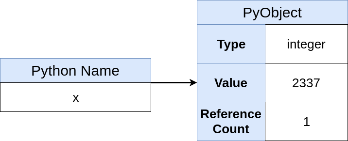
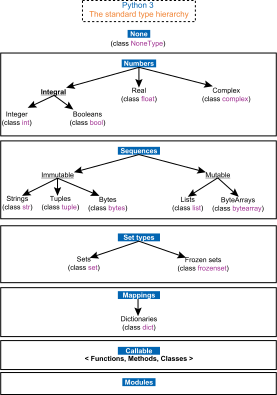
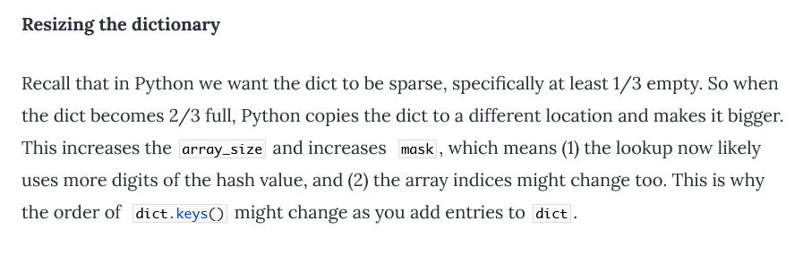
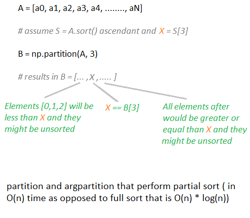
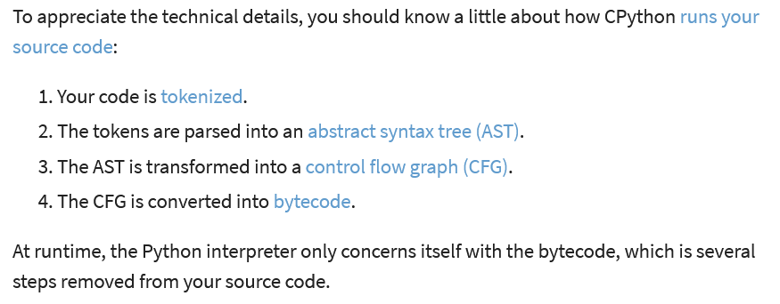

# Python

- [Python](#python)
  - [Cheat Sheets](#cheat-sheets)
  - [Identity vs equality](#identity-vs-equality)
  - [Shallow and Deep Copy](#shallow-and-deep-copy)
  - [Name resolution](#name-resolution)
  - [Operators](#operators)
    - [Division and Modulo](#division-and-modulo)
    - [Short-circuiting](#short-circuiting)
  - [Unpacking](#unpacking)
  - [Error handling](#error-handling)
  - [Pass by value or reference?](#pass-by-value-or-reference)
  - [Library, Packages, Modules](#library-packages-modules)
    - [python -m](#python--m)
    - [`__init__.py`](#__init__py)
    - [`__main__.py`](#__main__py)
  - [Types](#types)
    - [overload](#overload)
    - [Use object instead of Any](#use-object-instead-of-any)
    - [Generics and TypeVar](#generics-and-typevar)
    - [Constants](#constants)
  - [Sequences](#sequences)
    - [Filter Map Reduce](#filter-map-reduce)
    - [Comprehension lists/dicts](#comprehension-listsdicts)
    - [Custom sort](#custom-sort)
    - [Custom max](#custom-max)
  - [Itertools](#itertools)
  - [Generators, Iterators](#generators-iterators)
    - [yield from](#yield-from)
  - [Data structures](#data-structures)
    - [Lists](#lists)
    - [Dicts](#dicts)
    - [Sets](#sets)
    - [Frozen sets](#frozen-sets)
    - [String](#string)
    - [Enum](#enum)
    - [Data Classes](#data-classes)
      - [Namedtuple](#namedtuple)
      - [TypedDict](#typeddict)
      - [attrs](#attrs)
      - [Dataclasses](#dataclasses)
      - [Pydantinc](#pydantinc)
  - [Decorators](#decorators)
  - [Context managers (with)](#context-managers-with)
  - [Classes](#classes)
    - [Inheritance and MRO: Method Resolution Order](#inheritance-and-mro-method-resolution-order)
    - [ABC: Abstract Base Classes](#abc-abstract-base-classes)
    - [Class Decorators](#class-decorators)
    - [`__new__`](#__new__)
    - [Metaclasses](#metaclasses)
      - [Example](#example)
  - [Numpy](#numpy)
  - [CPython](#cpython)
  - [GIL](#gil)
  - [Python ooooopssiieess](#python-ooooopssiieess)
  - [Timing code](#timing-code)
  - [Wheels](#wheels)
  - [Virtualenv](#virtualenv)
  - [Versioning](#versioning)
  - [Logging](#logging)
  - [Organize Python code](#organize-python-code)
  - [Python Testing](#python-testing)
    - [Fixtures](#fixtures)
    - [Compare floats](#compare-floats)
    - [unittest (mock, patch, MagicMock)](#unittest-mock-patch-magicmock)
      - [Mock](#mock)
      - [return\_value](#return_value)
      - [side\_effect](#side_effect)
      - [Mock useful functions](#mock-useful-functions)
      - [spec](#spec)
      - [create\_autospec](#create_autospec)
      - [MagicMock](#magicmock)
      - [@mock.patch](#mockpatch)
      - [Where to patch?](#where-to-patch)
      - [@mock.patch pitfall: decorator order](#mockpatch-pitfall-decorator-order)
      - [@mock.patch.object](#mockpatchobject)
      - [Patch dictionnaries](#patch-dictionnaries)
      - [Property mocking](#property-mocking)
      - [Patch constant](#patch-constant)
      - [wraps](#wraps)
    - [pytest monkeypatch fixture](#pytest-monkeypatch-fixture)
    - [pytest-mock plugin mocker fixture](#pytest-mock-plugin-mocker-fixture)
  - [Async await](#async-await)
    - [Event loop](#event-loop)
    - [`asyncio.gather()`](#asynciogather)
    - [`asyncio.create_task()`](#asynciocreate_task)
    - [`asyncio.as_completed()`](#asyncioas_completed)
  - [FastApi](#fastapi)
    - [HTTP methods](#http-methods)
    - [Order matters](#order-matters)
    - [Parameters](#parameters)
  - [SQLAlchemy](#sqlalchemy)
    - [Session](#session)
    - [Expiring objects](#expiring-objects)
    - [Refreshing objects](#refreshing-objects)
    - [Expire vs Refresh](#expire-vs-refresh)
    - [Flusing objects](#flusing-objects)
    - [Committing objects](#committing-objects)
    - [Recap](#recap)
    - [Pitfalls](#pitfalls)
    - [Tips](#tips)

## Cheat Sheets

- [Comprehensive Python Cheatsheet](https://gto76.github.io/python-cheatsheet/)

## Identity vs equality

- use "==" for equality, "is" for identity.
- Python keeps an array of small integer objects (i.e., integers between -5 and 256):

```python
a = b = 1
print("a is b", bool(a is b))  # yes
c = d = 999
print("c is d", bool(c is d))  # false
```

## Shallow and Deep Copy

```python
list1 = [1, 2]
list2 = list1  # reference
list3 = list1[:]  # shallow copy
list4 = list1.copy()  # shallow copy
```

- The difference between shallow and deep copying is only relevant for __compound objects__ (objects that contain other objects, like lists or class instances):
  - A shallow copy constructs a new compound object and then (to the extent possible) inserts references into it to the objects found in the original.
  - A deep copy constructs a new compound object and then, recursively, inserts copies into it of the objects found in the original.
  - Use: `from copy import deepcopy ; list3 = deepcopy(list1)`

## Name resolution

LEGB scope resolution (Local -> Enclosed -> Global -> Built-in)

- Local can be inside a function or class method, for example.
- Enclosed can be its enclosing function, e.g., if a function is wrapped inside another function.
- Global refers to the uppermost level of the executing script itself
- Built-in are special names that Python reserves for itself.

## Operators

### Division and Modulo

- Modulo: `(-5) % 4 = (-2 × 4 + 3) % 4 = 3`
- get remainder: `quotient, remainder = divmod(a, b)`

### Short-circuiting

`a = a or []` sets `a` to `[]` if `a` is `None`

## Unpacking

- Unpacking syntax, "splat"-operators, `*args, **kwargs` ([Asterisks in Python: what they are and how to use them](https://treyhunner.com/2018/10/asterisks-in-python-what-they-are-and-how-to-use-them/))
- transpose list:

```python
def transpose_list(list_of_lists):
    return [list(row) for row in zip(*list_of_lists)]
```

## Error handling

```python
try:
    print("in try:")
    print("do some stuff")
    float("abc")
except ValueError:
    print("an error occurred")
else:
    print("no error occurred")
finally:
    print("always execute finally")
```

## Pass by value or reference?

- Not by value

```python
a = [1, 2]


def f(x):
    x[0] = 5


print(a)  # prints [5, 2]
```

- Not by reference

```python
a = 3


def f(x):
    x = 5


print(a)  # prints 3
```

- Call by assignment! <https://www.jeffknupp.com/blog/2012/11/13/is-python-callbyvalue-or-callbyreference-neither/>

- the parameter passed in is actually a reference to an object (but the reference is passed by value)

## Library, Packages, Modules

- A module is a bunch of related code grouped together. A module is any python file, it can  contain submodules.
- A package is a collection of various modules. `__init__.py` contains the initialization code for the package. For example, you can control the functions you are exposing from the package by importing those specific functions into `__init__.py` file.
- A library is a collection of modules and packages.

### python -m

`python -m` lets you run modules as scripts.

If your module is just one `.py` file it'll be executed (which usually means code under `if __name__ == '__main__'`).

If your module is a directory, Python will look for `__main__.py` (next to `__init__.py`) and will run it.

### `__init__.py`

`__init__.py` is run when you import a package into a running python program.

For instance, `import idlelib` within a program, runs `idlelib/__init__.py`, which does not do anything as its only purpose is to mark the idlelib directory as a package.

On the otherhand, `tkinter/__init__.py` contains most of the tkinter code and defines all the widget classes.

You might see `__all__` in some `__init__.py` files. This is a list of names that will be imported when you do `from package import *`. It's not used very often.

### `__main__.py`

`__main__.py` is run as `__main__` when you run a package as the main program.

For instance, `python -m idlelib` at a command line runs `idlelib/__main__.py`, which starts Idle.

Similarly, `python -m tkinter` runs `tkinter/__main__.py`.

## Types



### overload

The `@overload` decorator is used to provide multiple function signatures for the same function. It allows the type checker to understand the different ways a function can be called and to narrow down the type of the result.

Sometimes the types of several variables are related, such as “if x is type A, y is type B, else y is type C”. Basic type hints cannot describe such relationships, making type checking cumbersome or inaccurate. We can instead use `@typing.overload` to represent type relationships properly.

```python
from typing import overload


@overload
def double(input_: int) -> int:
    ...  # ellipsis is a placeholder for the actual implementation


@overload
def double(input_: Sequence[int]) -> list[int]:
    ...  # ellipsis is a placeholder for the actual implementation


def double(input_: int | Sequence[int]) -> int | list[int]:
    if isinstance(input_, Sequence):
        return [i * 2 for i in input_]
    return input_ * 2
```

All @overload definitions must come before the implementation, and multiple implementations are not allowed.

### Use object instead of Any

It’s common to overuse `typing.Any`. This is dangerous, since `Any` entirely disables type checking for a variable, allowing any operation.

If you’re using `Any` to mean “this object could be any type, and I don’t care what”, you probably want to use `object` instead. Every object in Python inherits from `object`, which makes it an “opaque” type that only allows operations common to everything. Therefore we could pass, print, or store such variables in a container, but we couldn’t do anything more specific.

```python
from typing import Any

x: Any = 1
x.foo()  # No pyright error, but runtime error

x: object = 1
x.foo()  # Pyright error
```

### Generics and TypeVar

The aim of generics are to:

- Allow functions, methods and classes to work with arguments of any type whilst maintaining the information on the relationships between things, such as arguments and return values.
- Better define how types can mix

Let's build a method that returns the first element of a sequence:

```python
def first(container):
    return container[0]
```

Let's add type hints:

```python
from typing import Sequence, TypeVar

T = TypeVar("T")  # generic type


def first(container: Sequence[T]) -> T:
    return container[0]
```

Much better! Now we can see that the function takes a sequence of T and returns a T. But what is T? It's a type variable. It's a placeholder for a type that will be provided later.

`T = TypeVar("T", A, B)` means type variable `T` has value restrictions of classes `A` and `B`, but because it's invariant... it only accepts those two (and not any child classes of `A` or `B`).

`T = TypeVar("T", bound=A)` is a type variable with upper bound `A`. It can be substituted for any type that is a subclass of `A`.

`T` and `U` are commonly used names in generics to represent type variables.

Generics are not just used for function and method parameters. They can also be used to define classes that can contain, or work with, multiple types.

In our previous example, we use `Sequence[T]`. `Sequence` is a generic type. It's a type that takes a type variable. It's a generic container type, like `List`, `Tuple`, `Dict`, `Set`, etc. Most container types in the Typing module are generic.

If we did not define a type on instantiation, then it assumes `Any`. That means that `my_list: List = ['a']` and `my_list: List[Any] = ['a']` are the same.

```python
from typing import TypeVar, Generic

T = TypeVar("T")


class Box(Generic[T]):
    def __init__(self, content: T) -> None:
        self.content = content

    def get_content(self) -> T:
        return self.content


box = Box(1)
reveal_type(box)  # Revealed type is 'Box[builtins.int]'
reveal_type(box.get_content())  # Revealed type is 'builtins.int'
```

Advanced example: we want a class with an attribute `.jobs` that has a different type depending on an input parameter.

```python
from typing import Generic, Literal, TypeVar, cast, overload, reveal_type

InputType = Literal["TEXT", "IMAGE", "VIDEO"]


# we don't fill the class for this example...
class TextJob:
    ...


class ImageJob:
    ...


class VideoJob:
    ...


T = TypeVar("T", TextJob, ImageJob, VideoJob)


class MyMainClass(Generic[T]):
    jobs: T  # we don't know the type yet, but we know it will be one of the 3 classes above

    # we use overload to define the different signatures of the __init__ method
    @overload
    def __init__(self: "MyMainClass[TextJob]", input_type: Literal["TEXT"]) -> None:
        ...

    @overload
    def __init__(self: "MyMainClass[ImageJob]", input_type: Literal["IMAGE"]) -> None:
        ...

    @overload
    def __init__(self: "MyMainClass[VideoJob]", input_type: Literal["VIDEO"]) -> None:
        ...

    # we usually start with the "real" implementation and then we define the overload above
    def __init__(self, input_type: InputType) -> None:
        # we set the jobs attribute to the correct type depending on the input_type
        # we also cast the result to the correct type
        # note that cast(typ, val) does nothing at runtime, it's only for type checking
        if input_type == "TEXT":
            self.jobs = cast(T, TextJob())
        elif input_type == "IMAGE":
            self.jobs = cast(T, ImageJob())
        elif input_type == "VIDEO":
            self.jobs = cast(T, VideoJob())


# now we can instantiate the class with the correct type
my_class = MyMainClass(input_type="TEXT")
reveal_type(my_class)  # Revealed type is 'MyMainClass[TextJob]'
reveal_type(my_class.jobs)  # Revealed type is 'TextJob'
```

### Constants

```python
from typing import Final

PI: Final = 3.14
```

## Sequences

### Filter Map Reduce

- `filter/map/reduce(lambda x: x, sequence)`
- Mapping: Items in the new iterable are produced by calling the transformation function on each item in the original iterable.
- Filtering: Items in the new iterable are produced by filtering out any items in the original iterable that make the predicate function return false.
- Reducing: applying a reduction function to an iterable to produce a single cumulative value.

### Comprehension lists/dicts

- comprehension list faster than for loop: it doesn't have to look up the list and its append method on every iteration.

### Custom sort

```python
x = sorted(x, key=functools.cmp_to_key(greater))
```

### Custom max

```python
max_len_string = max(list_of_strings, key=len)
```

## Itertools

- `islice(iterable, N)`: return an iterator of N selected elements from an iterable (`islice('ABCDEFG', 2) --> A B`)
- `chain(*iterables)`: return an iterator that combines the elements of several iterators into a single sequential iterator (`chain('ABC', 'DEF') --> A B C D E F`)
- `groupby(iterable, key=None)`: return an iterator that produces sets of values organized by a common key. MAKE SURE TO SORT THE ITERABLE FIRST! (`groupby('AAAABBBCC') --> A B C`)
- `pairwise(iterable)`: return an iterator that produces pairs of consecutive elements from an iterable (`pairwise('ABCDEFG') --> AB BC CD DE EF FG`)
- `takewhile(predicate, iterable)`: return an iterator that produces elements from the iterable as long as the predicate is true (`takewhile(lambda x: x<5, [1,4,6,4,1]) --> 1 4`)

## Generators, Iterators

- An iterable is anything you’re able to loop over.
- An iterator is the object that does the actual iterating.
- iterators are also iterables and their iterator is themselves
- [Python: range is not an iterator!](https://treyhunner.com/2018/02/python-range-is-not-an-iterator/)
- 4 ways:
  1. `yield`
  2. generator `a_generator = (i for i in range(0))`
  3. class with `__iter__` and `__next__` (and `__reversed__` if reverse needed)
  4. class with `__getitem__` and iterate on it (and `__len__` if reverse needed)
- A generator IS an iterator
- 4 ways have pros and cons: `yield` and `generator` cannot be reversed

### yield from

- `yield from` is a way to delegate iteration to a subgenerator. It allows you to write a generator that is a wrapper around another generator.

```python
def starting_five() -> Generator[int, None, None]:
    """Generator that returns integers from 1-5"""
    for n in range(1, 6):
        yield n


def ending_five() -> Generator[int, None, None]:
    """Generator that returns integers from 6-10"""
    for n in range(6, 11):
        yield n


def all_ten() -> Generator[int, None, None]:
    """Generator that relies on other generators"""
    yield starting_five()  # This is broken, we need to use yield from
    yield ending_five()  # This is broken, we need to use yield from
```

## Data structures

- Everything is immutable except `list`, `dict`, `set`
- `from collections import deque` for stacks and queues

### Lists

- `list = list + a` not in place
- `list += a` in place (same `id`)
- Out of range list slicing

```python
my_list = [1, 2, 3, 4, 5]
print(my_list[899:])  # no error!
```

- Slicing a list `a[2:4]` returns a new list but does a shallow copy. Numpy view doesn't create a new array, it creates a view...
- [] vs list() <https://towardsdatascience.com/no-and-list-are-different-in-python-8940530168b0> , [] is faster!

### Dicts

- `x = car.setdefault("model", "Bronco")` with `car` being a dictionnary. The `setdefault()` method returns the value of the item with the specified key. If the key does not exist, insert the key, with the specified value (`"Bronco"`)
- `car = collections.defaultdict(lambda:"Bronco")`
- resizing: 

### Sets

```python
A = {0, 2, 4, 6, 8}
B = {1, 2, 3, 4, 5}
print("Union :", A | B)  # set([0, 1, 2, 3, 4, 5, 6, 8])
print("Intersection :", A & B)  # set([2, 4])
print("Difference :", A - B)  # set([8, 0, 6])
print("Symmetric difference :", A ^ B)  # set([0, 1, 3, 5, 6, 8])
```

### Frozen sets

immutables

### String

- `str1.rfind(pattern, begin=0, end=len(str1))`

### Enum

```python
from enum import Enum, auto


class Color(Enum):
    RED = auto()  # auto() assigns a value automatically. Here RED = 1
    GREEN = auto()
    BLUE = auto()


print(Color.RED)  # Color.RED
```

Can also have typed enums:

```python
from enum import Enum


class Color(Enum):
    RED: int = 1
    GREEN: int = 2
    BLUE: int = 3


print(Color.RED)  # Color.RED
```

### Data Classes

#### Namedtuple

- ok for small data structures
- they can be typed.

```python
Point = typing.NamedTuple("Point", [("x", int), ("y", int)])


# or the class way:
class Point(NamedTuple):
    x: int
    y: int = 1  # Set default value
```

- hard to add default values
- are immutable.

#### TypedDict

- are a regular dictionary
- typecheckers will warn you of errors.
- But at run time no check is performed.
- no way to customize magic methods (for equality, properties, etc.)

#### attrs

- More powerful than dataclasses
- Attrs supports both ways. The default is to allow positional and keyword arguments like data classes. You can enable kw-only arguments by passing kw_only=True to the class decorator.
- When you need more features (more control over the generated class or data validation and conversion), you should use attrs.

#### Dataclasses

Inspired by attrs, but smaller feature set. Added to the standard library in Python 3.7.

- TypedDict with attributes...
- mostly contain data but they can also include methods
- they reduce the boilerplate you have to write.
- Basic functionality is already implemented (equality, print, etc.).
- They can be made immutable: `@dataclass(frozen=True)`. But be careful cause attributes can be mutable...
- no type validation is done at runtime.
- Data classes support positional as well as keyword arguments.

```python
from dataclasses import dataclass


@dataclass
class DataClassCard:
    rank: str
    suit: str = 42
```

#### Pydantinc

- gives you a class which gives you both static and runtime type safety.
- data validation
- convert data (json, yaml, etc.) to your dataclass in python
- Pydantic models enforce keyword only arguments when creating new instances.
- pydantic allows you to use mutable objects like lists or dicts as default values. pydantic deep-copies the default value for each new instance.
- attrs and data classes are much faster than pydantic when no validation is needed. They also use a lot less memory.
- If you need extended input validation and data conversion, Pydantic is the tool of choice.

```python
from pydantic import BaseModel, Field


class Item(BaseModel):
    name: str
    price: float = Field(gt=0, description="The price must be greater than zero")
    description: Optional[str] = Field(
        None, title="Description of the item", max_length=300
    )
```

## Decorators

```python
def validate_summary(func):
    def wrapper(*args, **kwargs):
        data = func(*args, **kwargs)
        if len(data["summary"]) > 80:
            raise ValueError("Summary too long")
        return data

    return wrapper
```

```python
class MyDecorator:
    def __init__(self, function):
        self.function = function

    def __call__(self, *args, **kwargs):
        # DO STUFF
        self.function(*args, **kwargs)
        # DO STUFF


# adding class decorator to the function
@MyDecorator
def function(arg1, arg2):
    pass


function("foo", "bar")
```

Difference between `@decorator` and `@decorator()`:

- `@pytest.fixture` is a regular decorator, equivalent to `my_decorated_method = pytest.fixture(my_method)`.
- `@pytest.fixture()` is a method that returns a decorator/callable, equivalent to `my_decorated_method = pytest.fixture()(my_method)`.
- For `pytest.fixture`, there is no difference, you can use both since `pytest.fixture()` without arguments will return the decorator `pytest.fixture`.

`functools.wraps` is used to preserve the metadata of the decorated function.

```python
from functools import wraps


def my_decorator(func):
    @wraps(func)
    def wrapper(*args, **kwargs):
        # Do something with func
        return func(*args, **kwargs)

    return wrapper


@my_decorator
def example():
    """Docstring"""
    pass


print(example.__name__)  # example
print(example.__doc__)  # Docstring
```

## Context managers (with)

Use context managers (`with...`) instead of `try` + `finally`!

Just need a class with `__enter__` and `__exit__` implemented.

But, if you still prefer to use `try` + `finally`, you can use `contextlib.contextmanager`:

```python
from contextlib import contextmanager


@contextmanager
def my_context_manager():
    res = get_resource()
    try:
        yield res  # might crash here
    finally:
        release_resource(res)
```

## Classes

- `super()`: [Comment marche réellement la fonction super() de Python](http://www.stashofcode.fr/comment-marche-fonction-super-de-python/)
- `super().__init__(args...)`
- [A Guide to Python's Magic Methods](https://rszalski.github.io/magicmethods/)
- `__repr__` vs `__str__`:
  - `__repr__` goal is to be unambiguous
  - `__str__` goal is to be readable
- `__init__` is not a constructor! It is the static method `__new__` (it is not a class method!) that creates and returns a new instance before `__init__()` is called
- `del x` doesn’t directly call `x.__del__()`:
  - `del x` decrements the reference count for x by one
  - `x.__del__()` is only called when x’s reference count reaches zero. It is called when an object is garbage collected which happens at some point after all references to the object have been deleted.
- `hasattr(self, attr_name)` to check if `instance.attr_name` exists

### Inheritance and MRO: Method Resolution Order

```python
class A:
    def foo(self):
        print("class A")


class B(A):
    pass


class C(A):
    def foo(self):
        print("class C")


class D(B, C):
    pass


D().foo()  # prints class C, searches in B first!
```

```python
class A:
    x = 1


class B(A):
    pass


class C(A):
    pass


A.x, B.x, C.x  # (1, 1, 1)
B.x = 2  # B.x is now 2
A.x, B.x, C.x  # (1, 2, 1)
A.x = 3  # A.x is now 3
A.x, B.x, C.x  # (3, 2, 3) # C.x is now 3 !!!
```

Since C.x is not defined, it searches in A, and since A.x is now 3, C.x is now 3.

### ABC: Abstract Base Classes

```python
from abc import ABC, abstractmethod


class AbstractClass(ABC):
    @abstractmethod
    def foo(self):
        raise NotImplementedError  # or pass or ...


class ConcreteClass(AbstractClass):
    def foo(self):
        return "foo"
```

### Class Decorators

- staticmethod: code that belongs to a class, but that doesn't use the object itself at all
- classmethod: Class methods are methods that are
not bound to an object, but to… a class
- abstractmethod: method defined in a base class, but that may not provide any implementation
- property: access or compute property

<https://towardsdatascience.com/why-you-should-wrap-decorators-in-python-5ac3676835f9>

### `__new__`

`__new__` is the first step of instance creation. It's called first, and is responsible for returning a new instance of your class. In contrast, `__init__` doesn't return anything; it's only responsible for initializing the instance after it's been created.

You can use `__new__` to create a singleton class for example:

```python
class MyClass:
    _self = None

    def __new__(cls, *args, **kwargs):
        if not cls._self:
            cls._self = super().__new__(cls, *args, **kwargs)
        return cls._self
```

### Metaclasses

Since classes are objects, you can create them on the fly, like any object.

Metaclasses are the "stuff" that creates classes. They are classes that create classes.

Well, metaclasses are what create these objects. They are the classes' classes, you can picture them this way:

```python
MyClass = MetaClass()
my_object = MyClass()
```

`type` is the metaclass Python uses to create all classes behind the scenes.

The `__class__` of any `__class__`  is `type`.

`type` has an ability: it can create classes on the fly. `type` can take the description of a class as parameters, and return a class.

`type` works this way: `type(name: str, bases: tuple, attrs: dict)`

- `name`: name of the class
- `bases`: tuple of the parent class (used for inheritance, can be left empty)
- `attrs`: dictionary containing attributes names and values

You can thus create a class with `type`:

```python
MyClass = type("MyClass", (), {"bar": True})
my_instance = MyClass()


# same as
class MyClass:
    bar = True
```

To create a metaclass, you need to subclass `type`:

```python
class MyMetaClass(type):
    """Metaclass.

    Prints a message every time a class is created.

    Also automatically add a 'bar' attribute set to True to every class.
    """

    def __new__(cls, name, bases, dct):
        print("Creating class %s" % name)
        dct["bar"] = True
        return super().__new__(cls, name, bases, dct)


class MyClass(metaclass=MyMetaClass):  # MyClass is created by Meta
    pass


my_instance = MyClass()
print(my_instance.bar)  # True
```

#### Example

Let's create a singleton metaclass:

```python
class Singleton(type):
    _instances = {}

    def __call__(
        cls, *args, **kwargs
    ):  # Note that we are using __call__ here, not __new__.
        if cls not in cls._instances:
            cls._instances[cls] = super().__call__(
                *args, **kwargs
            )  # super().__call__ calls __new__ and __init__
        return cls._instances[cls]


class MyClass(metaclass=Singleton):
    pass


my_instance = MyClass()
my_instance2 = MyClass()
print(my_instance is my_instance2)  # True
```

## Numpy

- `np.take(A, indices=[0, -1], axis=0)` faster than `B = A[[0, -1], :]`
- `a += x` faster than `a = a + x` because inplace
- [100 numpy exercises (with solutions)](https://github.com/rougier/numpy-100)
- <https://numpy.org/devdocs/user/basics.broadcasting.html>



## CPython



## GIL

- GIL, Global Interpreter Lock
- a mutex that allows only one thread to hold the control of the Python interpreter.
- only one thread can be in a state of execution at any point in time.
- it can be a performance bottleneck in CPU-bound and multi-threaded code.
- Why GIL?
  - Python uses reference counting for memory management.
  - The problem was that this reference count variable needed protection from race conditions where two threads increase or decrease its value simultaneously.
- Imagine you have two threads, each one having to add an element to a dictionary.
- This operation, adding an element to a dictionary, is not a single operation in the underlying C code. It is a series of instructions.
- The problem is that if two threads try at the same time to add an element to that dictionary, the order in which the series of instructions (which are executed twice, once per each thread) above is interleaved may end up making a mess.
- So you need to ensure that the series of instructions is executed by only one thread at a time. How to do so?
- You use a lock. A lock is basically a guarantee that the first thread that needs to execute those instructions, will execute them without any other thread touching that dictionary until it's done adding that element.
- Now the problem moves to how granular you want the lock to be. Clearly, if one thread is acting on one dictionary, and another thread is acting on another dictionary, they don't conflict with each other and they can work in parallel, but then you need to add a lock to every dictionary. The same applies to every list, every mutable structure, external or internal. This is a lot of locks to handle and manage. And each lock occupies memory, and each lock requires time to be grabbed, and time to be released.
- So a simpler solution is to have One lock (TM). The first thread that grabs it wins, and does whatever it wants until it's done. __Even if the second thread has no intention of touching anything that the first thread is modifying, it will have to wait until the first thread is done.__

## Python ooooopssiieess

- <https://github.com/satwikkansal/wtfpython>

```python
def foo(
    bar=[],
):  # the default value for a function argument is only evaluated once, at the time that the function is defined. Each time the function is called, the same list is used.
    bar.append("baz")
    return bar
```

## Timing code

```python
import timeit

print(timeit.timeit(my_function, number=100000))
```

- the `timeit` function requires you to pass only the name of the function (in this case `my_function`)
- the `%timeit` magic command requires the function call `my_function()` itself. `%timeit sum(range(100))`
- `python -m cProfile -s tottime your_program.py` ([Profiling and optimizing your Python code](https://toucantoco.com/en/tech-blog/tech/python-performance-optimization))

## Wheels

- <https://www.lfd.uci.edu/~gohlke/pythonlibs/>
- <http://eturnbull.ca/pythonlibs/>

## Virtualenv

```shell
virtualenv --python=c:\Python25\python.exe path/to/new/env/envname
```

## Versioning

<https://www.darius.page/pipdev/>

## Logging

```python
import logging

logging.basicConfig(level=logging.WARNING)  # minimum level that will be logged

logging.debug("")  # won't be logged
logging.info("")  # won't be logged
logging.warning("")
logging.error("")
logging.critical("")
```

Python doesn’t provide any logging handlers by default, resulting in not seeing anything but an error from the logging package itself...

Add a handler to the root logger so we can see the actual errors:

```python
import logging

logger = logging.getLogger(
    "my_app"
)  # you can use another logger name for a module of your app
logger.setLevel(logging.DEBUG)  # minimum level that will be logged
logger.addHandler(
    logging.StreamHandler()
)  # add a handler to the root logger. StreamHandler() will log to the console. You can use FileHandler() to log to a file.
```

To keep a single logger for the whole app:

```python
LOGGER = None


def get_logger():
    global LOGGER

    if LOGGER is not None:
        return LOGGER

    LOGGER = logging.getLogger("my_app")
    LOGGER.handlers.clear()  # remove all handlers
    LOGGER.addHandler(logging.StreamHandler())
    return LOGGER
```

More: <https://guicommits.com/how-to-log-in-python-like-a-pro/>

## Organize Python code

- <https://guicommits.com/organize-python-code-like-a-pro/>
- <https://blog.ionelmc.ro/2014/05/25/python-packaging/#the-structure%3E>

## Python Testing

### Fixtures

Pytest provides some built-in fixtures that can be used in tests:

- `tmp_path`: A temporary directory unique to each test function, as a pathlib.Path object.

Every test function will get the fixture below that sets args:

```python
@pytest.fixture(autouse=True)
def setup_tests():
    # DO stuff
    yield object  # or return...
    # clean if needed
```

This will block all people from using requests.get in their tests:

```python
@pytest.fixture(autouse=True)
def disable_network_calls(monkeypatch):
    def stunted_get():
        raise RuntimeError("Network access not allowed during testing!")

    monkeypatch.setattr(requests, "get", lambda *args, **kwargs: stunted_get())
```

### Compare floats

```python
assert output_value == pytest.approx(expected_value)
```

### unittest (mock, patch, MagicMock)

- Mock class
- mock provides a patch() decorator that handles patching module and class level attributes within the scope of a test
- along with sentinel for creating unique objects.
- Mock and MagicMock classes are interchangeable. As the MagicMock is the more capable class it makes a sensible one to use by default.

#### Mock

```python
mock = Mock()
mock.__str__ = Mock()
mock.__str__.return_value = "fooble"
str(mock)  # prints 'fooble'
mock = Mock(return_value=42)
mock()  # 42
```

```python
book = Mock(author=Mock(first_name="Tatjana"))
print(book.author.first_name)  # "Tatjana"

book = Mock()
book.author.first_name = "Evgenij"
print(book.author.first_name)  # "Evgenij"

book = Mock()
print(
    book.author.first_name
)  # <Mock name='mock.author.first_name' id='140504918800992'>
```

```python
book = Mock()
book.author.get_full_name.return_value = ""
print(book.author.get_full_name())  # ""

book = Mock(author=Mock(get_full_name=Mock(return_value="Aleksandr Pushkin")))
print(book.author.get_full_name())  # "Aleksandr Pushkin"
```

```python
book = Mock()
book.get_review.return_value.reviewer = {"name": "Natalia"}
print(book.get_review(type="oldest").reviewer.get("name", "unknown"))  # "Natalia"
```

⚠ careful with `name` attribute, it is used to describe the Mock name:

```python
author = Mock(name="Pushkin")
print(author.name)  # <Mock name='Pushkin.name' id='140504918800992'>
```

When we are mocking a deeply nested attribute, we don’t need to explicitly create sub-Mocks at every level. As soon as we access an attribute/function/property, a new Mock will automatically be created, if none exists:

```python
book.get_review(sort="date", order="desc").reviewer.get_country().short_name  # valid
```

```python
from unittest import mock


def test_my_function():
    r = Mock()
    r.content = b'{"success": true}'
    with mock.patch(
        "requests.get", return_value=r
    ) as get:  # Avoid doing actual GET request
        some_function()  # Function that calls requests.get
        get.assert_called_once()
```

```python
def some_method(target, value):
    return target.apply(value)


def test_method():
    target = mock.Mock()
    some_method(target, "value")
    target.apply.assert_called_with("value")
```

#### return_value

```python
m.return_value = 42
assert m() == 42
```

#### side_effect

To mock a method in a class with @patch.object but return a different value each time it is called, use side_effect:

- iterator

    ```python
    mock = Mock(side_effect=[...])
    ```

- exception

    ```python
    user = Mock()
    user.social_accounts.add.side_effect = SocialAlreadyClaimedException
    ```

- as a substitute class/function (But it must be a function or a class not a different type of object and it must accept the same variables as the original function/class.)

    ```python
    create_url = Mock(side_effect=substitue_create_url)
    ```

#### Mock useful functions

All useful functions:

- mock_obj.assert_called()  # doesn't work with autospec=True? just assert obj.called
- mock_obj.assert_called_once()
- mock_obj.assert_called_with(100, "Natalia")
- mock_obj.assert_called_once_with(100, "Natalia")
- mock_obj.assert_not_called()
- mock_obj.reset_mock()

When we don't care to know all function parameters or don't care to set them all, we can use ANY as a placeholder.

```python
from mock import ANY

mock_obj.assert_called_once_with(ANY, "Natalia")
```

What about when the mocked function is called more than once:

```python
from mock import call

mock_obj.assert_has_calls(
    [
        call(None, "Evgenij"),
        call(100, "Natalia"),
    ],
    any_order=True,
)
```

Special attributes:

```python
# Number of times you called loads():
print(json.loads.call_count)
1

# The last loads() call:
print(json.loads.call_args)
call('{"key": "value"}')

# List of loads() calls:
print(json.loads.call_args_list)
[call('{"key": "value"}')]

# List of calls to json's methods (recursively):
print(json.method_calls)
[call.loads('{"key": "value"}')]
```

#### spec

Put simply, it preconfigures mocks to only respond to methods that actually exist in the spec class. There are several ways to define specs, but the easiest is to simply pass `autospec=True` to the patch call, which will configure the Mock to behave as the object being mocked, raising exceptions for missing attributes and incorrect signatures as required.

When configuring a Mock, you can pass an object specification to the `spec` parameter. The `spec` parameter accepts a list of names or another object and defines the mock’s interface. If you attempt to access an attribute that does not belong to the specification, Mock will raise an AttributeError:

```python
book = Mock(spec=["is_weekday", "get_holidays"])
print(item.slug)  # attribute error since "slug" is not in "spec"
```

#### create_autospec

One way to implement automatic specifications is `create_autospec`.

The `mock.create_autospec` method creates a functionally equivalent instance to the provided class. What this means, practically speaking, is that when the returned instance is interacted with, it will raise exceptions if used in illegal ways.

More specifically, if a method is called with the wrong number of arguments, an exception will be raised.

```python
def test_upload_complete():
    mock_removal_service = mock.create_autospec(RemovalService)  # creates instance
    reference = UploadService(mock_removal_service)
    reference.upload_complete("my uploaded file")
    mock_removal_service.rm.assert_called_with("my uploaded file")
```

You should always use the `create_autospec` method and the `autospec` parameter with the `@patch` and `@patch.object` decorators.

#### MagicMock

MagicMock is a subclass of Mock with default implementations of most of the magic methods. You can use MagicMock without having to configure the magic methods yourself:

```python
mock = MagicMock()
mock[
    3
] = "fish"  # MagicMock already has __getitem__ implemented, this would crash with Mock
mock.__setitem__.assert_called_with(3, "fish")  # true
mock.__getitem__.return_value = "result"
mock[2]  # 'result'
```

#### @mock.patch

it produces a MagicMock

Generally speaking, the target is constructed like this: `<prefix><suffix><optional suffix>`:

- The prefix is: the path to the module, which will import the function/class/module we are mocking.
- The suffix is: the last part of the from .. import.. statement which imports the object we are mocking, everything after import.
- The optional suffix is: If the suffix is the name of a module or class, then the optional suffix can the a class in this module or a function in this class. This way we can mock only 1 function in a class or 1 class in a module.

See level 5 here: <https://www.ines-panker.com/2020/06/01/python-mock.html>

```python
@mock.patch("mymodule.os")
def test_rm(mock_os):
    rm("any path")  # calls rm (that calls patched os.remove inside)
    mock_os.remove.assert_called_with("any path")  # test parameters match
```

```python
@mock.patch("mymodule.os.path")
@mock.patch("mymodule.os")
def test_rm(mock_os, mock_path):
    mock_path.isfile.return_value = False  # set up the mock
    rm("any path")  # don't delete file since file doesn't exist
    assert not mock_os.remove.called
    mock_path.isfile.return_value = True  # make the file 'exist'
    rm("any path")  # should call os.remove
    mock_os.remove.assert_called_with("any path")
```

```python
from unittest import mock


def test_my_function():
    with mock.patch("module.some_function") as some_function:  # Used as context manager
        my_function()  # function that calls `some_function`

        some_function.assert_called_once()
        some_function.assert_called_with(2, "x")


@mock.patch("module.func")  # Used as decorator
def test_my_function(some_function):
    module.func(10)  # Calls patched function
    some_function.assert_called_with(10)  # True
```

By default, `mock.patch()` will create a new mock object and use that as the replacement value. You can pass a different object using `mock.patch(new=other_object)` if want it to be used in place of a newly created mock object.

#### Where to patch?

A good rule of thumb is to patch() the object where it is looked up.

```python
import my_calendar
from unittest.mock import patch

with patch("my_calendar.is_weekday"):  # lookup function in my_calendar module
    my_calendar.is_weekday()  # <MagicMock name='is_weekday()' id='4336501256'>
```

```python
from my_calendar import is_weekday  # is_weekday has local scope, it won't be patched
from unittest.mock import patch

with patch("my_calendar.is_weekday"):
    is_weekday()  # False!!! It called the real function...
```

Do this instead:

```python
from my_calendar import is_weekday
from unittest.mock import patch

with patch("__main__.is_weekday"):
    is_weekday()  # <MagicMock name='is_weekday()' id='4502362992'>
```

#### @mock.patch pitfall: decorator order

When using multiple decorators on your test methods, order is important.

```python
@mock.patch("mymodule.sys")
@mock.patch("mymodule.os")
@mock.patch("mymodule.os.path")
def test_something(mock_os_path, mock_os, mock_sys):
    pass
```

```python
patch_sys(patch_os(patch_os_path(test_something)))
```

Since the patch to sys is the outermost patch, it will be executed last, making it the last parameter in the actual test method arguments.

#### @mock.patch.object

Also called partial class mocking.

The only difference is that patch takes a string as the target while patch.object needs a reference. patch.object is thus used for patching individual functions of a class.

object() takes the same configuration parameters that patch() does. But instead of passing the target’s path, you provide the target object, itself, as the first parameter.

```python
@mock.patch.object(facebook.GraphAPI, "put_object", autospec=True)
def test_post_message(mock_put_object):  # instance of class GraphAPI
    sf = simple_facebook.SimpleFacebook()
    sf.post_message(message="Hello World!")
    mock_put_object.assert_called_with(message="Hello World!")
```

```python
from unittest import mock


def test_my_function():
    with mock.patch.object(
        SomeClass, "method_of_class", return_value=None
    ) as mock_method:
        instance = SomeClass()
        instance.method_of_class("arg")
        mock_method.assert_called_with("arg")  # True
```

```python
@patch.object(requests, "get", side_effect=requests.exceptions.Timeout)
def test_get_holidays_timeout(mock_requests):
    with pytest.raises(requests.exceptions.Timeout):
        get_holidays()
```

#### Patch dictionnaries

Besides objects and attributes, you can also patch() dictionaries with patch.dict().

```python
with mock.patch.dict("os.environ", {"MY_VAR": "testing"}):
    assert os.environ["MY_VAR"] == "testing"
```

`os.path.dict` does not return a mocker:

```python
@mock.patch("os.getcwd", return_value="/home/")
@mock.patch("worker.print")
@mock.patch.dict("os.environ", {"MY_VAR": "testing"})
def test_patch_builtin_dict_decorators(self, mock_print, mock_getcwd):
    pass  # do stuff
```

#### Property mocking

```python
from mock import PropertyMock


@patch.object(Square, "area", new_callable=PropertyMock)
def test(mock_square):
    pass  # do stuff
```

#### Patch constant

```python
@patch("code.MY_CONSTANT", new=3)
def test():
    assert code.MY_CONSTANT == 3
```

#### wraps

`my_method = MagicMock(wraps=my_method)` will return a MagicMock object that wraps the original method. This means that when you call the MagicMock object, the original method will be called.

```python
from unittest.mock import MagicMock


def my_method():
    return 1


my_method = MagicMock(wraps=my_method)
print(my_method())  # 1

my_method.assert_called_once()
```

You can also use the `spy` feature of `pytest-mock` plugin: <https://pytest-mock.readthedocs.io/en/latest/usage.html#spy>

### pytest monkeypatch fixture

pytest monkeypatch is a pytest fixture that allows you to modify objects, dictionaries or os.environ variables, etc. It is a very powerful tool that allows you to modify the environment before running your tests.

monkeypatch is available as a parameter in each test function, and once inside the function we can use monkeypatch.setattr() to patch our command line arguments:

```python
def test_blabla(monkeypatch, tmp_path):
    monkeypatch.setattr("sys.argv", ["pytest", "--name", "logfilename.log"])
    ## Test as usual here
```

every test function will get the fixture below that sets args:

```python
@pytest.fixture(autouse=True)
def mock_sys_args(monkeypatch):
    monkeypatch.setattr("sys.argv", ["pytest", "--name", "logfilename.log"])
```

### pytest-mock plugin mocker fixture

pytest-mock is a pytest plugin thats:

- adds a mocker fixture which uses mock under the hood but with a surface area / api similar to monkeypatch.
- Basically all of the features of mock, but with the api of monkeypatch.

```python
from pytest_mock import MockerFixture


def test_blabla(mocker: MockerFixture):
    mocker.patch("sys.argv", ["pytest", "--name", "logfilename.log"])
    ## Test as usual here
```

## Async await

Async/await is a feature in Python that allows for asynchronous programming.

Asynchronous programming is a programming model where multiple tasks are executed concurrently, with each task running independently without waiting for the other tasks to finish.

This is in contrast to synchronous programming, where each task runs in sequence and waits for the previous task to complete before starting the next one.

Async functions are functions that can be paused and resumed at a later time. They are defined using the async keyword.

```python
async def my_function():
    print("Hello")
    await asyncio.sleep(
        1
    )  # Pause the function for 1 second. This is a coroutine function.
    print("World")


asyncio.run(my_function())  # Run the function until it is complete.
```

Await is used to pause the function until the coroutine is complete. __The await keyword can only be used inside an async function.__

Await tells Python interpreter to run other code in the meantime, and then return to the await statement later.

How is it different to threads ?

- Threads can be interrupted by the OS at any time, but async functions yeild control back to the event loop when they are waiting for an IO operation to complete.
- This is a cooperative multitasking model: the event loop will only switch to another task when the current task yields control back to the event loop.
- async/await runs in a single thread, so it can be more efficient than threads if you are doing a lot of IO-bound work (reading/writing files, making network requests, etc.).
- Indeed, when using threads you have to do a lot of context switching between threads, which is expensive.
- However, async/await is not suitable for CPU-bound work (computing stuff locally), as it will only use a single CPU core. Better to use threads for this.

In general:

- __async/await is a good choice for I/O-bound tasks__, where tasks spend most of their time waiting for I/O operations to complete (network, read/write file to disk, etc.).
- __threads are a good choice for CPU-bound tasks__, where tasks spend most of their time performing computations.

__Remember__: Async/await is not parallelism, it's concurrency.

- It's a way to write code that looks like it's running in parallel, but it's actually running in a single thread.
- There is not code being executed in parallel, it's just that the code is being executed in a way that makes it look like it's running in parallel.
- Everytime we use await, we are yielding control back to the event loop, which can then switch to another task.
- Python async only optimizes IDLE time

The downside of async is that you need to use libs that support it. For example, requests does not support async, so we need to use aiohttp instead.

### Event loop

The event loop is exactly what it sounds like, there is a queue of events/jobs and a loop that just constantly pulls jobs off the queue and runs them.

These jobs are called coroutines. They are a small set of instructions, including which events to put back on to the queue, if any.

### `asyncio.gather()`

Let's simulate an example of a server request taking some time to answer:

```python
import asyncio
import aiohttp  # use this instead of requests


async def query_something(url: str, fake_delay: int = 0):
    async with aiohttp.ClientSession() as session:
        async with session.get(url) as response:
            await asyncio.sleep(fake_delay)
            return await response.text()


async def main():  # main is async since it uses await
    await asyncio.gather(
        query_something("https://www.google.com", 1),
        query_something("https://www.google.com", 2),
        query_something("https://www.google.com", 3),
    )


if __name__ == "__main__":
    asyncio.run(
        main()
    )  # This will take around 3 seconds (max(1,2,3)) to complete! In a sync world, it would take 6 seconds.
```

### `asyncio.create_task()`

Is a function that creates a task from a coroutine. It's similar to `asyncio.gather()` but it does not wait for the tasks to complete.

```python
async def main():
    task1 = asyncio.create_task(query_something("https://www.google.com", 1))
    task2 = asyncio.create_task(query_something("https://www.google.com", 2))
    task3 = asyncio.create_task(query_something("https://www.google.com", 3))

    await task1  # if you don't await here, the task1 will not be executed at all!
    await task2
    await task3
```

### `asyncio.as_completed()`

Is a function that takes an iterable of coroutines and returns a generator that yields the results as they become available.

```python
async def main():
    tasks = [
        asyncio.create_task(query_something("https://www.google.com", 1)),
        asyncio.create_task(query_something("https://www.google.com", 2)),
        asyncio.create_task(query_something("https://www.google.com", 3)),
    ]

    for task in asyncio.as_completed(tasks):
        result = await task
        print(result)
```

## FastApi

FastAPI is a modern, fast (high-performance), web framework for building APIs with Python 3.6+ based on standard Python type hints.

```cmd
pip install "fastapi[all]"
```

In FastApi, we define paths operations. A path operation is a function that handles an HTTP request.

In a url like `http://example.com/items/foo`, the path would be `/items/foo`.

```python
from fastapi import FastAPI
from typing import Optional

app = FastAPI()  # create an instance of the FastAPI class


@app.get("/")  # decorator to tell FastAPI which path operation this function handles
def read_root():
    return {"message": "Hello World"}  # return a dict that will be converted into JSON


@app.get("/items/{item_id}")  # you can define path parameters with {}
def read_item(item_id: int, q: Optional[str] = None):
    return {"item_id": item_id, "q": q}


@app.get("/burgers")
async def read_burgers():  # async function
    burgers = await get_burgers(2)  # await the async function get_burgers
    return burgers
```

Run the server with:

```cmd
uvicorn main:app --reload
```

`--reload`: make the server restart after code changes. Only do this for development.

Check it, open your browser at <http://127.0.0.1:8000/items/5?q=somequery>

You will see the json response:

```json
{
    "item_id": 5,
    "q": "somequery"
}
```

`q` is an optional query parameter. If you don't provide it, it will be `None`.

Now, to send data to the server, we can use the `POST` method:

```python
from pydantic import BaseModel


class Item(BaseModel):
    name: str
    price: float


@app.post("/items/")  # POST method
async def create_item(item: Item):
    return {"message": f"Item {item.name} created!"}
```

`BaseModel` is a class that allows us to define the fields of our data model. It will also validate the data we send to the server.

Now, we can send a POST request to <http://127.0.0.1:8000/items/> with the following body:

```json
{
    "name": "Cheese Burger",
    "price": 4.99
}
```

And we will get the following response:

```json
{
    "message": "Item Cheese Burger created!"
}
```

### HTTP methods

When building APIs, you normally use these specific HTTP methods to perform a specific action.

Normally you use:

- POST: to create data. `@app.post`
- GET: to read data.  `@app.get`
- PUT: to update data.  `@app.put`
- DELETE: to delete data.  `@app.delete`

In FastApi, the return of methods can be a `dict`, a `list`, a `str`, a `int`, a `float`, a `bool`, or a Pydantic model. Anything that can be converted to JSON.

### Order matters

The order of the path operations matters. If you define a path operation with a path of `/users/me` and another with `/users/{user_id}`, the first will be matched before the second. Because `/users/me` will match `/users/{user_id}`.

```python
from fastapi import FastAPI

app = FastAPI()


@app.get("/users/me")
async def read_user_me():
    return {"user_id": "the current user"}


@app.get("/users/{user_id}")
async def read_user(user_id: str):
    return {"user_id": user_id}
```

The `read_users_1` will always be used since the path matches first:

```python
from fastapi import FastAPI

app = FastAPI()


@app.get("/users")
async def read_users_1():
    return ["Rick", "Morty"]


@app.get("/users")
async def read_users_2():
    return ["Bean", "Elfo"]
```

### Parameters

Query parameters are optional parameters that are passed in the url.

```python
@app.get("/items/")
async def read_item(skip: int = 0, limit: int = 10):
    return fake_items_db[skip : skip + limit]
```

You can use those parameters calling this url: <http://127.0.0.1:8000/items/?skip=0&limit=100>

You can also declare optional query parameters with `typing.Optional`.

```python
@app.get("/items/{item_id}")
async def read_user_item(
    item_id: str, needy: str, skip: int = 0, limit: Union[int, None] = None
):
    item = {"item_id": item_id, "needy": needy, "skip": skip, "limit": limit}
    return item
```

`item_id` is a path parameter.

In this case, there are 3 query parameters:

- needy, a required str.
- skip, an int with a default value of 0.
- limit, an optional int.

## SQLAlchemy

SQLAlchemy is an object-relational mapper widely used in the Python. As an ORM, SQLAlchemy enables you to manipulate database records as Python objects.

For example, a row in your users table would be represented as a <User> object, which has attributes, methods, and so on.

### Session

The Session object is the entry point to SQLAlchemy’s ORM API. It represents the ORM’s “handle” to the database, and as such is most commonly used to issue queries via the Query object.

These objects are held in memory and need to be synchronised with its representation in your database at some interval, otherwise the in-memory representation differs from your persistent database record.

Sessions are a scope or context within which you can change these objects. Note that this does not necessarily mean any changes you make to the objects are (yet) synchronised back to the database.

Sessions have a natural lifecyle in which objects are first instantiated from the database record, changes are made to these objects, and then the changes are either persisted back to the database or discarded.

In most web applications, the established pattern is to begin and end the Session with each http request.

### Expiring objects

In a session, objects can expire:

```python
with Session() as session:
    user = session.query(User).first()
    print(user.name)  # "John Doe". This is the in-memory value.
    user.name = "New name"
    print(
        user.name
    )  # "New name". The change was made to the in-memory object. Not the DB!
    # session.expire_all()  # expire all objects
    session.expire(user)  # expire a single object
    print(
        user.name
    )  # "John Doe". The change was discarded, the value was reloaded from the database. This is because the object was expired and the changes were not committed.
```

So when do you actually need to explicitly expire objects? You do so when you want to force an object to reload its data, because you know its current state is possibly stale.

### Refreshing objects

Refreshing means to expire and then immediately get the latest data for the object from the database. It involves an immediate database query, which you may consider unnecessarily expensive.

### Expire vs Refresh

Expire is a local operation, it does not involve a database query. Refresh is a database query.

- Expire - I persisted some changes for an object to the database. I don't need this updated object anymore in the current method, but I don't want any subsequent methods to accidentally use the wrong attributes.
- Refresh - I persisted some changes for an object to the database. I need to use this updated object within the same method.

### Flusing objects

Flushing means to push all object changes to the database.

Note that this does not necessarily mean that changes have been made to the database records - you must still call `db.session.commit()` to update the database or `db.session.rollback()` to discard your changes.

If you configured your Session with `autocommit=True`:

- you are essentially requesting SQLAlchemy to call `db.session.commit()` whenever a transaction is not present
- therefore, `db.session.flush()` will automatically call `db.session.commit()` unless you explicitly started a transaction with `db.session.begin()`.

Without calling `db.session.commit()`, the changes remain in the database transaction buffer and any calls to refresh will get the unchanged values.

### Committing objects

Committing an object does flush it to the database, but it also commits the transaction.

### Recap

Here's how I decide what to use:

- Expire
  - I've made some changes to an object and don't need it immediately but don't want any subsequent methods to use stale values.
- Refresh
  - I've made some changes to an object and need its updated values immediately.
  - Costs extra database call as it expires and reads from database immediately.
- Flush
  - Push changes from memory to your database's transaction buffer. No database statements are issued yet.
  - If Session has autocommit: False, must still call commit() to persist the changes or rollback() to discard changes.
  - If Session has autocommit: True and you are not explicitly in a transaction, commit() will be automatically called.
- Commit
  - Persist changes in your database's transaction buffer to the database. Database statements are issued.
  - Automatically expires objects.
- Merge
  - Used when you may have more than 1 in-memory objects which map to the same database record with some key.
  - Merging causes the in-memory objects to be synchronised with each other, does not necessarily persist to the database.

### Pitfalls

- Fastapi: Make sure to use staticpool if you use `:memory:` database: <https://docs.sqlalchemy.org/en/14/dialects/sqlite.html#using-a-memory-database-in-multiple-threads>
- Table columns are nullable by default. If you want to make a column not nullable, you need to pass `nullable=False` to the column constructor.

### Tips

- Add `echo=True` to the `create_engine` function to see the SQL statements that are being executed.
- Add `doc` and `comment` to your tables and columns to document them.
- When using alembic, put the datetime in the migration file name. This way, the migrations will be applied in the correct order.
