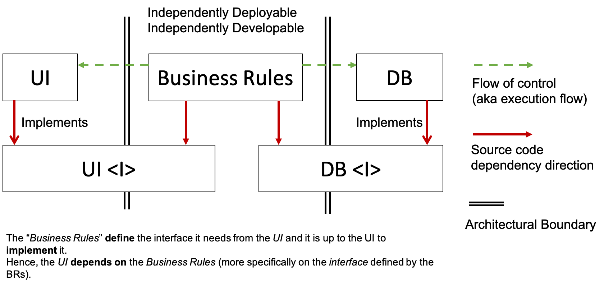

# Design patterns

- decorators
- singleton (keep one instance of a class, for a DB, logger, etc.)
- iterator
- Layered pattern (multiple levels of abstraction)
- clients / server
- master slave
- MVC 

<https://github.com/faif/python-patterns>

## Dependency injection

Dependency injection is a technique whereby one object (or static method) supplies the dependencies of another object. A dependency is an object that can be used (a service). An injection is the passing of a dependency to a dependent object (a client) that would use it. The service is made part of the client's state. Passing the service to the client, rather than allowing a client to build or find the service, is the fundamental requirement of the pattern.

In other terms, this pattern allows to "inject" a dependency into a class, instead of letting the class create the dependency.

```python
class Client:
    def __init__(self, service):
        self.service = service

    def do_something(self):
        return self.service.get("http://www.google.com")
```

Instead of:

```python
class Client:
    def __init__(self):
        self.service = Service()

    def do_something(self):
        return self.service.get("http://www.google.com")
```

## The clean architecture / Hexagonal architecture / Onion architecture

They all have the same objective, which is the separation of concerns. They all achieve this separation by dividing the software into layers. Each has at least one layer for business rules, and another for interfaces.

The clean architecture is a way to structure your code in a way that it is independent of frameworks, databases, etc. It is a way to make your code more testable, and more maintainable.

Although some people like to nitpick over the differences, all these are pretty much names for the same thing, and they all boil down to the dependency inversion principle: high-level modules (the domain) should not depend on low-level ones (the infrastructure).

The clean architecture is composed of 4 layers.


Each of these architectures produce systems that are:

- Independent of Frameworks.
- Testable. The business rules can be tested without the UI, Database, Web Server, or any other external element.
- Independent of UI. The UI can change easily, without changing the rest of the system.
- Independent of Database. You can swap out Oracle or SQL Server, for Mongo, BigTable, CouchDB, or something else. Your business rules are not bound to the database.
- Independent of any external agency.

The further in you go in the architecture, the more stable and abstract the components become. The more high level components are at the center, and the more low level components are at the edges: **the outer circles are mechanisms. The inner circles are policies.**

### The Dependency Rule

This rule says that source code dependencies can only point inwards.
Nothing in an inner circle can know anything at all about something in an outer circle.
In particular, the name of something declared in an outer circle must not be mentioned by the code in the an inner circle.
That includes, functions, classes. variables, or any other named software entity.

For example:

```python
class MyService:
    def __init__(self, repository):
        self._repository = repository

    def do_something(self):
        return self._repository.get("http://www.google.com")
```

The `MyService` class is in the inner circle. The `repository` is in the outer circle.
The `MyService` class depends on the `repository` class, but the `repository` class does not depend on the `MyService` class.

We don’t want anything in an outer circle to impact the inner circles. We don’t want SQL, or HTML, or the database, or the web, or any other mechanism to impact the inner circles. This allows us to keep those mechanisms at arms length from the business rules.


In the pic above, we see that the HL1 depends on the interface, but the execute flow (runtime) depends on the ML1, which is the implementation of the interface.



### Entities, Domain, Business rules

It's the core of the application. It contains the business rules. It is the most abstract layer of the application.

This layer should not depend on anything outside of itself. This layer typically defines the models and data structures that represent the business entities and concepts.

An entity can be an object with methods, or it can be a set of data structures and functions. It doesn’t matter so long as the entities could be used by many different applications in the enterprise.

### Use Cases, Application

This layer contains the application specific business rules.
It implements all the use cases of the application, it uses the domain classes, but it is isolated from the details and implementation of outer layers, such as databases, adapters, etc.
This layer just holds interfaces to interact with the outside world.

This layer is dependent on the Domain layer, but not on anything outside of itself. This layer typically defines the application services that implement the use cases of the system.

The Application layer only depends on abstractions, defined in interfaces, and these interfaces are implemented in outer layers. For example, persistence concerns (such as saving an item to a database) are defined only in terms of requirements: the real implementation is done in the outer layers.

As we have seen before, use cases are the user actions, or the user intentions, like fetching an order, creating a product, and so on.

**And each use case must be independent of the other use cases**, to be compliant with the Single Responsibility Principle (the first SOLID principle).

Why can't a use case depend on another use case? Because if it does, then it is not a use case anymore, it is a business rule. And business rules belong to the domain layer.

We do not expect this layer to be affected by changes to externalities such as the database, the UI, or any of the common frameworks. This layer is isolated from such concerns.

### Controller, Adapters, Gateways, Data sources, Infrastructure

They communicate with whatever is outside of the application.

It is this layer, for example, that will wholly contain the MVC architecture of a GUI. The Presenters, Views, and Controllers all belong in here.

The Presentation layer is where the system is interacted with. This might be via a Web API, a GUI, or a CLI.

The models are likely just data structures that are passed from the controllers to the use cases, and then back from the use cases to the presenters and views.

### In Python

In python we will design our repository with a domain and adapters folders.

The domain folder will contain the entities and the use cases. It cannot import anything from the adapters folder except for type hints.

The adapters folder will contain the implementation of the use cases, and the implementation of the repositories. It cannot import anything from the domain folder.

You can also define the entrypoint in src/your_app_name/main.py. This file will import the use cases from the domain folder, and the repositories from the adapters folder. You can also define several entrypoints in the entrypoints folder.
