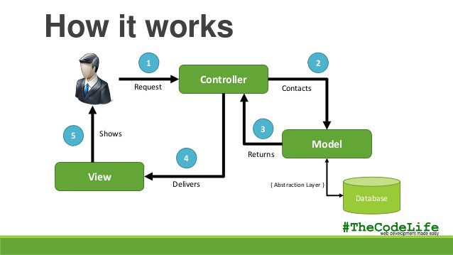

# Design patterns

- decorators
- singleton (keep one instance of a class, for a DB, logger, etc.)
- iterator
- Layered pattern (multiple levels of abstraction)
- clients / server
- master slave
- MVC 

<https://github.com/faif/python-patterns>
