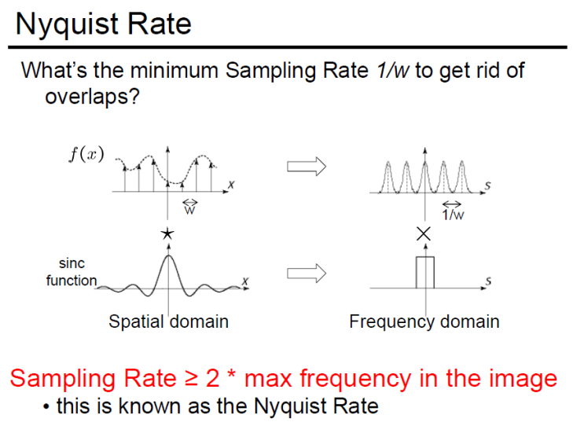
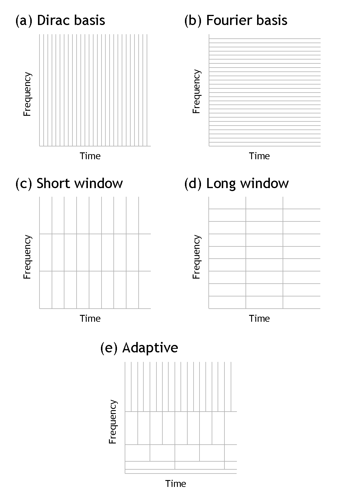

# Signal Processing

## Nyquist Shannon sampling theorem

- Aliasing
- Moiré pattern can appear on images

## Convolution

$$(f * g)(t) := \int_{-\infty}^\infty f(\tau) g(t - \tau) \, d\tau$$

$$[f * g](n) = \sum_{m=-\infty}^\infty f[m] g[n - m]$$

## Fourier

$$S(f) = \int_{-\infty}^{\infty} s(t) \cdot e^{- i\omega t} \, dt$$

$$X_{2\pi}(\omega) = \sum_{n=-\infty}^{\infty} x[n] \,e^{-i \omega n}$$

## Wavelets

- Short time Fourier transform on a non-stationary signal (the distribution changes over time) works but finding the right window is hard. Time frequency resolution tradeoff.
- Tight windows in time give good time resolution but bad frequency resolution.
- Moreover, wide windows (time domain) can violate the stationary condition cause the signal might chance too quickly.
- Time domain: good temporal resolution, bad frequential resolution
- good frequency resolution: (frequency components close together can be separated)
- good time resolution (the time at which frequencies change).
- A wide window gives better frequency resolution but poor time resolution.
- A narrower window gives good time resolution but poor frequency resolution.

In the figure below, figure (a) shows the signal in the time domain. There is good time resolution but poor frequency resolution.

In figure (b), in the frequency domain, we have the opposite.

Figure (c) shows a STFT analysis with a short window (in time domain), we have a good time resolution but a poor frequency resolution.

With a wider window the opposite is shown in figure (d).

Figure (e) shows a wavelet analysis as described above. Each Heisenberg box has a minimum area of $\frac{1}{4\pi}$.

$$\forall t \in \mathbb{R}, \psi_{s,\tau}(t) = \frac{1}{\sqrt{s}} \Psi\left(\frac{t-\tau}{s}\right)$$

The scaling parameter s is used to modify the shape of the wavelet:

- With s > 1 (high scale) the wavelet is expanded, so that low frequencies can be captured.
- With s < 1 (low scale) we the wavelet is contracted, so high frequencies can be detected.

## Zero-padding

- Add some zeros to the end of the temporal signal
- Will increase the resolution in the frequency domain: smoother spectral plots
- Also used for making the FFT more efficient
