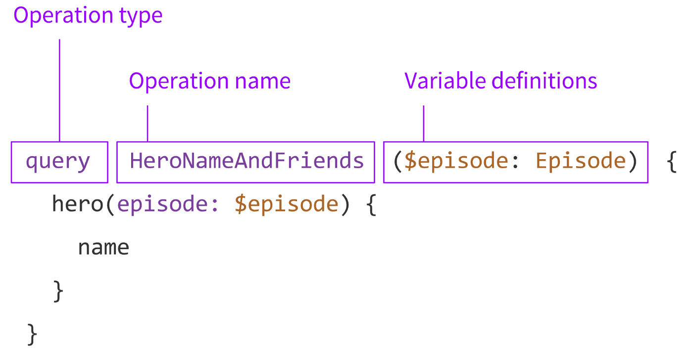
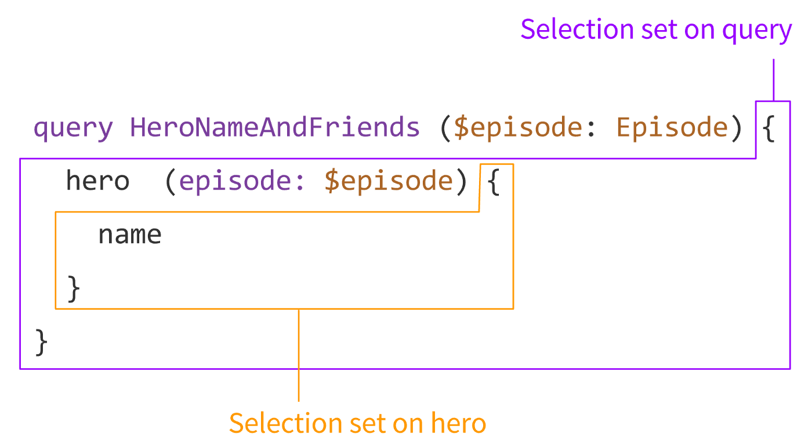

# GraphQL

> GraphQL makes it easier for app developers to get the data they need without needing to know which sources it’s coming from

## Introduction

API developers use GraphQL to create a **schema** to describe all the possible data that clients can query through that service.

A **GraphQL schema** is made up of object types, which define which kind of object you can request and what fields it has.

As queries come in, GraphQL validates the queries against the schema. GraphQL then executes the validated queries.

The API developer attaches each field in a schema to a function called a **resolver**. During execution, **the resolver is called to produce the value**.

GraphQL can query data from any number of different sources.
GraphQL leaves most other decisions to the API designer. GraphQL does not provide any direction for how to store data or what programming language to use. GraphQL offers no requirements for the network, authorization, or pagination.

Requests to a GraphQL server can be:

- query
- mutation
- subscription (Subscriptions are similar to queries with the additional benefit of being long-lasting operations.)

From the point of view of the client, the most common GraphQL operations are likely to be queries and mutations. If we were to think about them in terms of the create, read, update and delete (CRUD) model, a query would be equivalent to read. All the others (create, update, and delete) are handled by mutations.

## Some general concepts

### GraphQL document

A string written in the GraphQL language that defines one or more operations and fragments.


- Field: A unit of data you are asking for, which ends up as a field in your JSON response data.
- Arguments: A set of key-value pairs attached to a specific field.

Examples:

```graphql
{
  me {
    name
  }
}
```

would return:

```json
{
  "me": {
    "name": "Maison"
  }
}
```

With arguments:

```graphql
{
  human(id: "1000") {
    name
    location
  }
}
```

would return for the human with ID 1000:

```json
{
  "human": {
      "name": "Luke Skywalker",
      "location": "Tatooine"
  }
}
```

Another example:

```graphql
{
  user(uuid: "8f7ab4") {   # consider user 8f7ab4
    name                   # get the name of the user
    friends {              # get the friends of the user
      uuid                 # get the uuid of the friend
      name                 # get the name of the friend
    }
  }
}
```

With a REST API you'd have to query for each of the users by UUID, perhaps by using `user/<friend-id>`, returned from a `user/8f7ab4/friends` API call. Even more important is that the REST API call will return tons of information that you dont really care about, effectively costing you more for bandwidth and also resulting in high latency in completing the actual query you're trying to execute.

This query:

```graphql
{
  me {
    lastname
  }
}
```

and

```graphql
query MySuperQuery {
  me {
    lastname
  }
}
```

are equivalent.

Another ex:

```graphql
{
  authors {
    firstName
  }
}
```

returns a list of authors with their first name:

```json
{
  "authors": [{"firstName": "John"}, {"firstName": "Jane"}]
}
```

Another:

```graphql
{
  authors {
    firstName
    lastName
  }
}
```

returns:

```json
{
  "authors":
  [
      {"firstName": "John", "lastName": "Doe"},
      {"firstName": "Jane", "lastName": "Doe"}
  ]
}
```

Another example:

```graphql
{
  message(name: "Bob")
}
```

returns:

```json
{
  "message": "Hello Bob"
}
```

A mutation to add a user and get the id of the newly created user (we are printing the ‘id’, ‘name’, ‘age’ and ‘gender’ of the new user. But you can also print only the values that are required):

```graphql
mutation {
  add(name: "Robert", gender: "male", age: 31) {
    id
    name
    age
    gender
  }
}
```

### Operation

A single query, mutation, or subscription that can be interpreted by a GraphQL execution engine.

- Queries that fetch data are synonymous to GET calls in REST
- mutations signal that we’d like to invoke a change the in system, similar to REST’s POST or DELETE methods.



- Operation type: This is either **query**, **mutation**, or **subscription**
- Operation name: For debugging and server-side logging reasons, it’s useful to give your queries meaningful names.
- Variable definitions: These are the variables of your query.
  - Because GraphQL is statically typed, it can actually validate for you that you are passing in the right variables.
  - Variables are passed separately from the query document in a transport-specific way, In today’s GraphQL server implementations, that’s usually JSON.

### Selection set



The selection set:

- is what gives GraphQL its recursive nature, allowing you to do nested data fetching.
- A set of fields requested in an operation, or nested within another field.
- A GraphQL query must contain a selection set on any field that returns an object type, and selection sets are not allowed on fields that return scalar types, such as Int or String.

### Aliases

```graphql
query MyQuery {
  empireHero: hero(episode: EMPIRE) {
    name
  }
  jediHero: hero(episode: JEDI) {
    name
  }
}
```

In the above example, the two hero fields would have conflicted, but since we can alias them to different names, we can get both results in one request.

returns:

```json
{
  "empireHero": {
    "name": "Luke Skywalker"
  },
  "jediHero": {
    "name": "R2-D2"
  }
}
```

### Fragments


Fragment definition:

- Part of a GraphQL document which defines a GraphQL fragment.
- This is also sometimes called a **named fragment**, in contrast to an **inline fragment** which we’ll get to below.
- Fragment name: The name of each fragment has to be unique within a GraphQL document.
- Type condition: GraphQL operations always start at the query, mutation, or subscription type in your schema, but fragments can be used in any selection set.

### GraphQL schema

On the server, we create a **GraphQL schema** written in SDL (schema definition language) based on the data we need to build our app UIs.

```graphql
type Author {
  id: ID!
  firstName: String
  lastName: String
  age: Float
  book: Book
}

type Book {
  id: ID!
  name: String
  authorid: ID!
}
```

A “!” mark at the end of each field is to denote that those fields are non-nullable, meaning that they cannot contain null values. By default, all types in GraphQL are nullable.

Example of schema:

- application has three types: Author, Book, and Query
- Author and Post reference each other.
  - You can get from Author to Post through the Author’s “posts” field
  - you can get from Post to Author through the Posts’ “author” field.
- The third type `Query` is just there to mark the entry point into the schema.
  - Every query has to start with one of its fields: getAuthor or getPostsByTitle.
  - You can think of them sort of like REST endpoints, except more powerful.

```graphql
type Author {
  id: Int
  name: String
  posts: [Post]
}

type Post {
  id: Int
  title: String
  text: String
  author: Author
}

type Query {
  getAuthor(id: Int): Author
  getPostsByTitle(titleContains: String): [Post]
}

schema {
  query: Query
}
```

`[Post]` is known as list fields and they are used to indicate that a field can return a list containing items of a specific type.

Example with type `[Book!]!`:

- Basically it says that books is an array of object type Book.
- The outer exclamation mark says that the array itself cannot be Null — at a minimum, it should be an empty array.
- The inner exclamation mark says that each entry in the array must be a Book — it cannot be Null.

```graphql
type User {
    id: ID!
    firstName: String!
    lastName: String!
    email: String!
    age: Int
    tweets: [Tweet!]!
    comments: [Comment!]!
}

type Tweet {
    id: ID!
    title: String!
    body: String!
    published: Boolean!
    author: User!
    comments: [Comment!]!
}

type Comment {
    id: ID!
    text: String!
    author: User!
    tweet: Tweet!
}
```

The schema tells the server what queries clients are allowed to make, and how different types are related, but there is one critical piece of information that it doesn’t contain: where the data for each type comes from?

That’s what resolve functions are for!

### Resolvers

For each type, we write the **resolver functions**, connecting the data to our graph. Perhaps we get the Job data from an external API. And maybe we get the Location data from the Google Maps API.

```javascript
getAuthor(_, args){
  return sql.raw('SELECT * FROM authors WHERE id = %s', args.id);
}

posts(author){
  return request(`https://api.blog.io/by_author/${author.id}`);
}
```

## More

- <https://medium.com/naresh-bhatia/graphql-concepts-i-wish-someone-explained-to-me-a-year-ago-514d5b3c0eab>
- <https://docs.github.com/en/graphql/guides/forming-calls-with-graphql#example-query>
